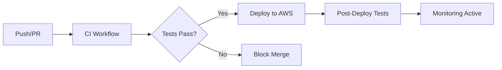

# 🔄 GitHub Actions Workflows

Este diretório contém todos os workflows automatizados do B3TR para CI/CD, monitoramento e qualidade.

## 📋 Workflows Disponíveis

### 🔧 CI/CD Workflows

| Workflow | Trigger | Descrição |
|----------|---------|-----------|
| **ci.yml** | Push/PR | Lint, testes e validação de código |
| **deploy.yml** | Push main | Deploy automático na AWS |
| **release.yml** | Tags v*.*.* | Criação de releases |

### 📊 Monitoramento

| Workflow | Trigger | Descrição |
|----------|---------|-----------|
| **monitoring.yml** | A cada 6h | Verifica saúde do sistema |
| **data-quality.yml** | Diário 19:00 UTC | Valida qualidade dos dados |
| **performance.yml** | Semanal | Testes de performance |

### 🔒 Segurança e Dependências

| Workflow | Trigger | Descrição |
|----------|---------|-----------|
| **codeql.yml** | Push/PR/Semanal | Análise de segurança do código |
| **dependabot.yml** | Semanal | Verificação de dependências |

## 🚀 CI/CD Pipeline



## 📊 Monitoramento Automático

### System Health (monitoring.yml)
- ✅ Verifica status das Lambda functions
- ✅ Valida dados recentes no S3
- ✅ Monitora jobs do SageMaker
- ✅ Checa alarmes do CloudWatch
- 🚨 Cria issues automáticas se problemas detectados

### Data Quality (data-quality.yml)
- ✅ Valida ingestão de dados diária
- ✅ Verifica freshness dos dados de treino
- ✅ Monitora artefatos de modelo
- ✅ Checa rankings gerados
- 📊 Gera relatórios de qualidade

### Performance (performance.yml)
- ⚡ Analisa métricas de Lambda functions
- 📈 Monitora pipeline de dados
- 🔍 Identifica gargalos de performance
- 📋 Gera relatórios semanais

## 🔧 Configuração

### Secrets Necessários

```bash
# AWS
AWS_ROLE_ARN=arn:aws:iam::ACCOUNT:role/GitHubActions
AWS_ACCOUNT_ID=123456789012

# B3TR
DEEPAR_IMAGE_URI=382416733822.dkr.ecr.us-east-1.amazonaws.com/forecasting-deepar:1
BRAPI_SECRET_ID=brapi/pro/token
ALERT_EMAIL=your-email@example.com
```

### Variáveis de Ambiente

```bash
# Região AWS
AWS_REGION=us-east-1

# Configurações do sistema
B3TR_BUCKET_PREFIX=b3tr
B3TR_SSM_PREFIX=/b3tr
```

## 📋 Como Usar

### 1. Deploy Manual
```bash
# Trigger deploy workflow
gh workflow run deploy.yml
```

### 2. Criar Release
```bash
# Criar tag para release
git tag v1.0.0
git push origin v1.0.0
```

### 3. Executar Monitoramento
```bash
# Executar verificação manual
gh workflow run monitoring.yml
```

### 4. Teste de Performance
```bash
# Executar teste de performance
gh workflow run performance.yml -f test_type=full
```

## 🔍 Troubleshooting

### Workflow Falhando?

1. **Verifique os logs:**
   ```bash
   gh run list --workflow=ci.yml
   gh run view RUN_ID --log
   ```

2. **Secrets configurados:**
   - AWS_ROLE_ARN
   - DEEPAR_IMAGE_URI
   - ALERT_EMAIL

3. **Permissões AWS:**
   - Role tem permissões para CDK deploy
   - S3, Lambda, SageMaker access
   - CloudWatch metrics

### Deploy Falhando?

1. **CDK Bootstrap:**
   ```bash
   npx cdk bootstrap aws://ACCOUNT/us-east-1
   ```

2. **Verificar env vars:**
   - DEEPAR_IMAGE_URI válido
   - BRAPI_SECRET_ID existe

3. **Logs do CloudFormation:**
   - Verificar stack events
   - Checar IAM permissions

## 📈 Métricas e Alertas

### Issues Automáticas
Os workflows criam issues automaticamente quando:
- ❌ Sistema com problemas críticos
- ⚠️ Qualidade de dados degradada
- 🐌 Performance abaixo do esperado
- 🔒 Vulnerabilidades de segurança

### Labels Automáticas
- `monitoring` - Issues de monitoramento
- `data-quality` - Problemas de qualidade
- `performance` - Issues de performance
- `security` - Alertas de segurança
- `urgent` - Problemas críticos

## 🔄 Manutenção

### Atualizações Semanais
- Dependabot atualiza dependências
- CodeQL faz scan de segurança
- Performance tests executam

### Monitoramento Contínuo
- Health checks a cada 6h
- Data quality diário
- Alertas em tempo real

## 📚 Referências

- [GitHub Actions Docs](https://docs.github.com/en/actions)
- [AWS CDK GitHub Actions](https://github.com/aws-actions)
- [Dependabot Configuration](https://docs.github.com/en/code-security/dependabot)
- [CodeQL Analysis](https://codeql.github.com/)