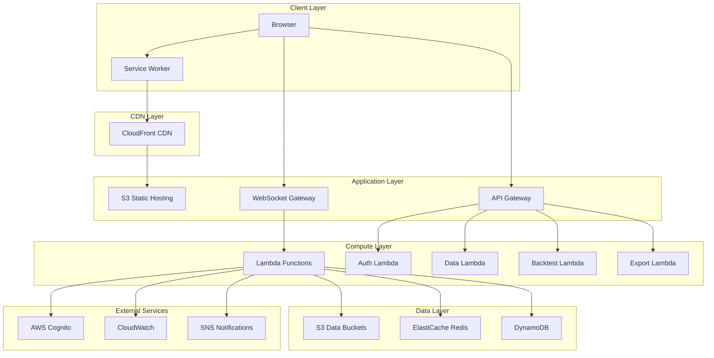
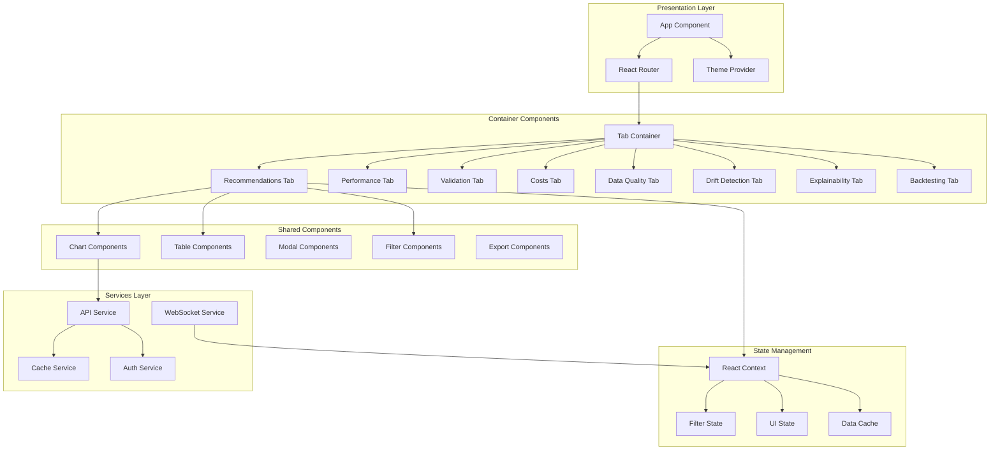

# Design Document: Dashboard Complete Enhancement

## Overview

This design document specifies the technical implementation for comprehensive enhancements to the B3 Tactical Ranking MLOps Dashboard. The dashboard is a React-based web application that monitors machine learning model recommendations for Brazilian stock market (B3) trading.

### Current Architecture

The existing system consists of:
- **Frontend**: React application using hooks, inline SVG for charts
- **Backend**: AWS Lambda functions behind API Gateway
- **Storage**: S3 buckets for data storage
- **Existing Tabs**: Recommendations, Performance, Validation, Costs (4 tabs)

### Enhancement Scope

This enhancement adds:
- **New Tabs**: Data Quality, Drift Detection, Explainability, Backtesting (4 new tabs)
- **Enhanced Features**: Advanced filtering, cross-filtering, drill-down, export, alerts, real-time updates
- **Advanced Visualizations**: Heatmaps, candlestick charts, waterfall charts, Sankey diagrams, sparklines
- **Infrastructure**: WebSocket support, caching layer, enhanced API endpoints
- **UX Improvements**: Accessibility, mobile responsiveness, keyboard shortcuts, guided tours

### Design Goals

1. **Scalability**: Support 1,000 concurrent users and 500 tickers
2. **Performance**: Initial load < 3 seconds, interactions < 100ms
3. **Maintainability**: Modular architecture with clear separation of concerns
4. **Accessibility**: WCAG 2.1 Level AA compliance
5. **Reliability**: Comprehensive error handling and recovery

## Architecture

### High-Level Architecture



### Frontend Architecture




### Component Hierarchy

The application follows a hierarchical component structure:

1. **App Level**: Theme, routing, authentication, global state
2. **Tab Level**: Tab-specific containers managing local state and data fetching
3. **Feature Level**: Reusable feature components (charts, tables, filters)
4. **UI Level**: Atomic UI components (buttons, inputs, cards)

### State Management Strategy

Given the complexity of cross-filtering, drill-down, and multi-tab interactions, we'll use a hybrid state management approach:

1. **React Context**: For global state (filters, user preferences, theme)
2. **Local State**: For component-specific UI state (modals, tooltips, form inputs)
3. **React Query**: For server state management (data fetching, caching, synchronization)
4. **URL State**: For shareable state (active tab, filters, date ranges)

This approach avoids the complexity of Redux while providing sufficient state management capabilities.

## Components and Interfaces

### Core Component Library

#### 1. Chart Components

We'll migrate from inline SVG to a professional charting library. After evaluating options:

**Selected Library: Recharts + D3.js**
- **Recharts**: For standard charts (line, bar, area, scatter, pie)
  - React-native, composable API
  - Good performance for datasets < 5,000 points
  - Built on D3.js
- **D3.js**: For custom visualizations (heatmaps, Sankey, waterfall)
  - Maximum flexibility
  - Better performance for large datasets
  - Steeper learning curve but necessary for advanced visualizations

**Chart Component Structure**:

```typescript
// Base chart wrapper
interface BaseChartProps {
  data: any[];
  loading?: boolean;
  error?: Error;
  height?: number;
  width?: number;
  responsive?: boolean;
  onElementClick?: (element: any) => void;
  exportable?: boolean;
}

// Specific chart types
interface LineChartProps extends BaseChartProps {
  xKey: string;
  yKeys: string[];
  colors?: string[];
  showLegend?: boolean;
  showGrid?: boolean;
  showTooltip?: boolean;
}

interface HeatmapProps extends BaseChartProps {
  xLabels: string[];
  yLabels: string[];
  colorScale?: [string, string];
  showValues?: boolean;
}

interface CandlestickChartProps extends BaseChartProps {
  dateKey: string;
  openKey: string;
  highKey: string;
  lowKey: string;
  closeKey: string;
  volumeKey?: string;
  movingAverages?: number[];
}
```

**Chart Components to Implement**:
- LineChart (time series, trends)
- BarChart (comparisons, distributions)
- AreaChart (cumulative values, stacked data)
- ScatterPlot (correlations, predicted vs actual)
- PieChart (composition, allocation)
- Heatmap (correlations, drift detection)
- CandlestickChart (price action)
- WaterfallChart (return decomposition)
- SankeyDiagram (sector flows)
- Sparkline (inline trends)
- ConfusionMatrix (prediction accuracy)

#### 2. Table Components

**Selected Library: TanStack Table (React Table v8)**
- Headless UI (full styling control)
- Built-in sorting, filtering, pagination
- Virtual scrolling for large datasets
- Column resizing, reordering
- Excellent TypeScript support

```typescript
interface TableProps<T> {
  data: T[];
  columns: ColumnDef<T>[];
  loading?: boolean;
  error?: Error;
  pagination?: boolean;
  pageSize?: number;
  sorting?: boolean;
  filtering?: boolean;
  selection?: boolean;
  onRowClick?: (row: T) => void;
  exportable?: boolean;
  sparklines?: boolean;
}

interface ColumnDef<T> {
  id: string;
  header: string;
  accessorKey?: keyof T;
  accessorFn?: (row: T) => any;
  cell?: (info: CellContext<T>) => React.ReactNode;
  sortable?: boolean;
  filterable?: boolean;
  width?: number;
  tooltip?: string;
}
```

#### 3. Filter Components

```typescript
interface FilterConfig {
  id: string;
  type: 'select' | 'multiselect' | 'range' | 'date' | 'search';
  label: string;
  options?: FilterOption[];
  min?: number;
  max?: number;
  defaultValue?: any;
}

interface FilterState {
  [filterId: string]: any;
}

interface FilterBarProps {
  filters: FilterConfig[];
  values: FilterState;
  onChange: (filterId: string, value: any) => void;
  onClear: () => void;
  onApply: () => void;
}
```

#### 4. Modal Components

```typescript
interface ModalProps {
  isOpen: boolean;
  onClose: () => void;
  title: string;
  size?: 'sm' | 'md' | 'lg' | 'xl' | 'full';
  children: React.ReactNode;
  footer?: React.ReactNode;
  closeOnOverlayClick?: boolean;
  closeOnEscape?: boolean;
}

// Specific modals
interface TickerDetailModalProps extends ModalProps {
  ticker: string;
  data: TickerDetail;
}

interface ComparisonModalProps extends ModalProps {
  tickers: string[];
  data: ComparisonData;
}
```

#### 5. Export Components

```typescript
interface ExportConfig {
  formats: ('csv' | 'excel' | 'pdf' | 'json')[];
  filename: string;
  data: any;
  includeCharts?: boolean;
  includeMetadata?: boolean;
}

interface ExportButtonProps {
  config: ExportConfig;
  onExportStart?: () => void;
  onExportComplete?: (format: string, blob: Blob) => void;
  onExportError?: (error: Error) => void;
}
```

### Tab-Specific Components

#### Recommendations Tab Components
- RecommendationCard: Display individual ticker recommendation
- SectorFilter: Filter by sector
- ReturnRangeFilter: Filter by expected return range
- ScoreFilter: Filter by minimum score
- ComparisonView: Side-by-side ticker comparison
- TickerDetailModal: Detailed ticker information

#### Performance Tab Components
- ModelBreakdownTable: Individual model performance
- ConfusionMatrixChart: Directional prediction accuracy
- ErrorDistributionChart: Histogram of prediction errors
- BenchmarkComparisonChart: Model vs benchmarks
- FeatureImportanceChart: Feature importance by model
- CorrelationHeatmap: Feature correlation matrix

#### Validation Tab Components
- ScatterPlot: Predicted vs actual returns
- TemporalAccuracyChart: Accuracy over time
- SegmentationChart: Performance by return range
- OutlierTable: Extreme prediction errors
- BacktestSimulator: Portfolio simulation interface

#### Costs Tab Components
- CostTrendChart: AWS costs over time
- CostPerPredictionChart: Unit economics
- ServiceBreakdownChart: Costs by AWS service
- OptimizationSuggestions: Cost reduction recommendations
- BudgetIndicator: Budget status and alerts
- ROICalculator: Return on investment

#### Data Quality Tab Components
- CompletenessTable: Data completeness by ticker
- AnomalyList: Detected data anomalies
- FreshnessIndicators: Data age by source
- CoverageMetrics: Universe coverage statistics

#### Drift Detection Tab Components
- DataDriftChart: Feature distribution changes
- ConceptDriftHeatmap: Correlation changes over time
- DegradationAlerts: Performance degradation warnings
- RetrainingRecommendations: Model update suggestions

#### Explainability Tab Components
- SHAPWaterfallChart: Feature contributions
- SensitivityAnalysis: Prediction sensitivity to features
- FeatureImpactChart: Aggregate feature impacts
- ExplanationText: Natural language explanations

#### Backtesting Tab Components
- BacktestConfiguration: Parameter inputs
- PortfolioValueChart: Cumulative value over time
- PerformanceMetricsTable: Comprehensive metrics
- BenchmarkComparison: Model vs benchmarks
- RiskAnalysis: VaR, CVaR, drawdowns
- WaterfallChart: Return decomposition
- SankeyDiagram: Sector flows
- ScenarioAnalysis: What-if analysis
- StressTesting: Adverse scenario testing

### Shared UI Components

```typescript
// KPI Card
interface KPICardProps {
  title: string;
  value: string | number;
  change?: number;
  changeLabel?: string;
  trend?: 'up' | 'down' | 'neutral';
  icon?: React.ReactNode;
  tooltip?: string;
  onClick?: () => void;
  loading?: boolean;
}

// Status Badge
interface StatusBadgeProps {
  status: 'success' | 'warning' | 'error' | 'info';
  label: string;
  icon?: React.ReactNode;
  tooltip?: string;
}

// Progress Bar
interface ProgressBarProps {
  value: number;
  max: number;
  label?: string;
  showPercentage?: boolean;
  color?: 'green' | 'yellow' | 'red';
  size?: 'sm' | 'md' | 'lg';
}

// Sparkline
interface SparklineProps {
  data: number[];
  width?: number;
  height?: number;
  color?: string;
  showTooltip?: boolean;
}

// Skeleton Screen
interface SkeletonProps {
  variant: 'text' | 'rect' | 'circle' | 'chart' | 'table';
  width?: number | string;
  height?: number | string;
  count?: number;
  animation?: 'pulse' | 'wave';
}
```

## Data Models

### Frontend Data Models

```typescript
// Recommendation
interface Recommendation {
  ticker: string;
  sector: string;
  score: number;
  expectedReturn: number;
  confidence: number;
  rank: number;
  timestamp: string;
  features: Record<string, number>;
}

// Ticker Detail
interface TickerDetail {
  ticker: string;
  name: string;
  sector: string;
  currentPrice: number;
  history: RecommendationHistory[];
  fundamentals: Fundamentals;
  news: NewsArticle[];
  priceHistory: PricePoint[];
}

interface RecommendationHistory {
  date: string;
  score: number;
  expectedReturn: number;
  actualReturn?: number;
  rank: number;
}

interface Fundamentals {
  marketCap: number;
  pe: number;
  pb: number;
  dividendYield: number;
  roe: number;
  debtToEquity: number;
}

interface NewsArticle {
  title: string;
  source: string;
  date: string;
  url: string;
  sentiment?: 'positive' | 'negative' | 'neutral';
}

interface PricePoint {
  date: string;
  open: number;
  high: number;
  low: number;
  close: number;
  volume: number;
}

// Performance
interface ModelPerformance {
  modelId: string;
  modelName: string;
  mape: number;
  accuracy: number;
  sharpeRatio: number;
  correlation: number;
  featureImportance: FeatureImportance[];
}

interface FeatureImportance {
  feature: string;
  importance: number;
  description: string;
}

interface ConfusionMatrix {
  predicted: {
    up: { actual: { up: number; down: number; neutral: number } };
    down: { actual: { up: number; down: number; neutral: number } };
    neutral: { actual: { up: number; down: number; neutral: number } };
  };
  precision: { up: number; down: number; neutral: number };
  recall: { up: number; down: number; neutral: number };
}

interface ErrorDistribution {
  bins: { min: number; max: number; count: number; percentage: number }[];
  mean: number;
  stdDev: number;
  outliers: PredictionError[];
}

interface PredictionError {
  ticker: string;
  date: string;
  predicted: number;
  actual: number;
  error: number;
  errorPercentage: number;
}

interface BenchmarkComparison {
  model: PerformanceMetrics;
  ibovespa: PerformanceMetrics;
  movingAverage: PerformanceMetrics;
  cdi: PerformanceMetrics;
}

interface PerformanceMetrics {
  totalReturn: number;
  annualizedReturn: number;
  volatility: number;
  sharpeRatio: number;
  sortinoRatio: number;
  maxDrawdown: number;
  alpha?: number;
  beta?: number;
  informationRatio?: number;
}

// Validation
interface ValidationData {
  scatterData: { predicted: number; actual: number; ticker: string; date: string }[];
  correlation: number;
  rSquared: number;
  temporalAccuracy: { date: string; accuracy: number; mape: number; correlation: number }[];
  segmentation: {
    range: string;
    accuracy: number;
    mape: number;
    count: number;
  }[];
  outliers: PredictionError[];
}

// Costs
interface CostData {
  daily: { date: string; total: number; lambda: number; s3: number; apiGateway: number; other: number }[];
  summary: {
    total: number;
    average: number;
    trend: 'increasing' | 'stable' | 'decreasing';
  };
  costPerPrediction: { date: string; cost: number }[];
  optimizations: OptimizationSuggestion[];
  budget: BudgetStatus;
}

interface OptimizationSuggestion {
  id: string;
  category: 'lambda' | 's3' | 'apiGateway' | 'other';
  title: string;
  description: string;
  estimatedSavings: number;
  priority: 'low' | 'medium' | 'high';
  implemented: boolean;
}

interface BudgetStatus {
  limit: number;
  current: number;
  percentage: number;
  projected: number;
  daysRemaining: number;
  status: 'on-track' | 'warning' | 'critical';
}

// Data Quality
interface DataQualityMetrics {
  completeness: { ticker: string; rate: number; missingFeatures: string[] }[];
  overallCompleteness: number;
  anomalies: DataAnomaly[];
  anomalyRate: number;
  freshness: { source: string; lastUpdate: string; age: number; status: 'current' | 'warning' | 'critical' }[];
  coverage: {
    universeSize: number;
    coveredTickers: number;
    excludedTickers: { ticker: string; reason: string }[];
    coverageRate: number;
  };
}

interface DataAnomaly {
  id: string;
  ticker: string;
  date: string;
  type: 'gap' | 'outlier' | 'inconsistency';
  severity: 'low' | 'medium' | 'high';
  description: string;
  falsePositive: boolean;
}

// Drift Detection
interface DriftData {
  dataDrift: {
    feature: string;
    ksStatistic: number;
    pValue: number;
    drifted: boolean;
    magnitude: number;
    currentDistribution: number[];
    baselineDistribution: number[];
  }[];
  conceptDrift: {
    feature: string;
    currentCorrelation: number;
    baselineCorrelation: number;
    change: number;
    drifted: boolean;
  }[];
  overallDriftScore: number;
  performanceDegradation: {
    metric: string;
    current: number;
    baseline: number;
    change: number;
    degraded: boolean;
    duration: number;
  }[];
  retrainingRecommendation: {
    priority: 'low' | 'medium' | 'high' | 'critical';
    reason: string;
    expectedImprovement: number;
    daysSinceLastTraining: number;
    checklist: { item: string; completed: boolean }[];
  };
}

// Explainability
interface ExplainabilityData {
  ticker: string;
  prediction: number;
  baseValue: number;
  shapValues: { feature: string; value: number; featureValue: number }[];
  explanation: string;
  confidence: number;
}

interface SensitivityAnalysis {
  ticker: string;
  feature: string;
  baselinePrediction: number;
  sensitivity: { featureValue: number; prediction: number }[];
  sensitivityScore: number;
}

interface AggregateFeatureImpact {
  feature: string;
  meanAbsoluteShap: number;
  rank: number;
  distribution: { min: number; q25: number; median: number; q75: number; max: number };
}

// Backtesting
interface BacktestConfig {
  startDate: string;
  endDate: string;
  initialCapital: number;
  positionSize: 'equal' | 'weighted';
  topN: number;
  rebalanceFrequency: 'daily' | 'weekly' | 'monthly';
  commissionRate: number;
}

interface BacktestResult {
  config: BacktestConfig;
  portfolioValue: { date: string; value: number; positions: Position[] }[];
  metrics: PerformanceMetrics & {
    winRate: number;
    averageGain: number;
    averageLoss: number;
    turnoverRate: number;
  };
  benchmarks: BenchmarkComparison;
  riskMetrics: {
    var95: number;
    var99: number;
    cvar95: number;
    cvar99: number;
    maxConsecutiveLosses: number;
    downsideDeviation: number;
    rollingVolatility: { date: string; volatility: number }[];
  };
  drawdowns: { start: string; end: string; depth: number; duration: number }[];
  returnDecomposition: { ticker: string; contribution: number }[];
  sectorFlows: { from: string; to: string; amount: number }[];
}

interface Position {
  ticker: string;
  shares: number;
  value: number;
  weight: number;
}

// Alerts
interface Alert {
  id: string;
  type: 'ticker' | 'performance' | 'cost' | 'drift' | 'dataQuality';
  ticker?: string;
  condition: string;
  threshold: number;
  currentValue: number;
  triggered: boolean;
  timestamp?: string;
  severity: 'info' | 'warning' | 'critical';
  acknowledged: boolean;
}

// Notifications
interface Notification {
  id: string;
  type: 'info' | 'warning' | 'critical';
  category: 'drift' | 'anomaly' | 'cost' | 'performance' | 'system';
  title: string;
  message: string;
  timestamp: string;
  read: boolean;
  actionUrl?: string;
}

// User Preferences
interface UserPreferences {
  theme: 'light' | 'dark';
  fontSize: 'small' | 'medium' | 'large' | 'xlarge';
  layout: LayoutConfig;
  favorites: string[];
  alerts: Alert[];
  notifications: {
    email?: string;
    phone?: string;
    emailTypes: string[];
    smsTypes: string[];
    quietHours: { start: string; end: string };
  };
  keyboardShortcuts: Record<string, string>;
}

interface LayoutConfig {
  preset: string;
  kpiCards: { id: string; visible: boolean; order: number }[];
  chartSizes: Record<string, { width: number; height: number }>;
}
```

### API Response Models

```typescript
// API responses wrap data with metadata
interface APIResponse<T> {
  data: T;
  metadata: {
    timestamp: string;
    version: string;
    cached: boolean;
    cacheExpiry?: string;
  };
  error?: {
    code: string;
    message: string;
    details?: any;
  };
}

// Paginated responses
interface PaginatedResponse<T> {
  data: T[];
  pagination: {
    page: number;
    pageSize: number;
    totalPages: number;
    totalItems: number;
  };
  metadata: {
    timestamp: string;
    version: string;
  };
}
```

### Backend Data Storage Models

```typescript
// S3 Storage Structure
/*
s3://dashboard-data/
  recommendations/
    YYYY-MM-DD/
      recommendations.parquet
      features.parquet
  performance/
    YYYY-MM-DD/
      model_metrics.json
      confusion_matrix.json
      feature_importance.parquet
  validation/
    YYYY-MM-DD/
      predictions.parquet
      actuals.parquet
  costs/
    YYYY-MM/
      daily_costs.json
  data_quality/
    YYYY-MM-DD/
      completeness.json
      anomalies.json
  drift/
    YYYY-MM-DD/
      data_drift.json
      concept_drift.json
  explainability/
    YYYY-MM-DD/
      shap_values.parquet
  backtesting/
    results/
      {backtest_id}.json
*/

// DynamoDB Tables
/*
UserPreferences:
  PK: userId
  SK: "PREFERENCES"
  data: UserPreferences

Alerts:
  PK: userId
  SK: "ALERT#{alertId}"
  data: Alert

Notifications:
  PK: userId
  SK: "NOTIFICATION#{timestamp}"
  data: Notification
  TTL: timestamp + 30 days

APIKeys:
  PK: apiKey (hashed)
  SK: "KEY"
  userId: string
  created: timestamp
  lastUsed: timestamp
  rateLimit: number

WebhookConfigurations:
  PK: userId
  SK: "WEBHOOK#{webhookId}"
  url: string
  events: string[]
  secret: string
  enabled: boolean
*/
```


## Error Handling

### Frontend Error Handling Strategy

#### Error Boundaries

Implement React error boundaries at multiple levels:

```typescript
// App-level error boundary
<ErrorBoundary fallback={<AppCrashFallback />}>
  <App />
</ErrorBoundary>

// Tab-level error boundaries
<ErrorBoundary fallback={<TabErrorFallback />}>
  <RecommendationsTab />
</ErrorBoundary>

// Component-level error boundaries for critical components
<ErrorBoundary fallback={<ChartErrorFallback />}>
  <ComplexChart />
</ErrorBoundary>
```

#### API Error Handling

```typescript
interface APIError {
  code: string;
  message: string;
  userMessage: string;
  retryable: boolean;
  details?: any;
}

// Error classification
const errorHandlers = {
  NetworkError: (error) => ({
    userMessage: "Unable to connect. Please check your internet connection.",
    retryable: true,
    action: "retry"
  }),
  AuthenticationError: (error) => ({
    userMessage: "Your session has expired. Please log in again.",
    retryable: false,
    action: "redirect_login"
  }),
  ValidationError: (error) => ({
    userMessage: `Invalid input: ${error.details.field}`,
    retryable: false,
    action: "show_validation"
  }),
  ServerError: (error) => ({
    userMessage: "Something went wrong on our end. We're working on it.",
    retryable: true,
    action: "retry"
  }),
  NotFoundError: (error) => ({
    userMessage: "The requested data was not found.",
    retryable: false,
    action: "show_message"
  }),
  RateLimitError: (error) => ({
    userMessage: "Too many requests. Please wait a moment and try again.",
    retryable: true,
    action: "retry_with_backoff"
  })
};
```

#### Retry Logic

```typescript
// Exponential backoff retry
async function fetchWithRetry<T>(
  fetcher: () => Promise<T>,
  maxRetries: number = 3,
  baseDelay: number = 1000
): Promise<T> {
  for (let attempt = 0; attempt <= maxRetries; attempt++) {
    try {
      return await fetcher();
    } catch (error) {
      if (attempt === maxRetries || !isRetryable(error)) {
        throw error;
      }
      const delay = baseDelay * Math.pow(2, attempt);
      await sleep(delay);
    }
  }
}
```

#### Offline Handling

```typescript
// Detect offline state
window.addEventListener('online', handleOnline);
window.addEventListener('offline', handleOffline);

// Show cached data with staleness indicator
function handleOffline() {
  showNotification({
    type: 'warning',
    message: 'You are offline. Showing cached data.',
    persistent: true
  });
  
  // Switch to cache-only mode
  setCacheStrategy('cache-only');
}

function handleOnline() {
  showNotification({
    type: 'success',
    message: 'Back online. Refreshing data.',
    duration: 3000
  });
  
  // Refresh stale data
  invalidateCache();
  refetchQueries();
}
```

#### User-Facing Error Messages

All error messages follow these principles:
1. **Clear**: Explain what went wrong in plain language
2. **Actionable**: Tell users what they can do about it
3. **Specific**: Provide relevant details without technical jargon
4. **Empathetic**: Acknowledge the inconvenience

### Backend Error Handling

#### Lambda Error Handling

```python
# Lambda function error handling pattern
def lambda_handler(event, context):
    try:
        # Validate input
        validate_request(event)
        
        # Process request
        result = process_request(event)
        
        # Return success response
        return {
            'statusCode': 200,
            'headers': cors_headers(),
            'body': json.dumps({
                'data': result,
                'metadata': {
                    'timestamp': datetime.utcnow().isoformat(),
                    'version': API_VERSION
                }
            })
        }
    
    except ValidationError as e:
        logger.warning(f"Validation error: {e}")
        return error_response(400, 'VALIDATION_ERROR', str(e))
    
    except AuthenticationError as e:
        logger.warning(f"Authentication error: {e}")
        return error_response(401, 'AUTHENTICATION_ERROR', 'Invalid credentials')
    
    except AuthorizationError as e:
        logger.warning(f"Authorization error: {e}")
        return error_response(403, 'AUTHORIZATION_ERROR', 'Access denied')
    
    except NotFoundError as e:
        logger.info(f"Resource not found: {e}")
        return error_response(404, 'NOT_FOUND', str(e))
    
    except RateLimitError as e:
        logger.warning(f"Rate limit exceeded: {e}")
        return error_response(429, 'RATE_LIMIT_EXCEEDED', 'Too many requests')
    
    except Exception as e:
        logger.error(f"Unexpected error: {e}", exc_info=True)
        # Send alert for unexpected errors
        send_alert(e, event, context)
        return error_response(500, 'INTERNAL_ERROR', 'An unexpected error occurred')

def error_response(status_code, error_code, message):
    return {
        'statusCode': status_code,
        'headers': cors_headers(),
        'body': json.dumps({
            'error': {
                'code': error_code,
                'message': message
            },
            'metadata': {
                'timestamp': datetime.utcnow().isoformat()
            }
        })
    }
```

#### Data Validation

```python
# Input validation schema
from pydantic import BaseModel, validator

class BacktestRequest(BaseModel):
    start_date: date
    end_date: date
    initial_capital: float
    position_size: str
    top_n: int
    rebalance_frequency: str
    commission_rate: float
    
    @validator('end_date')
    def end_after_start(cls, v, values):
        if 'start_date' in values and v <= values['start_date']:
            raise ValueError('end_date must be after start_date')
        return v
    
    @validator('initial_capital')
    def positive_capital(cls, v):
        if v <= 0:
            raise ValueError('initial_capital must be positive')
        return v
    
    @validator('position_size')
    def valid_position_size(cls, v):
        if v not in ['equal', 'weighted']:
            raise ValueError('position_size must be "equal" or "weighted"')
        return v
    
    @validator('top_n')
    def valid_top_n(cls, v):
        if v < 1 or v > 50:
            raise ValueError('top_n must be between 1 and 50')
        return v
```

#### Circuit Breaker Pattern

```python
# Circuit breaker for external dependencies
class CircuitBreaker:
    def __init__(self, failure_threshold=5, timeout=60):
        self.failure_threshold = failure_threshold
        self.timeout = timeout
        self.failures = 0
        self.last_failure_time = None
        self.state = 'CLOSED'  # CLOSED, OPEN, HALF_OPEN
    
    def call(self, func, *args, **kwargs):
        if self.state == 'OPEN':
            if time.time() - self.last_failure_time > self.timeout:
                self.state = 'HALF_OPEN'
            else:
                raise CircuitBreakerOpenError('Circuit breaker is open')
        
        try:
            result = func(*args, **kwargs)
            if self.state == 'HALF_OPEN':
                self.state = 'CLOSED'
                self.failures = 0
            return result
        
        except Exception as e:
            self.failures += 1
            self.last_failure_time = time.time()
            
            if self.failures >= self.failure_threshold:
                self.state = 'OPEN'
            
            raise e
```

## Testing Strategy

### Testing Approach

This project requires a comprehensive testing strategy combining multiple testing methodologies:

1. **Unit Tests**: Test individual functions and components in isolation
2. **Property-Based Tests**: Verify universal properties across all inputs
3. **Integration Tests**: Test interactions between components and services
4. **End-to-End Tests**: Test complete user workflows
5. **Visual Regression Tests**: Ensure UI consistency
6. **Accessibility Tests**: Verify WCAG compliance
7. **Performance Tests**: Validate performance benchmarks

### Frontend Testing

#### Unit Testing

**Framework**: Jest + React Testing Library

```typescript
// Example unit test for filter logic
describe('filterRecommendations', () => {
  it('filters by sector correctly', () => {
    const recommendations = [
      { ticker: 'PETR4', sector: 'Energy', score: 0.8 },
      { ticker: 'VALE3', sector: 'Materials', score: 0.7 },
      { ticker: 'ITUB4', sector: 'Financials', score: 0.9 }
    ];
    
    const filtered = filterRecommendations(recommendations, {
      sector: 'Energy'
    });
    
    expect(filtered).toHaveLength(1);
    expect(filtered[0].ticker).toBe('PETR4');
  });
  
  it('filters by multiple criteria', () => {
    const recommendations = [
      { ticker: 'PETR4', sector: 'Energy', score: 0.8, expectedReturn: 0.15 },
      { ticker: 'VALE3', sector: 'Materials', score: 0.7, expectedReturn: 0.10 },
      { ticker: 'ITUB4', sector: 'Financials', score: 0.9, expectedReturn: 0.20 }
    ];
    
    const filtered = filterRecommendations(recommendations, {
      minScore: 0.75,
      minReturn: 0.12
    });
    
    expect(filtered).toHaveLength(2);
    expect(filtered.map(r => r.ticker)).toEqual(['PETR4', 'ITUB4']);
  });
});

// Example component test
describe('RecommendationCard', () => {
  it('renders recommendation data correctly', () => {
    const recommendation = {
      ticker: 'PETR4',
      sector: 'Energy',
      score: 0.85,
      expectedReturn: 0.15,
      rank: 1
    };
    
    render(<RecommendationCard recommendation={recommendation} />);
    
    expect(screen.getByText('PETR4')).toBeInTheDocument();
    expect(screen.getByText('Energy')).toBeInTheDocument();
    expect(screen.getByText('85%')).toBeInTheDocument();
    expect(screen.getByText('15.0%')).toBeInTheDocument();
  });
  
  it('calls onClick when clicked', () => {
    const onClick = jest.fn();
    const recommendation = { ticker: 'PETR4', sector: 'Energy', score: 0.85 };
    
    render(<RecommendationCard recommendation={recommendation} onClick={onClick} />);
    
    fireEvent.click(screen.getByRole('button'));
    
    expect(onClick).toHaveBeenCalledWith('PETR4');
  });
});
```

#### Property-Based Testing

**Framework**: fast-check

Property-based tests will be used extensively to verify universal properties across all inputs. Each correctness property from the design document will be implemented as a property-based test.

```typescript
import fc from 'fast-check';

// Example property test for filter composition
describe('Filter Properties', () => {
  it('Property: Multiple filters should be intersection of individual filters', () => {
    fc.assert(
      fc.property(
        fc.array(recommendationArbitrary()),
        fc.record({
          sector: fc.option(fc.constantFrom('Energy', 'Materials', 'Financials')),
          minScore: fc.option(fc.float({ min: 0, max: 1 })),
          minReturn: fc.option(fc.float({ min: -0.5, max: 0.5 }))
        }),
        (recommendations, filters) => {
          // Apply all filters together
          const allFiltered = filterRecommendations(recommendations, filters);
          
          // Apply filters individually
          let individualFiltered = recommendations;
          if (filters.sector) {
            individualFiltered = individualFiltered.filter(r => r.sector === filters.sector);
          }
          if (filters.minScore !== null) {
            individualFiltered = individualFiltered.filter(r => r.score >= filters.minScore);
          }
          if (filters.minReturn !== null) {
            individualFiltered = individualFiltered.filter(r => r.expectedReturn >= filters.minReturn);
          }
          
          // Results should be identical
          expect(allFiltered).toEqual(individualFiltered);
        }
      ),
      { numRuns: 100 }
    );
  });
  
  it('Property: Clearing a filter should restore unfiltered view', () => {
    fc.assert(
      fc.property(
        fc.array(recommendationArbitrary()),
        fc.constantFrom('sector', 'minScore', 'minReturn'),
        (recommendations, filterKey) => {
          // Apply filter
          const filter = { [filterKey]: getRandomFilterValue(filterKey) };
          const filtered = filterRecommendations(recommendations, filter);
          
          // Clear filter
          const cleared = filterRecommendations(filtered, {});
          
          // Should restore original (when starting from full dataset)
          const refiltered = filterRecommendations(recommendations, {});
          expect(cleared.length).toBeLessThanOrEqual(refiltered.length);
        }
      ),
      { numRuns: 100 }
    );
  });
});

// Arbitrary generators for property tests
function recommendationArbitrary() {
  return fc.record({
    ticker: fc.stringOf(fc.constantFrom('A', 'B', 'C', 'D', 'E', '1', '2', '3', '4'), { minLength: 5, maxLength: 5 }),
    sector: fc.constantFrom('Energy', 'Materials', 'Financials', 'Technology', 'Healthcare'),
    score: fc.float({ min: 0, max: 1 }),
    expectedReturn: fc.float({ min: -0.5, max: 0.5 }),
    rank: fc.nat({ max: 100 })
  });
}
```

**Property Test Configuration**:
- Minimum 100 iterations per property test
- Each test tagged with reference to design document property
- Tag format: `@property Feature: dashboard-complete-enhancement, Property {number}: {property_text}`

#### Integration Testing

Test interactions between components and API:

```typescript
describe('Recommendations Tab Integration', () => {
  it('loads recommendations and applies filters', async () => {
    // Mock API
    mockAPI.get('/recommendations').reply(200, mockRecommendations);
    
    render(<RecommendationsTab />);
    
    // Wait for data to load
    await waitFor(() => {
      expect(screen.getByText('PETR4')).toBeInTheDocument();
    });
    
    // Apply filter
    fireEvent.change(screen.getByLabelText('Sector'), {
      target: { value: 'Energy' }
    });
    
    // Verify filtered results
    expect(screen.getByText('PETR4')).toBeInTheDocument();
    expect(screen.queryByText('VALE3')).not.toBeInTheDocument();
  });
});
```

#### End-to-End Testing

**Framework**: Playwright

```typescript
test('complete recommendation workflow', async ({ page }) => {
  // Navigate to dashboard
  await page.goto('http://localhost:3000');
  
  // Login
  await page.fill('[name="email"]', 'test@example.com');
  await page.fill('[name="password"]', 'password');
  await page.click('button[type="submit"]');
  
  // Wait for recommendations to load
  await page.waitForSelector('[data-testid="recommendation-card"]');
  
  // Apply filters
  await page.selectOption('[data-testid="sector-filter"]', 'Energy');
  await page.fill('[data-testid="min-score-filter"]', '0.7');
  
  // Verify filtered results
  const cards = await page.$$('[data-testid="recommendation-card"]');
  expect(cards.length).toBeGreaterThan(0);
  
  // Click ticker for details
  await page.click('[data-testid="ticker-PETR4"]');
  
  // Verify modal opens
  await page.waitForSelector('[data-testid="ticker-detail-modal"]');
  expect(await page.textContent('h2')).toContain('PETR4');
  
  // Export data
  await page.click('[data-testid="export-button"]');
  await page.click('[data-testid="export-csv"]');
  
  // Verify download
  const download = await page.waitForEvent('download');
  expect(download.suggestedFilename()).toMatch(/recommendations_\d{4}-\d{2}-\d{2}/);
});
```

#### Visual Regression Testing

**Framework**: Percy or Chromatic

```typescript
describe('Visual Regression Tests', () => {
  it('matches snapshot for recommendations tab', async () => {
    const page = await browser.newPage();
    await page.goto('http://localhost:3000/recommendations');
    await page.waitForSelector('[data-testid="recommendations-loaded"]');
    
    await percySnapshot(page, 'Recommendations Tab');
  });
  
  it('matches snapshot for dark theme', async () => {
    const page = await browser.newPage();
    await page.goto('http://localhost:3000');
    await page.click('[data-testid="theme-toggle"]');
    await page.waitForTimeout(500); // Wait for theme transition
    
    await percySnapshot(page, 'Dashboard Dark Theme');
  });
});
```

#### Accessibility Testing

**Framework**: jest-axe + pa11y

```typescript
import { axe } from 'jest-axe';

describe('Accessibility Tests', () => {
  it('has no accessibility violations', async () => {
    const { container } = render(<RecommendationsTab />);
    const results = await axe(container);
    
    expect(results).toHaveNoViolations();
  });
  
  it('supports keyboard navigation', () => {
    render(<RecommendationsTab />);
    
    // Tab through interactive elements
    userEvent.tab();
    expect(screen.getByRole('button', { name: 'Export' })).toHaveFocus();
    
    userEvent.tab();
    expect(screen.getByRole('combobox', { name: 'Sector' })).toHaveFocus();
  });
  
  it('announces dynamic content to screen readers', async () => {
    render(<RecommendationsTab />);
    
    // Verify ARIA live region
    const liveRegion = screen.getByRole('status');
    expect(liveRegion).toHaveAttribute('aria-live', 'polite');
    
    // Trigger data update
    fireEvent.click(screen.getByRole('button', { name: 'Refresh' }));
    
    // Verify announcement
    await waitFor(() => {
      expect(liveRegion).toHaveTextContent('Data updated');
    });
  });
});
```

### Backend Testing

#### Unit Testing

**Framework**: pytest

```python
def test_filter_recommendations_by_sector():
    recommendations = [
        {'ticker': 'PETR4', 'sector': 'Energy', 'score': 0.8},
        {'ticker': 'VALE3', 'sector': 'Materials', 'score': 0.7},
        {'ticker': 'ITUB4', 'sector': 'Financials', 'score': 0.9}
    ]
    
    filtered = filter_recommendations(recommendations, sector='Energy')
    
    assert len(filtered) == 1
    assert filtered[0]['ticker'] == 'PETR4'

def test_calculate_backtest_metrics():
    portfolio_values = [
        {'date': '2023-01-01', 'value': 100000},
        {'date': '2023-01-02', 'value': 102000},
        {'date': '2023-01-03', 'value': 101000},
        {'date': '2023-01-04', 'value': 105000}
    ]
    
    metrics = calculate_backtest_metrics(portfolio_values)
    
    assert metrics['total_return'] == 0.05
    assert metrics['max_drawdown'] < 0
    assert 'sharpe_ratio' in metrics
```

#### Property-Based Testing

**Framework**: Hypothesis

```python
from hypothesis import given, strategies as st

@given(
    recommendations=st.lists(
        st.fixed_dictionaries({
            'ticker': st.text(min_size=5, max_size=5),
            'sector': st.sampled_from(['Energy', 'Materials', 'Financials']),
            'score': st.floats(min_value=0, max_value=1),
            'expected_return': st.floats(min_value=-0.5, max_value=0.5)
        }),
        min_size=0,
        max_size=100
    ),
    min_score=st.floats(min_value=0, max_value=1)
)
def test_filter_by_score_property(recommendations, min_score):
    """Property: All filtered recommendations should have score >= min_score"""
    filtered = filter_recommendations(recommendations, min_score=min_score)
    
    for rec in filtered:
        assert rec['score'] >= min_score

@given(
    portfolio_values=st.lists(
        st.floats(min_value=1000, max_value=1000000),
        min_size=2,
        max_size=1000
    )
)
def test_drawdown_property(portfolio_values):
    """Property: Maximum drawdown should be non-positive"""
    drawdown = calculate_max_drawdown(portfolio_values)
    
    assert drawdown <= 0
```

#### Integration Testing

```python
def test_lambda_handler_integration(mock_s3, mock_dynamodb):
    # Setup mocks
    mock_s3.put_object(
        Bucket='test-bucket',
        Key='recommendations/2023-01-01/recommendations.json',
        Body=json.dumps(test_recommendations)
    )
    
    # Invoke Lambda
    event = {
        'httpMethod': 'GET',
        'path': '/recommendations',
        'queryStringParameters': {'date': '2023-01-01'}
    }
    
    response = lambda_handler(event, {})
    
    # Verify response
    assert response['statusCode'] == 200
    body = json.loads(response['body'])
    assert 'data' in body
    assert len(body['data']) > 0
```

### Performance Testing

#### Load Testing

**Framework**: k6

```javascript
import http from 'k6/http';
import { check, sleep } from 'k6';

export let options = {
  stages: [
    { duration: '2m', target: 100 }, // Ramp up to 100 users
    { duration: '5m', target: 100 }, // Stay at 100 users
    { duration: '2m', target: 200 }, // Ramp up to 200 users
    { duration: '5m', target: 200 }, // Stay at 200 users
    { duration: '2m', target: 0 },   // Ramp down to 0 users
  ],
  thresholds: {
    http_req_duration: ['p(95)<500'], // 95% of requests should be below 500ms
    http_req_failed: ['rate<0.01'],   // Error rate should be below 1%
  },
};

export default function () {
  // Test recommendations endpoint
  let response = http.get('https://api.example.com/recommendations');
  check(response, {
    'status is 200': (r) => r.status === 200,
    'response time < 500ms': (r) => r.timings.duration < 500,
  });
  
  sleep(1);
  
  // Test performance endpoint
  response = http.get('https://api.example.com/performance');
  check(response, {
    'status is 200': (r) => r.status === 200,
    'response time < 1000ms': (r) => r.timings.duration < 1000,
  });
  
  sleep(1);
}
```

#### Frontend Performance Testing

**Framework**: Lighthouse CI

```javascript
// lighthouserc.js
module.exports = {
  ci: {
    collect: {
      url: [
        'http://localhost:3000/',
        'http://localhost:3000/recommendations',
        'http://localhost:3000/performance',
        'http://localhost:3000/backtesting'
      ],
      numberOfRuns: 3,
    },
    assert: {
      assertions: {
        'categories:performance': ['error', { minScore: 0.9 }],
        'categories:accessibility': ['error', { minScore: 1.0 }],
        'categories:best-practices': ['error', { minScore: 1.0 }],
        'first-contentful-paint': ['error', { maxNumericValue: 2000 }],
        'interactive': ['error', { maxNumericValue: 3000 }],
        'speed-index': ['error', { maxNumericValue: 3000 }],
      },
    },
    upload: {
      target: 'temporary-public-storage',
    },
  },
};
```

### Test Coverage Goals

- **Unit Test Coverage**: 80% for utility functions and business logic
- **Component Test Coverage**: 70% for React components
- **Integration Test Coverage**: All critical user workflows
- **E2E Test Coverage**: Top 10 user journeys
- **Property Test Coverage**: All correctness properties from design document
- **Accessibility Test Coverage**: 100% of interactive components
- **Performance Test Coverage**: All performance benchmarks

### Continuous Testing

All tests run automatically:
- **On commit**: Unit tests, linting
- **On pull request**: Unit tests, integration tests, accessibility tests
- **On merge to main**: All tests including E2E and visual regression
- **Nightly**: Performance tests, load tests
- **Weekly**: Full test suite including property tests with extended iterations


## Correctness Properties

*A property is a characteristic or behavior that should hold true across all valid executions of a system—essentially, a formal statement about what the system should do. Properties serve as the bridge between human-readable specifications and machine-verifiable correctness guarantees.*

After analyzing all 91 requirements and their acceptance criteria, we've identified the following correctness properties. These properties will be implemented as property-based tests to ensure the system behaves correctly across all possible inputs.

### Filtering and Data Manipulation Properties

#### Property 1: Sector Filter Correctness

*For any* set of recommendations and any sector value, filtering by that sector should return only recommendations belonging to that sector.

**Validates: Requirements 1.2**

#### Property 2: Range Filter Correctness

*For any* set of recommendations and any return range [min, max], filtering by that range should return only recommendations with expected returns within [min, max].

**Validates: Requirements 1.3**

#### Property 3: Threshold Filter Correctness

*For any* set of recommendations and any minimum score threshold, filtering by that threshold should return only recommendations with scores >= threshold.

**Validates: Requirements 1.4**

#### Property 4: Filter Composition (Intersection)

*For any* set of recommendations and any combination of filters, applying all filters together should produce the same result as applying each filter sequentially (intersection property).

**Validates: Requirements 1.5**

#### Property 5: Filter Clear Round-Trip

*For any* set of recommendations and any filter, applying the filter then clearing it should restore the original unfiltered view.

**Validates: Requirements 1.6**

#### Property 6: Filter Count Accuracy

*For any* filtered view, the displayed count should equal the actual number of items in the filtered result set.

**Validates: Requirements 1.8**

### Export Properties

#### Property 7: Export Data Completeness

*For any* visible dataset, exporting to CSV or Excel should include all visible rows and all columns.

**Validates: Requirements 2.3, 2.4**

#### Property 8: Export Header Presence

*For any* export operation, the generated file should contain column headers as the first row.

**Validates: Requirements 2.5**

#### Property 9: Export Filter Application

*For any* active filter combination, exported data should match the filtered view exactly.

**Validates: Requirements 2.6**

#### Property 10: Export Filename Format

*For any* export operation, the generated filename should match the pattern "recommendations_YYYY-MM-DD_HH-MM-SS" with valid timestamp.

**Validates: Requirements 2.7**

### Modal and Interaction Properties

#### Property 11: Modal Trigger Consistency

*For any* ticker symbol, clicking it should open a modal containing details for that specific ticker.

**Validates: Requirements 3.1**

#### Property 12: Modal Content Completeness

*For any* ticker modal, it should contain recommendation history, fundamentals, and news sections.

**Validates: Requirements 3.2, 3.3, 3.4**

#### Property 13: Comparison Selection Limit

*For any* comparison mode session, the system should prevent selection of more than 5 tickers.

**Validates: Requirements 4.8**

#### Property 14: Comparison Data Consistency

*For any* set of selected tickers, the comparison view should display the same metrics for all tickers (scores, returns, historical performance).

**Validates: Requirements 4.5, 4.6, 4.7**

### Alert Properties

#### Property 15: Alert Trigger Accuracy

*For any* configured alert with condition and threshold, the alert should trigger if and only if the condition is met.

**Validates: Requirements 5.4**

#### Property 16: Alert Persistence

*For any* created alert, it should persist across user sessions until explicitly deleted.

**Validates: Requirements 5.5**

### Performance Metrics Properties

#### Property 17: Model Performance Sorting

*For any* set of models and any performance metric, sorting by that metric should order models correctly (ascending or descending).

**Validates: Requirements 6.6**

#### Property 18: Confusion Matrix Sum Consistency

*For any* confusion matrix, the sum of all cells should equal the total number of predictions.

**Validates: Requirements 7.1, 7.2, 7.3, 7.4**

#### Property 19: Confusion Matrix Precision Calculation

*For any* confusion matrix, precision for each predicted category should equal true positives / (true positives + false positives).

**Validates: Requirements 7.5**

#### Property 20: Error Distribution Bin Coverage

*For any* set of prediction errors, all errors should be assigned to exactly one bin in the histogram.

**Validates: Requirements 8.2, 8.3, 8.4**

#### Property 21: Benchmark Comparison Consistency

*For any* time period, cumulative returns should be calculated consistently for model and all benchmarks using the same methodology.

**Validates: Requirements 9.4**

#### Property 22: Feature Importance Sum

*For any* model's feature importance values, they should sum to 100% (or 1.0 if normalized).

**Validates: Requirements 10.2, 10.7**

### Validation Properties

#### Property 23: Scatter Plot Correlation Consistency

*For any* set of predicted and actual values, the displayed correlation coefficient should match the calculated Pearson correlation.

**Validates: Requirements 11.6**

#### Property 24: R-Squared Bounds

*For any* regression analysis, R-squared value should be between 0 and 1.

**Validates: Requirements 11.8**

#### Property 25: Temporal Accuracy Monotonicity

*For any* time series of accuracy metrics, each data point should correspond to a valid date in chronological order.

**Validates: Requirements 12.2, 12.3, 12.4**

#### Property 26: Segmentation Coverage

*For any* set of predictions segmented by return ranges, every prediction should belong to exactly one segment.

**Validates: Requirements 13.2**

#### Property 27: Outlier Definition Consistency

*For any* set of prediction errors, outliers should be defined consistently as errors exceeding 3 standard deviations from mean.

**Validates: Requirements 14.2**

### Backtesting Properties

#### Property 28: Backtest Portfolio Value Continuity

*For any* backtest simulation, portfolio values should form a continuous time series with no gaps in the date range.

**Validates: Requirements 15.3, 15.4, 15.5**

#### Property 29: Backtest Return Calculation

*For any* backtest period, total return should equal (final value - initial value) / initial value.

**Validates: Requirements 34.1, 34.2**

#### Property 30: Backtest Position Weights

*For any* portfolio snapshot, the sum of position weights should equal 100% (or 1.0).

**Validates: Requirements 33.6**

#### Property 31: Backtest Transaction Cost Impact

*For any* backtest with non-zero commission rate, portfolio value after transactions should be less than or equal to value before transactions.

**Validates: Requirements 33.5**

#### Property 32: Drawdown Non-Positive

*For any* portfolio time series, maximum drawdown should be non-positive (≤ 0).

**Validates: Requirements 34.6, 36.3**

#### Property 33: Sharpe Ratio Calculation

*For any* return series, Sharpe ratio should equal (mean return - risk-free rate) / standard deviation of returns.

**Validates: Requirements 34.4**

#### Property 34: VaR Ordering

*For any* return distribution, VaR at 99% confidence should be less than or equal to VaR at 95% confidence (more extreme).

**Validates: Requirements 36.1**

### Cost Properties

#### Property 35: Cost Aggregation Consistency

*For any* time period, total cost should equal the sum of costs across all services (Lambda + S3 + API Gateway + other).

**Validates: Requirements 16.4**

#### Property 36: Cost Per Prediction Calculation

*For any* day, cost per prediction should equal total daily cost / number of predictions generated that day.

**Validates: Requirements 17.2**

#### Property 37: Budget Percentage Calculation

*For any* budget configuration, current spend percentage should equal (current spend / budget limit) * 100.

**Validates: Requirements 19.5**

#### Property 38: ROI Calculation

*For any* portfolio value and cost data, ROI should equal (value generated - costs) / costs.

**Validates: Requirements 20.4, 20.5**

### Data Quality Properties

#### Property 39: Completeness Rate Bounds

*For any* ticker, completeness rate should be between 0% and 100%.

**Validates: Requirements 21.2**

#### Property 40: Completeness Calculation

*For any* ticker, completeness rate should equal (present data points / expected data points) * 100.

**Validates: Requirements 21.2**

#### Property 41: Anomaly Rate Calculation

*For any* dataset, anomaly rate should equal (number of anomalies / total data points) * 100.

**Validates: Requirements 22.5**

#### Property 42: Freshness Status Consistency

*For any* data source, if age > 48 hours then status = critical, else if age > 24 hours then status = warning, else status = current.

**Validates: Requirements 23.4, 23.5**

#### Property 43: Coverage Rate Calculation

*For any* universe, coverage rate should equal (covered tickers / universe size) * 100.

**Validates: Requirements 24.2, 24.3, 24.4**

### Drift Detection Properties

#### Property 44: KS Test P-Value Bounds

*For any* distribution comparison, Kolmogorov-Smirnov p-value should be between 0 and 1.

**Validates: Requirements 25.4**

#### Property 45: Drift Flag Consistency

*For any* feature, drift flag should be true if and only if p-value < 0.05.

**Validates: Requirements 25.5**

#### Property 46: Correlation Change Calculation

*For any* feature, correlation change should equal current correlation - baseline correlation.

**Validates: Requirements 26.3, 26.4**

#### Property 47: Concept Drift Flag Consistency

*For any* feature, concept drift flag should be true if and only if absolute correlation change > 0.2.

**Validates: Requirements 26.4**

#### Property 48: Performance Degradation Detection

*For any* performance metric, degradation alert should trigger if and only if the metric exceeds its threshold (MAPE +20%, accuracy -10%, Sharpe -0.5).

**Validates: Requirements 27.2, 27.3, 27.4**

### Explainability Properties

#### Property 49: SHAP Value Sum

*For any* prediction, the sum of SHAP values plus base value should equal the final prediction value.

**Validates: Requirements 29.3, 29.4**

#### Property 50: SHAP Value Ordering

*For any* prediction, displayed SHAP values should be ordered by absolute magnitude (largest impact first).

**Validates: Requirements 29.6**

#### Property 51: Sensitivity Monotonicity

*For any* sensitivity analysis, if feature increases and prediction increases, sensitivity should be positive; if feature increases and prediction decreases, sensitivity should be negative.

**Validates: Requirements 30.4, 30.5**

#### Property 52: Aggregate Impact Calculation

*For any* set of predictions, aggregate feature impact should equal mean absolute SHAP value across all predictions.

**Validates: Requirements 31.2**

### UI Interaction Properties

#### Property 53: Breadcrumb Path Consistency

*For any* navigation state, breadcrumb path should accurately reflect the current location hierarchy.

**Validates: Requirements 37.2, 37.3**

#### Property 54: Favorite Toggle Idempotence

*For any* ticker, toggling favorite twice should return to the original state.

**Validates: Requirements 38.2**

#### Property 55: Favorite Limit Enforcement

*For any* user session, the system should prevent adding more than 50 favorites.

**Validates: Requirements 38.8**

#### Property 56: Layout Persistence

*For any* layout configuration, saving and reloading should restore the exact same layout.

**Validates: Requirements 39.4**

#### Property 57: Keyboard Shortcut Uniqueness

*For any* keyboard shortcut configuration, no two actions should be mapped to the same key combination.

**Validates: Requirements 40.8**

#### Property 58: Cross-Filter Consistency

*For any* chart selection, all other charts should filter to show only data matching the selection.

**Validates: Requirements 42.1, 42.5**

#### Property 59: Zoom Synchronization

*For any* zoom operation on one chart, related charts should zoom to the same time range.

**Validates: Requirements 43.8**

#### Property 60: Annotation Persistence

*For any* created annotation, it should persist across sessions and appear on the chart at the correct date.

**Validates: Requirements 44.8**

### Notification Properties

#### Property 61: Notification Unread Count

*For any* notification state, the unread count badge should equal the number of notifications with read = false.

**Validates: Requirements 45.2**

#### Property 62: Notification Ordering

*For any* notification list, notifications should be ordered by timestamp with newest first.

**Validates: Requirements 45.5**

#### Property 63: Notification Retention

*For any* notification, it should be automatically deleted after 30 days.

**Validates: Requirements 45.10**

### System Health Properties

#### Property 64: Health Status Aggregation

*For any* system state, if all components are healthy then status = green, else if any component is failing then status = red, else status = yellow.

**Validates: Requirements 47.6, 47.7, 47.8**

### Performance Properties

#### Property 65: Skeleton Screen Timeout

*For any* loading operation, skeleton screen should be replaced by content or error message within 10 seconds.

**Validates: Requirements 49.7**

#### Property 66: Cache Expiration Consistency

*For any* cached item, it should be considered stale if current time > cache time + expiration duration.

**Validates: Requirements 51.3, 51.4**

#### Property 67: Pagination Range Accuracy

*For any* paginated table, the displayed range (e.g., "1-50 of 237") should accurately reflect the visible rows.

**Validates: Requirements 52.9**

#### Property 68: Pagination Page Count

*For any* paginated table, total pages should equal ceiling(total items / page size).

**Validates: Requirements 52.5**

### Chart Properties

#### Property 69: Correlation Heatmap Symmetry

*For any* correlation matrix, correlation(A, B) should equal correlation(B, A) (symmetric property).

**Validates: Requirements 53.2**

#### Property 70: Correlation Bounds

*For any* correlation value, it should be between -1 and +1.

**Validates: Requirements 53.2**

#### Property 71: Candlestick OHLC Consistency

*For any* candlestick, high should be >= open, close, and low should be <= open, close.

**Validates: Requirements 54.2**

#### Property 72: Waterfall Sum Consistency

*For any* waterfall chart, starting value + sum of all contributions should equal ending value.

**Validates: Requirements 55.2, 55.3, 55.4**

#### Property 73: Sankey Flow Conservation

*For any* Sankey diagram, total inflow should equal total outflow for each intermediate node.

**Validates: Requirements 56.2, 56.3, 56.4**

#### Property 74: Progress Bar Bounds

*For any* progress bar, displayed percentage should be between 0% and 100% (or above 100% if over target).

**Validates: Requirements 58.3**

### Temporal Comparison Properties

#### Property 75: Percentage Change Calculation

*For any* temporal comparison, percentage change should equal ((current - previous) / previous) * 100.

**Validates: Requirements 60.4**

#### Property 76: Change Direction Consistency

*For any* temporal comparison, if current > previous then arrow = up, else if current < previous then arrow = down, else arrow = neutral.

**Validates: Requirements 60.7**

### Scenario Analysis Properties

#### Property 77: Scenario Parameter Independence

*For any* scenario analysis, modifying one parameter should not affect other unmodified parameters.

**Validates: Requirements 61.3, 61.4, 61.5**

#### Property 78: Stress Test Loss Magnitude

*For any* stress test, portfolio loss should be greater under stress scenario than under baseline scenario.

**Validates: Requirements 62.5, 62.6**

### Export and Integration Properties

#### Property 79: PDF Report Completeness

*For any* report generation, the PDF should include all selected sections.

**Validates: Requirements 63.3, 63.5, 63.6, 63.7**

#### Property 80: Excel Export Multi-Sheet

*For any* Excel export, the file should contain multiple sheets as specified in the export configuration.

**Validates: Requirements 64.2**

#### Property 81: API Response Format

*For any* successful API request, the response should contain "data" and "metadata" fields.

**Validates: Requirements 65.9**

#### Property 82: API Rate Limiting

*For any* API key, requests should be rejected with 429 status if rate exceeds 1000 requests per hour.

**Validates: Requirements 65.11**

#### Property 83: Webhook Retry Logic

*For any* failed webhook delivery, the system should retry up to 3 times before marking as failed.

**Validates: Requirements 66.6**

#### Property 84: Webhook Signature Verification

*For any* webhook payload, it should include an HMAC signature that can be verified using the webhook secret.

**Validates: Requirements 66.7**

### Accessibility Properties

#### Property 85: Keyboard Navigation Completeness

*For any* interactive element, it should be reachable and operable via keyboard alone.

**Validates: Requirements 67.3, 67.4**

#### Property 86: Contrast Ratio Compliance

*For any* text element, the contrast ratio between text and background should be >= 4.5:1 for normal text or >= 3:1 for large text.

**Validates: Requirements 67.5, 67.6**

#### Property 87: ARIA Label Presence

*For any* interactive element without visible text, it should have an aria-label or aria-labelledby attribute.

**Validates: Requirements 67.8**

#### Property 88: Form Label Association

*For any* form input, it should have an associated label element or aria-label.

**Validates: Requirements 67.12**

### Error Handling Properties

#### Property 89: Error Message Specificity

*For any* error condition, the displayed error message should be specific to the error type (not generic).

**Validates: Requirements 76.2**

#### Property 90: Retry Button Presence

*For any* transient error (network, timeout), the error message should include a retry button.

**Validates: Requirements 76.4**

#### Property 91: State Preservation on Error

*For any* error recovery, user input and selections should be preserved (not lost).

**Validates: Requirements 76.8**

### Data Validation Properties

#### Property 92: Schema Validation

*For any* API response, it should conform to the expected schema before being processed.

**Validates: Requirements 77.1**

#### Property 93: Impossible Value Detection

*For any* numeric data, values that are logically impossible (e.g., negative prices) should be flagged.

**Validates: Requirements 77.5**

#### Property 94: Timestamp Ordering

*For any* time series data, timestamps should be in chronological order.

**Validates: Requirements 77.7**

### Security Properties

#### Property 95: Session Timeout

*For any* user session, it should expire after 60 minutes of inactivity.

**Validates: Requirements 82.8**

#### Property 96: API Key Rotation

*For any* API key, it should be automatically rotated after 90 days.

**Validates: Requirements 82.6**

#### Property 97: Input Sanitization

*For any* user input, it should be sanitized to prevent XSS attacks before being rendered.

**Validates: Requirements 82.12**

### Storage Properties

#### Property 98: S3 Lifecycle Transition

*For any* data file in S3, it should transition to Infrequent Access after 90 days and to Glacier after 365 days.

**Validates: Requirements 81.2, 81.3**

#### Property 99: Data Compression

*For any* data file uploaded to S3, it should be compressed before upload.

**Validates: Requirements 81.5**

### Monitoring Properties

#### Property 100: Metric Timestamp Accuracy

*For any* logged metric, its timestamp should be within 1 second of the actual event time.

**Validates: Requirements 83.1, 83.2**

---

## Property Reflection

After reviewing all identified properties, we've consolidated redundant properties:

**Consolidations Made:**
1. Properties about filter correctness (1-4) are distinct and test different filter types
2. Export properties (7-10) each test unique aspects of export functionality
3. Backtest properties (28-34) each validate different calculation aspects
4. Cost properties (35-38) each test different cost metrics
5. Data quality properties (39-43) each test different quality dimensions
6. Chart properties (69-74) each test different chart types

**Unique Value Confirmed:**
Each property provides unique validation value and tests a distinct aspect of system behavior. No further consolidation is recommended.


## Implementation Roadmap

### Phase 1: Foundation (Weeks 1-3)

**Goals**: Establish core infrastructure and shared components

**Tasks**:
1. Set up enhanced project structure with proper separation of concerns
2. Implement state management (React Context + React Query)
3. Migrate from inline SVG to Recharts + D3.js
4. Create base chart components (Line, Bar, Area, Scatter, Pie)
5. Create base table component with TanStack Table
6. Implement theme system (light/dark mode)
7. Set up authentication with AWS Cognito
8. Implement error boundaries and error handling
9. Set up testing infrastructure (Jest, React Testing Library, fast-check)
10. Create shared UI components (KPI cards, buttons, inputs, modals)

**Deliverables**:
- Working component library
- Theme system
- Authentication flow
- Testing framework
- CI/CD pipeline

### Phase 2: Enhanced Existing Tabs (Weeks 4-6)

**Goals**: Add new features to existing 4 tabs

**Tasks**:
1. **Recommendations Tab**:
   - Implement filter controls (sector, return range, score)
   - Add export functionality (CSV, Excel)
   - Create ticker detail modal
   - Implement multi-ticker comparison
   - Add alert configuration

2. **Performance Tab**:
   - Add individual model performance breakdown
   - Implement confusion matrix visualization
   - Create error distribution histogram
   - Add benchmark comparison charts
   - Implement feature importance visualization
   - Add correlation heatmap

3. **Validation Tab**:
   - Create predicted vs actual scatter plot
   - Implement temporal accuracy analysis
   - Add performance segmentation
   - Create outlier analysis table
   - Add basic backtesting simulator

4. **Costs Tab**:
   - Implement cost trend visualization
   - Add cost per prediction metric
   - Create optimization suggestions
   - Implement budget alert indicators
   - Add ROI calculator

**Deliverables**:
- Enhanced existing tabs with all new features
- Export functionality working
- Alert system functional
- Property tests for all new features

### Phase 3: New Tabs - Data Quality & Drift (Weeks 7-9)

**Goals**: Implement data quality monitoring and drift detection

**Tasks**:
1. **Data Quality Tab**:
   - Create completeness monitoring table
   - Implement anomaly detection and display
   - Add data freshness indicators
   - Create universe coverage metrics
   - Implement data quality alerts

2. **Drift Detection Tab**:
   - Implement data drift detection (KS test)
   - Create concept drift heatmap
   - Add performance degradation alerts
   - Implement retraining recommendations
   - Create drift visualization charts

3. **Backend**:
   - Extend Lambda functions for data quality endpoints
   - Implement drift detection algorithms
   - Add data quality monitoring jobs
   - Set up CloudWatch alarms for data issues

**Deliverables**:
- Data Quality tab fully functional
- Drift Detection tab fully functional
- Automated data quality monitoring
- Property tests for data quality and drift features

### Phase 4: New Tabs - Explainability & Backtesting (Weeks 10-12)

**Goals**: Implement explainability and comprehensive backtesting

**Tasks**:
1. **Explainability Tab**:
   - Implement SHAP value visualization (waterfall charts)
   - Create sensitivity analysis tools
   - Add aggregate feature impact visualization
   - Generate natural language explanations
   - Implement feature impact comparison

2. **Backtesting Tab**:
   - Create comprehensive backtest configuration UI
   - Implement portfolio simulation engine
   - Add performance metrics calculation
   - Create benchmark comparison
   - Implement risk analysis (VaR, CVaR, drawdowns)
   - Add waterfall charts for return decomposition
   - Create Sankey diagrams for sector flows
   - Implement scenario analysis
   - Add stress testing

3. **Backend**:
   - Implement SHAP value calculation endpoints
   - Create backtesting simulation engine
   - Add scenario analysis engine
   - Implement stress testing scenarios
   - Optimize for performance (caching, parallel processing)

**Deliverables**:
- Explainability tab fully functional
- Backtesting tab with full simulation capabilities
- Scenario analysis and stress testing working
- Property tests for explainability and backtesting

### Phase 5: UX Enhancements (Weeks 13-15)

**Goals**: Implement advanced UX features

**Tasks**:
1. **Navigation & Interaction**:
   - Implement breadcrumb navigation
   - Add favorite tickers functionality
   - Create layout personalization
   - Implement keyboard shortcuts
   - Add drill-down interactions
   - Implement cross-filtering between charts
   - Add chart zoom and pan
   - Create user annotations

2. **Notifications & Alerts**:
   - Implement notification center
   - Add email and SMS integration
   - Create system health indicator
   - Implement real-time status updates via WebSocket

3. **Performance Optimizations**:
   - Implement skeleton screens
   - Add lazy loading for tabs
   - Create intelligent caching layer
   - Implement table pagination
   - Optimize bundle size (code splitting)
   - Add service worker for offline support

4. **Advanced Visualizations**:
   - Implement candlestick charts with volume
   - Add sparklines in tables
   - Create progress bars for goals
   - Implement status badges
   - Add temporal comparison mode

**Deliverables**:
- All UX enhancements functional
- WebSocket real-time updates working
- Performance optimizations complete
- Advanced visualizations implemented

### Phase 6: Accessibility & Documentation (Weeks 16-17)

**Goals**: Ensure accessibility compliance and comprehensive documentation

**Tasks**:
1. **Accessibility**:
   - Implement WCAG 2.1 Level AA compliance
   - Add comprehensive screen reader support
   - Implement adjustable font sizes
   - Add metric tooltips throughout
   - Create guided tour for new users
   - Ensure keyboard navigation works everywhere
   - Add ARIA labels and landmarks
   - Test with screen readers (NVDA, JAWS, VoiceOver)

2. **Help & Documentation**:
   - Create FAQ section
   - Build technical glossary
   - Write user documentation
   - Create video tutorials
   - Add contextual help throughout UI

3. **Testing**:
   - Run accessibility audit with axe
   - Conduct manual accessibility testing
   - Perform usability testing with real users
   - Run visual regression tests
   - Execute full E2E test suite

**Deliverables**:
- WCAG 2.1 Level AA compliance achieved
- Comprehensive documentation
- Guided tour functional
- All accessibility tests passing

### Phase 7: Integration & Advanced Features (Weeks 18-19)

**Goals**: Implement integrations and advanced features

**Tasks**:
1. **Export & Reporting**:
   - Implement automated PDF reports
   - Add Excel and Google Sheets export
   - Create report scheduling
   - Add custom report templates

2. **API & Integrations**:
   - Implement REST API for integrations
   - Add API documentation (OpenAPI/Swagger)
   - Create webhook system
   - Implement API key management
   - Add rate limiting

3. **Advanced Analysis**:
   - Implement scenario analysis
   - Add stress testing
   - Create what-if analysis tools

**Deliverables**:
- PDF report generation working
- REST API fully functional
- Webhook system operational
- Advanced analysis tools complete

### Phase 8: Security, Monitoring & Polish (Weeks 20-21)

**Goals**: Finalize security, monitoring, and polish the application

**Tasks**:
1. **Security**:
   - Implement comprehensive authentication
   - Add role-based access control
   - Implement API key rotation
   - Add input sanitization
   - Conduct security audit
   - Implement CSRF protection
   - Add rate limiting

2. **Monitoring & Observability**:
   - Set up CloudWatch dashboards
   - Implement custom metrics
   - Add distributed tracing
   - Create alerting rules
   - Implement error tracking (Sentry)
   - Add user analytics

3. **Infrastructure**:
   - Implement S3 lifecycle policies
   - Optimize Lambda memory allocation
   - Set up ElastiCache for caching
   - Implement DynamoDB tables
   - Configure CloudFront CDN
   - Set up disaster recovery

4. **Polish**:
   - Fix all bugs from testing
   - Optimize performance
   - Improve error messages
   - Refine UI/UX based on feedback
   - Update documentation

**Deliverables**:
- Security hardened
- Monitoring fully operational
- Infrastructure optimized
- Application polished and ready for production

### Phase 9: Testing & Quality Assurance (Weeks 22-23)

**Goals**: Comprehensive testing and quality assurance

**Tasks**:
1. **Testing**:
   - Run full unit test suite (target 80% coverage)
   - Execute all property-based tests (100 iterations each)
   - Run integration tests
   - Execute E2E tests for all user journeys
   - Perform load testing (1000 concurrent users)
   - Run performance tests (Lighthouse CI)
   - Execute accessibility tests
   - Conduct visual regression testing
   - Perform browser compatibility testing

2. **Quality Assurance**:
   - Manual testing of all features
   - User acceptance testing
   - Performance benchmarking
   - Security testing
   - Disaster recovery testing

3. **Documentation**:
   - Update all documentation
   - Create deployment guide
   - Write operations runbook
   - Document API endpoints
   - Create troubleshooting guide

**Deliverables**:
- All tests passing
- Performance benchmarks met
- Documentation complete
- Application ready for deployment

### Phase 10: Deployment & Launch (Week 24)

**Goals**: Deploy to production and launch

**Tasks**:
1. **Deployment**:
   - Deploy to staging environment
   - Conduct final testing in staging
   - Deploy to production (blue-green deployment)
   - Monitor for issues
   - Verify all features working

2. **Launch**:
   - Announce launch to users
   - Provide training sessions
   - Monitor user feedback
   - Address any immediate issues
   - Collect usage metrics

3. **Post-Launch**:
   - Monitor performance and errors
   - Gather user feedback
   - Plan iteration 2 features
   - Optimize based on real usage patterns

**Deliverables**:
- Application deployed to production
- Users onboarded
- Monitoring active
- Support processes in place

## Technical Decisions

### Key Technology Choices

#### Frontend Stack
- **React 18**: Latest version with concurrent features
- **TypeScript**: Type safety and better developer experience
- **Recharts + D3.js**: Chart library combination for flexibility and performance
- **TanStack Table v8**: Headless table library for maximum control
- **React Query**: Server state management and caching
- **React Router v6**: Client-side routing
- **Tailwind CSS**: Utility-first CSS framework for rapid development
- **fast-check**: Property-based testing library

**Rationale**: This stack provides modern React features, type safety, excellent performance, and comprehensive testing capabilities.

#### Backend Stack
- **AWS Lambda**: Serverless compute for cost efficiency and scalability
- **Python 3.11**: Latest Python with performance improvements
- **API Gateway**: RESTful API management
- **WebSocket API**: Real-time updates
- **S3**: Object storage for data files
- **DynamoDB**: NoSQL database for user preferences and alerts
- **ElastiCache (Redis)**: Caching layer for performance
- **Cognito**: Authentication and authorization

**Rationale**: Serverless architecture minimizes operational overhead, scales automatically, and provides cost efficiency.

#### Data Storage Strategy
- **S3 with Parquet**: Columnar format for analytical queries, excellent compression
- **Lifecycle Policies**: Automatic tiering to reduce costs
- **DynamoDB**: Fast key-value access for user data
- **ElastiCache**: Sub-millisecond latency for frequently accessed data

**Rationale**: Optimizes for both cost and performance based on access patterns.

#### Testing Strategy
- **Jest**: Unit testing framework
- **React Testing Library**: Component testing
- **fast-check**: Property-based testing
- **Playwright**: E2E testing
- **Lighthouse CI**: Performance testing
- **axe**: Accessibility testing
- **k6**: Load testing

**Rationale**: Comprehensive testing coverage across all quality dimensions.

### Architecture Patterns

#### State Management Pattern
- **React Context**: Global state (theme, user, filters)
- **React Query**: Server state (data fetching, caching)
- **Local State**: Component-specific UI state
- **URL State**: Shareable state (filters, active tab)

**Rationale**: Avoids Redux complexity while providing sufficient state management.

#### Caching Strategy
- **Browser Cache**: Static assets (1 year)
- **Service Worker**: Offline support and faster loads
- **React Query Cache**: API responses (5-60 minutes based on data type)
- **ElastiCache**: Backend caching (5-60 minutes)
- **CloudFront**: CDN caching (24 hours for static, 5 minutes for API)

**Rationale**: Multi-layer caching for optimal performance and offline support.

#### Error Handling Pattern
- **Error Boundaries**: Prevent full app crashes
- **Retry Logic**: Exponential backoff for transient errors
- **Circuit Breaker**: Prevent cascading failures
- **User-Friendly Messages**: Clear, actionable error messages
- **Error Tracking**: Sentry for monitoring and alerting

**Rationale**: Comprehensive error handling improves reliability and user experience.

#### Security Pattern
- **Authentication**: AWS Cognito with SSO support
- **Authorization**: Role-based access control (RBAC)
- **API Security**: API keys with rotation, rate limiting
- **Data Security**: TLS 1.3 in transit, encryption at rest
- **Input Validation**: Pydantic schemas, sanitization
- **CSRF Protection**: Token-based protection

**Rationale**: Defense in depth approach to security.

### Performance Optimizations

#### Frontend Optimizations
1. **Code Splitting**: Lazy load routes and heavy components
2. **Tree Shaking**: Remove unused code
3. **Bundle Optimization**: Minimize bundle size (target < 1MB gzipped)
4. **Image Optimization**: WebP format, lazy loading
5. **Virtual Scrolling**: For large tables and lists
6. **Memoization**: React.memo, useMemo, useCallback
7. **Web Workers**: Offload heavy computations
8. **Service Worker**: Cache assets and API responses

#### Backend Optimizations
1. **Lambda Memory**: Optimize memory allocation (cost vs performance)
2. **Connection Pooling**: Reuse database connections
3. **Query Optimization**: Efficient S3 queries with partitioning
4. **Caching**: ElastiCache for frequently accessed data
5. **Compression**: Gzip/Brotli for API responses
6. **Parallel Processing**: Concurrent Lambda invocations
7. **Data Partitioning**: Partition by date for efficient queries

#### Database Optimizations
1. **Parquet Format**: Columnar storage for analytics
2. **Compression**: Snappy compression for Parquet
3. **Partitioning**: Partition by date for time-series data
4. **Indexing**: DynamoDB indexes for common queries
5. **Batch Operations**: Batch reads/writes to reduce latency

### Scalability Considerations

#### Horizontal Scaling
- **Lambda**: Automatic scaling up to 1000 concurrent executions
- **API Gateway**: Handles 10,000 requests per second
- **DynamoDB**: On-demand scaling
- **ElastiCache**: Cluster mode for horizontal scaling
- **CloudFront**: Global CDN for static assets

#### Vertical Scaling
- **Lambda Memory**: Increase memory for compute-intensive operations
- **ElastiCache Node Size**: Upgrade node type for larger cache

#### Data Scaling
- **S3 Lifecycle**: Archive old data to Glacier
- **Data Retention**: Delete data older than 3 years
- **Compression**: Reduce storage footprint
- **Partitioning**: Efficient queries on large datasets

### Monitoring and Observability

#### Metrics to Track
1. **Application Metrics**:
   - Page load time
   - Time to interactive
   - API response time
   - Error rate
   - User session duration

2. **Business Metrics**:
   - Daily active users
   - Feature usage
   - Export frequency
   - Alert trigger rate

3. **Infrastructure Metrics**:
   - Lambda invocations
   - Lambda duration
   - Lambda errors
   - API Gateway requests
   - S3 storage size
   - DynamoDB read/write capacity
   - ElastiCache hit rate

4. **Cost Metrics**:
   - Daily AWS costs by service
   - Cost per user
   - Cost per prediction

#### Alerting Rules
- **Critical**: API error rate > 5%, Lambda errors > 10%, System health = red
- **Warning**: API response time > 1s, Data freshness > 24h, Budget > 80%
- **Info**: New deployment, Data drift detected, Retraining recommended

#### Logging Strategy
- **Application Logs**: CloudWatch Logs
- **Access Logs**: API Gateway access logs
- **Error Logs**: Sentry for error tracking
- **Audit Logs**: DynamoDB for user actions
- **Retention**: 90 days for application logs, 1 year for audit logs

### Disaster Recovery

#### Backup Strategy
- **S3 Data**: Cross-region replication to backup region
- **DynamoDB**: Point-in-time recovery enabled
- **Configuration**: Version controlled in Git
- **Backup Frequency**: Continuous for S3 and DynamoDB

#### Recovery Procedures
- **RTO**: 4 hours (Recovery Time Objective)
- **RPO**: 24 hours (Recovery Point Objective)
- **Failover**: Manual failover to backup region
- **Testing**: Quarterly disaster recovery drills

#### High Availability
- **Multi-AZ**: Lambda and DynamoDB deployed across multiple AZs
- **CloudFront**: Global CDN with automatic failover
- **Health Checks**: API Gateway health checks
- **Circuit Breakers**: Prevent cascading failures

## Conclusion

This design document provides a comprehensive technical specification for enhancing the B3 Tactical Ranking MLOps Dashboard. The design covers:

1. **Architecture**: Scalable serverless architecture with clear separation of concerns
2. **Components**: Reusable component library with consistent interfaces
3. **Data Models**: Well-defined data structures for frontend and backend
4. **Correctness Properties**: 100 properties to ensure system correctness
5. **Error Handling**: Comprehensive error handling at all layers
6. **Testing Strategy**: Multi-faceted testing approach including property-based testing
7. **Implementation Roadmap**: 24-week phased implementation plan
8. **Technical Decisions**: Justified technology choices and patterns

The design prioritizes:
- **Scalability**: Support for 1,000 concurrent users and 500 tickers
- **Performance**: Sub-3-second load times and sub-100ms interactions
- **Maintainability**: Modular architecture with clear patterns
- **Accessibility**: WCAG 2.1 Level AA compliance
- **Reliability**: Comprehensive error handling and monitoring
- **Security**: Defense-in-depth security approach
- **Cost Efficiency**: Optimized storage and compute usage

With this design, the enhanced dashboard will provide a world-class MLOps monitoring experience for portfolio managers, data scientists, analysts, and other stakeholders.

