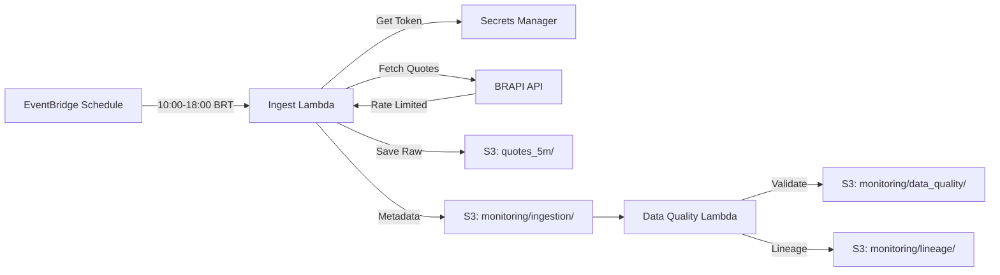
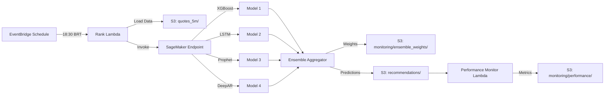
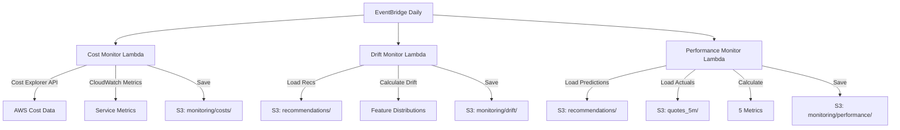
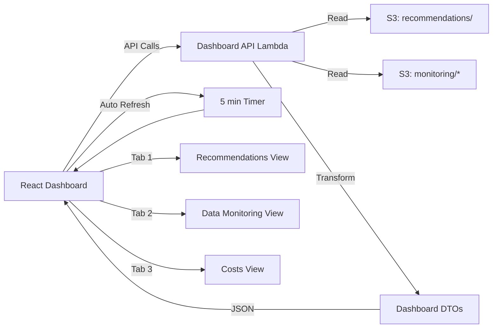

# Design Document: ML Monitoring, Governance & Dashboard

## Overview

Este documento descreve o design técnico completo para a refatoração do sistema de recomendações de ações ML da B3, com foco em três pilares fundamentais:

1. **Governança de Dados**: Sistema robusto para validação, qualidade e linhagem de dados históricos e novos dados ingeridos
2. **Monitoramento de Performance**: Tracking multi-métrico do modelo ensemble com detecção de drift e triggers de retreinamento
3. **Dashboard Redesenhado**: Interface React com 3 abas (Recomendações, Monitoramento de Dados, Custos) para visibilidade total do sistema

### Contexto do Sistema

O sistema atual é um pipeline de ML em produção que:
- Coleta dados de 50 tickers da B3 via API BRAPI durante pregão (10:00-18:00 BRT)
- Mantém histórico de 2 anos de dados de mercado
- Usa ensemble de 4 modelos (XGBoost, LSTM, Prophet, DeepAR) para predições
- Gera recomendações diárias ao final do pregão (18:30 BRT)
- Roda em infraestrutura AWS (Lambda, S3, SageMaker, CloudWatch)

### Problemas Atuais

1. **Segurança**: Chaves de API expostas no código e variáveis de ambiente
2. **Visibilidade**: Falta de monitoramento sobre qualidade dos dados ingeridos
3. **Governança**: Ausência de validação sistemática dos dados históricos
4. **Performance**: Monitoramento insuficiente da degradação do modelo
5. **Custos**: Sem tracking detalhado dos gastos AWS (limite: R$500/mês)
6. **Dashboard**: Interface desatualizada sem informações críticas

### Objetivos do Design


- Implementar armazenamento seguro de credenciais via AWS Secrets Manager
- Criar pipeline de ingestão robusto com retry logic e rate limiting
- Validar integridade de 2 anos de dados históricos (completude, consistência)
- Monitorar qualidade de dados diários (completude, latência, anomalias)
- Rastrear linhagem completa dos dados (origem, transformações, timestamps)
- Calcular 5 métricas de performance do modelo (MAPE, acurácia direcional, MAE, Sharpe, taxa de acerto)
- Detectar drift de modelo e features com triggers automáticos
- Monitorar custos AWS por serviço e componente
- Redesenhar dashboard com 3 abas especializadas
- Garantir atualizações em tempo real (5 minutos) no dashboard

## Architecture

### High-Level Architecture

O sistema segue uma arquitetura serverless event-driven com 4 camadas principais:

```
┌─────────────────────────────────────────────────────────────────┐
│                        PRESENTATION LAYER                        │
│  ┌──────────────────────────────────────────────────────────┐  │
│  │  React Dashboard (3 Tabs)                                 │  │
│  │  - Recomendações  - Monitoramento  - Custos              │  │
│  └──────────────────────────────────────────────────────────┘  │
└─────────────────────────────────────────────────────────────────┘
                              ▲
                              │ HTTPS/REST
                              ▼
┌─────────────────────────────────────────────────────────────────┐
│                          API LAYER                               │
│  ┌──────────────┐  ┌──────────────┐  ┌──────────────┐         │
│  │ Dashboard    │  │ Public       │  │ S3 Proxy     │         │
│  │ API Lambda   │  │ Recs Lambda  │  │ Lambda       │         │
│  └──────────────┘  └──────────────┘  └──────────────┘         │
└─────────────────────────────────────────────────────────────────┘
                              ▲
                              │
                              ▼
┌─────────────────────────────────────────────────────────────────┐
│                      PROCESSING LAYER                            │
│  ┌──────────────┐  ┌──────────────┐  ┌──────────────┐         │
│  │ Data         │  │ Model        │  │ Monitoring   │         │
│  │ Pipeline     │  │ Ensemble     │  │ System       │         │
│  └──────────────┘  └──────────────┘  └──────────────┘         │
└─────────────────────────────────────────────────────────────────┘
                              ▲
                              │
                              ▼
┌─────────────────────────────────────────────────────────────────┐
│                        STORAGE LAYER                             │
│  ┌──────────────┐  ┌──────────────┐  ┌──────────────┐         │
│  │ S3 Data      │  │ Secrets      │  │ CloudWatch   │         │
│  │ Lake         │  │ Manager      │  │ Logs         │         │
│  └──────────────┘  └──────────────┘  └──────────────┘         │
└─────────────────────────────────────────────────────────────────┘
```

### Component Architecture


#### 1. Data Pipeline



**Componentes**:
- **Ingest Lambda**: Coleta dados da BRAPI com retry logic e rate limiting
- **Data Quality Lambda**: Valida completude, detecta anomalias, calcula métricas
- **Historical Validator Lambda**: Valida 2 anos de dados históricos (execução sob demanda)

#### 2. Model Ensemble & Recommendations



**Componentes**:
- **Rank Lambda**: Orquestra geração de recomendações
- **SageMaker Endpoint**: Serve ensemble de modelos
- **Performance Monitor Lambda**: Calcula métricas e detecta drift


#### 3. Monitoring System



**Componentes**:
- **Cost Monitor Lambda**: Coleta custos de todos os serviços AWS
- **Drift Monitor Lambda**: Detecta drift de features e performance
- **Performance Monitor Lambda**: Calcula MAPE, acurácia direcional, MAE, Sharpe, taxa de acerto

#### 4. Dashboard & API



**Componentes**:
- **Dashboard API Lambda**: Agrega dados de múltiplas fontes S3
- **React Dashboard**: SPA com 3 abas, auto-refresh, cache local

### Technology Stack


**Backend**:
- Runtime: Python 3.11
- AWS Lambda: Serverless compute
- AWS Secrets Manager: Credenciais seguras
- AWS S3: Data lake (particionado por data)
- AWS SageMaker: Model serving
- AWS EventBridge: Scheduling
- AWS CloudWatch: Logs e métricas
- AWS Cost Explorer: Dados de custo

**Frontend**:
- Framework: React 18.2
- State Management: Zustand 4.4
- Data Fetching: TanStack Query 5.17
- Charts: Recharts 2.12 + Plotly.js 2.27
- Icons: Lucide React 0.460
- Animations: Framer Motion 10.18

**APIs Externas**:
- BRAPI (brapi.dev): Dados de mercado da B3

### Deployment Architecture

**AWS Regions**: us-east-1 (primary)

**S3 Bucket Structure**:
```
b3-tactical-ranking-{account-id}-{region}/
├── config/
│   └── universe.txt                    # 50 tickers
├── quotes_5m/
│   └── dt=YYYY-MM-DD/
│       └── {TICKER}_{HHMMSS}.json     # Dados brutos
├── recommendations/
│   └── dt=YYYY-MM-DD/
│       └── recommendations_{HHMMSS}.json
├── monitoring/
│   ├── ingestion/
│   │   └── dt=YYYY-MM-DD/
│   │       └── ingestion_{HHMMSS}.json
│   ├── data_quality/
│   │   └── dt=YYYY-MM-DD/
│   │       └── quality_{HHMMSS}.json
│   ├── lineage/
│   │   └── dt=YYYY-MM-DD/
│   │       └── lineage_{HHMMSS}.json
│   ├── performance/
│   │   └── dt=YYYY-MM-DD/
│   │       └── performance_{HHMMSS}.json
│   ├── drift/
│   │   └── dt=YYYY-MM-DD/
│   │       └── drift_{HHMMSS}.json
│   ├── costs/
│   │   └── dt=YYYY-MM-DD/
│   │       └── costs_{HHMMSS}.json
│   ├── ensemble_weights/
│   │   └── dt=YYYY-MM-DD/
│   │       └── weights_{HHMMSS}.json
│   ├── api_latency/
│   │   └── dt=YYYY-MM-DD/
│   │       └── latency_{HHMMSS}.json
│   ├── completeness/
│   │   └── dt=YYYY-MM-DD/
│   │       └── completeness_{HHMMSS}.json
│   ├── errors/
│   │   └── dt=YYYY-MM-DD/
│   │       └── errors_{HHMMSS}.json
│   └── validation/
│       └── historical_data_report_YYYY-MM-DD.json
```

## Components and Interfaces


### 1. Data Pipeline Components

#### 1.1 Ingest Lambda

**Responsabilidade**: Coletar dados de mercado da BRAPI durante pregão

**Inputs**:
- EventBridge trigger (a cada 5 minutos, 10:00-18:00 BRT)
- Secrets Manager: BRAPI token

**Outputs**:
- S3: `quotes_5m/dt={date}/{ticker}_{time}.json`
- S3: `monitoring/ingestion/dt={date}/ingestion_{time}.json`

**Algoritmo**:
1. Carregar token da BRAPI do Secrets Manager
2. Ler lista de 50 tickers do S3 (`config/universe.txt`)
3. Para cada batch de 20 tickers:
   - Fazer request para BRAPI com intervalo de 5 minutos
   - Se erro 429: aguardar tempo do header `Retry-After`
   - Se erro 5xx: retry com backoff exponencial (1s, 2s, 4s) até 3 vezes
   - Se erro 4xx (exceto 429): registrar erro e pular ticker
   - Aguardar 500ms antes do próximo batch
4. Salvar cada ponto de dados no S3 com particionamento por data
5. Registrar metadados da execução (timestamp, records, status)
6. Medir latência de cada request (p50, p95, p99)

**Error Handling**:
- Retry com backoff exponencial para erros temporários
- Registro de todos os erros em `monitoring/errors/`
- Continuar processamento mesmo com falhas parciais

**Performance**:
- Timeout: 5 minutos
- Memory: 512 MB
- Concurrency: 1 (evitar rate limiting)


#### 1.2 Data Quality Lambda

**Responsabilidade**: Validar qualidade dos dados ingeridos diariamente

**Inputs**:
- EventBridge trigger (diário, 19:00 BRT)
- S3: `quotes_5m/dt={date}/`
- S3: `quotes_5m/dt={date-1}/` (dia anterior para comparação)

**Outputs**:
- S3: `monitoring/data_quality/dt={date}/quality_{time}.json`
- S3: `monitoring/completeness/dt={date}/completeness_{time}.json`

**Algoritmo**:
1. Carregar todos os dados ingeridos do dia
2. Calcular completude: `(tickers_com_dados / 50) * 100`
3. Identificar tickers faltantes
4. Para cada ticker com dados:
   - Validar que `high >= low`
   - Validar que `open, high, low, close > 0`
   - Validar que `volume >= 0`
5. Comparar com dia anterior:
   - Detectar variações > 50% em volume
   - Detectar variações > 50% em preço
6. Calcular latência média de ingestão
7. Calcular taxa de erro (requests falhados / total)
8. Se completude < 90%: gerar alerta
9. Se completude < 95%: gerar warning

**Métricas Calculadas**:
- `completeness_percentage`: % de tickers com dados
- `missing_tickers`: lista de tickers sem dados
- `avg_ingestion_latency_ms`: latência média
- `error_rate`: % de requests falhados
- `anomalies`: lista de anomalias detectadas
- `quality_score`: score 0-100 baseado em completude e consistência


#### 1.3 Historical Data Validator Lambda

**Responsabilidade**: Validar integridade de 2 anos de dados históricos

**Inputs**:
- Invocação manual ou agendada (semanal)
- S3: `quotes_5m/dt=*/` (últimos 2 anos)

**Outputs**:
- S3: `monitoring/validation/historical_data_report_{date}.json`

**Algoritmo**:
1. Para cada ticker (50 total):
   - Carregar todos os dados dos últimos 2 anos (730 dias)
   - Identificar dias úteis esperados (excluir finais de semana e feriados)
   - Detectar gaps > 5 dias úteis consecutivos
   - Validar consistência de preços (high >= low, valores positivos)
   - Validar volume não-negativo
   - Calcular score de qualidade: `(dias_com_dados / dias_uteis_esperados) * 100`
2. Gerar relatório consolidado:
   - Score geral (média dos 50 tickers)
   - Lista de gaps por ticker
   - Lista de inconsistências por ticker
   - Recomendações de ação

**Relatório Gerado**:
```json
{
  "timestamp": "2024-01-15T10:00:00Z",
  "period_start": "2022-01-15",
  "period_end": "2024-01-15",
  "tickers_validated": 50,
  "overall_quality_score": 94.5,
  "gaps": [
    {
      "ticker": "PETR4",
      "start_date": "2023-06-10",
      "end_date": "2023-06-20",
      "duration_days": 10,
      "recommendation": "Backfill data from alternative source"
    }
  ],
  "inconsistencies": [
    {
      "ticker": "VALE3",
      "date": "2023-08-15",
      "field": "high",
      "value": -10.5,
      "issue": "Negative price",
      "recommendation": "Remove or correct record"
    }
  ],
  "ticker_scores": {
    "PETR4": 92.3,
    "VALE3": 95.1,
    ...
  }
}
```


#### 1.4 Data Lineage Tracker

**Responsabilidade**: Rastrear origem e transformações de dados

**Integração**: Embedded no Ingest Lambda e Data Quality Lambda

**Lineage Record Schema**:
```json
{
  "data_id": "PETR4_2024-01-15_100500",
  "ticker": "PETR4",
  "timestamp": "2024-01-15T10:05:00Z",
  "source": "brapi",
  "source_version": "v2",
  "pipeline_version": "1.2.0",
  "collection_timestamp": "2024-01-15T10:05:23Z",
  "storage_timestamp": "2024-01-15T10:05:25Z",
  "transformations": [
    {
      "type": "validation",
      "timestamp": "2024-01-15T19:00:00Z",
      "status": "passed"
    }
  ],
  "s3_location": "s3://bucket/quotes_5m/dt=2024-01-15/PETR4_100500.json"
}
```

**Outputs**:
- S3: `monitoring/lineage/dt={date}/lineage_{time}.json`

### 2. Model & Recommendations Components

#### 2.1 Rank Lambda

**Responsabilidade**: Orquestrar geração de recomendações diárias

**Inputs**:
- EventBridge trigger (diário, 18:30 BRT)
- S3: `quotes_5m/dt={date}/` (dados do dia)
- SageMaker Endpoint: ensemble de modelos

**Outputs**:
- S3: `recommendations/dt={date}/recommendations_{time}.json`
- S3: `monitoring/ensemble_weights/dt={date}/weights_{time}.json`

**Algoritmo**:
1. Carregar dados de cotações do dia para os 50 tickers
2. Preparar features para cada ticker (últimos 60 dias de contexto)
3. Invocar SageMaker endpoint para cada ticker
4. Coletar predições de cada modelo (XGBoost, LSTM, Prophet, DeepAR)
5. Calcular predição ensemble usando pesos adaptativos
6. Calcular retorno esperado: `(pred_price - current_price) / current_price`
7. Calcular score de confiança baseado em concordância dos modelos
8. Ranquear ações por score de confiança
9. Selecionar top 50 ações
10. Salvar recomendações e pesos do ensemble


#### 2.2 Performance Monitor Lambda

**Responsabilidade**: Calcular métricas de performance do modelo

**Inputs**:
- EventBridge trigger (diário, 20:00 BRT)
- S3: `recommendations/dt={date-20}/` (predições de 20 dias atrás)
- S3: `quotes_5m/dt={date}/` (preços reais de hoje)

**Outputs**:
- S3: `monitoring/performance/dt={date}/performance_{time}.json`

**Algoritmo**:
1. Carregar predições de 20 dias atrás (t-20)
2. Carregar preços reais de hoje (t)
3. Para cada ticker com predição:
   - Calcular erro absoluto: `|pred_price - actual_price|`
   - Calcular erro percentual: `|pred_price - actual_price| / actual_price`
   - Verificar direção: `sign(pred_price - price_t-20) == sign(actual_price - price_t-20)`
   - Verificar retorno positivo: `actual_price > price_t-20`
4. Calcular métricas agregadas:
   - **MAPE**: `mean(|pred - actual| / actual) * 100`
   - **Acurácia Direcional**: `(direções_corretas / total) * 100`
   - **MAE**: `mean(|pred - actual|)`
   - **Sharpe Ratio**: `mean(returns) / std(returns)` (últimos 20 dias)
   - **Taxa de Acerto**: `(retornos_positivos / total) * 100`
5. Salvar histórico de métricas

**Métricas Output**:
```json
{
  "timestamp": "2024-01-15T20:00:00Z",
  "date": "2024-01-15",
  "prediction_date": "2023-12-26",
  "mape": 7.2,
  "directional_accuracy": 68.5,
  "mae": 1.45,
  "sharpe_ratio": 1.23,
  "hit_rate": 72.0,
  "samples_evaluated": 50
}
```


#### 2.3 Drift Monitor Lambda

**Responsabilidade**: Detectar drift de modelo e features

**Inputs**:
- EventBridge trigger (diário, 20:30 BRT)
- S3: `recommendations/dt={date}/` (últimos 7 dias)
- S3: `monitoring/performance/dt={date}/` (últimos 10 dias)

**Outputs**:
- S3: `monitoring/drift/dt={date}/drift_{time}.json`

**Algoritmo**:

**1. Performance Drift Detection**:
- Carregar MAPE dos últimos 5 dias (current window)
- Carregar MAPE dos 5 dias anteriores (reference window)
- Calcular `mape_change = (current_mape - reference_mape) / reference_mape`
- Se `mape_change > 0.5` (50% de degradação): sinalizar drift
- Calcular drift score: `min(mape_change, 1.0)`

**2. Feature Drift Detection**:
- Para cada feature (score, expected_return, volatility):
  - Carregar distribuição dos últimos 2 dias (current)
  - Carregar distribuição dos 5 dias anteriores (reference)
  - Calcular drift usando KL divergence simplificado:
    ```python
    drift = |mean(current) - mean(reference)| / std(reference)
    drift_score = min(drift, 1.0)
    ```
  - Se `drift_score > 0.3`: marcar feature como drifted

**3. Drift Severity**:
- `drift_score > 0.5`: critical
- `drift_score > 0.3`: warning
- `drift_score <= 0.3`: stable

**4. Retraining Trigger**:
- Recomendar retreinamento se:
  - MAPE > 20% OU
  - drift_score > 0.5 OU
  - Mais de 30% das features com drift

**Output Schema**:
```json
{
  "timestamp": "2024-01-15T20:30:00Z",
  "date": "2024-01-15",
  "drift_detected": true,
  "drift_score": 0.42,
  "performance_drift": true,
  "feature_drift_count": 2,
  "baseline_mape": 7.2,
  "current_mape": 10.8,
  "mape_change_percentage": 50.0,
  "features_drift": {
    "score": 0.25,
    "expected_return": 0.45,
    "volatility": 0.38
  },
  "drifted_features": [
    {"feature": "expected_return", "drift_score": 0.45, "status": "drifted"},
    {"feature": "volatility", "drift_score": 0.38, "status": "drifted"}
  ],
  "retrain_recommended": false,
  "retrain_reason": null
}
```


### 3. Monitoring Components

#### 3.1 Cost Monitor Lambda

**Responsabilidade**: Monitorar custos AWS por serviço e componente

**Inputs**:
- EventBridge trigger (diário, 21:00 BRT)
- AWS Cost Explorer API
- CloudWatch Metrics API

**Outputs**:
- S3: `monitoring/costs/dt={date}/costs_{time}.json`
- CloudWatch Custom Metrics

**Algoritmo**:

**1. Coletar Custos por Serviço** (últimos 7 dias):
- SageMaker: training jobs + endpoints
- Lambda: invocações + compute
- S3: storage + requests
- CloudWatch: logs + métricas
- Cost Explorer: custos agregados

**2. Calcular Custos Detalhados**:

**SageMaker**:
```python
# Training jobs
for job in training_jobs:
    duration_hours = (end_time - start_time).hours
    cost = duration_hours * instance_price * instance_count

# Endpoints
for endpoint in endpoints:
    hours_active = (now - creation_time).hours
    cost = hours_active * instance_price * instance_count
```

**Lambda**:
```python
request_cost = (invocations / 1_000_000) * 0.20
memory_gb = memory_mb / 1024
gb_seconds = (invocations * avg_duration_ms / 1000) * memory_gb
compute_cost = gb_seconds * 0.0000166667
total_cost = request_cost + compute_cost
```

**S3**:
```python
storage_cost = size_gb * 0.023  # $0.023 per GB/month
request_cost = (get_requests / 1000) * 0.0004 + (put_requests / 1000) * 0.005
```

**3. Calcular Projeção Mensal**:
```python
daily_avg = sum(last_7_days_costs) / 7
monthly_projection = daily_avg * 30
```

**4. Verificar Thresholds**:
- Total mensal > R$500 (≈ $100): alerta crítico
- Total mensal > R$400 (80%): warning
- Serviço individual com aumento > 50% vs média: anomalia

**5. Calcular Custo por Recomendação**:
```python
cost_per_recommendation = total_daily_cost / num_recommendations
```


**Output Schema**:
```json
{
  "timestamp": "2024-01-15T21:00:00Z",
  "date": "2024-01-15",
  "period_days": 7,
  "total_cost_usd": 45.23,
  "monthly_projection_usd": 193.84,
  "monthly_projection_brl": 967.92,
  "threshold_brl": 500.0,
  "threshold_status": "warning",
  "costs_by_service": {
    "SageMaker": 30.50,
    "Lambda": 8.20,
    "S3": 4.53,
    "CloudWatch": 2.00
  },
  "costs_by_component": {
    "training": 15.00,
    "inference": 15.50,
    "storage": 4.53,
    "compute": 10.20
  },
  "cost_per_recommendation": 0.90,
  "alerts": [
    {
      "type": "threshold_warning",
      "message": "Projeção mensal em 80% do limite (R$967.92 / R$500.00)",
      "severity": "warning"
    }
  ],
  "anomalies": []
}
```

### 4. Dashboard & API Components

#### 4.1 Dashboard API Lambda

**Responsabilidade**: Agregar dados de múltiplas fontes para o dashboard

**Inputs**:
- HTTP GET requests do React Dashboard
- S3: múltiplos prefixos de monitoring

**Endpoints**:

**GET /api/recommendations/latest**
- Retorna recomendações mais recentes
- Response: `RecommendationsDTO`

**GET /api/monitoring/data-quality**
- Retorna status de qualidade dos dados
- Query params: `?days=30`
- Response: `DataQualityDTO`

**GET /api/monitoring/model-performance**
- Retorna métricas de performance do modelo
- Query params: `?days=30`
- Response: `ModelPerformanceDTO`

**GET /api/monitoring/drift**
- Retorna status de drift
- Query params: `?days=30`
- Response: `DriftMonitoringDTO`

**GET /api/monitoring/costs**
- Retorna dados de custos
- Query params: `?days=30`
- Response: `CostsDTO`

**GET /api/monitoring/ensemble-weights**
- Retorna evolução dos pesos do ensemble
- Query params: `?days=30`
- Response: `EnsembleWeightsDTO`


**Caching Strategy**:
- Cache responses por 5 minutos (TTL)
- Usar ETag para validação de cache
- Comprimir responses com gzip

**Performance**:
- Timeout: 30 segundos
- Memory: 1024 MB
- Concurrent requests: 10

#### 4.2 React Dashboard

**Responsabilidade**: Interface visual com 3 abas especializadas

**Architecture**:
```
src/
├── components/
│   ├── recommendations/
│   │   ├── RecommendationsTable.tsx
│   │   ├── RecommendationsKPIs.tsx
│   │   ├── ReturnDistributionChart.tsx
│   │   └── TickerDetailModal.tsx
│   ├── monitoring/
│   │   ├── DataQualityPanel.tsx
│   │   ├── ModelPerformancePanel.tsx
│   │   ├── DriftMonitoringPanel.tsx
│   │   ├── MAPEChart.tsx
│   │   ├── FeaturesTable.tsx
│   │   └── DriftTimeline.tsx
│   ├── costs/
│   │   ├── CostsSummary.tsx
│   │   ├── CostsByServiceChart.tsx
│   │   ├── CostsEvolutionChart.tsx
│   │   └── CostsTable.tsx
│   └── common/
│       ├── Layout.tsx
│       ├── Tabs.tsx
│       ├── LoadingSpinner.tsx
│       └── ErrorBoundary.tsx
├── hooks/
│   ├── useRecommendations.ts
│   ├── useDataQuality.ts
│   ├── useModelPerformance.ts
│   ├── useDrift.ts
│   └── useCosts.ts
├── services/
│   └── api.ts
├── stores/
│   └── dashboardStore.ts
└── types/
    └── dtos.ts
```

**State Management** (Zustand):
```typescript
interface DashboardStore {
  activeTab: 'recommendations' | 'monitoring' | 'costs';
  setActiveTab: (tab: string) => void;
  lastUpdate: Date | null;
  setLastUpdate: (date: Date) => void;
  autoRefresh: boolean;
  toggleAutoRefresh: () => void;
}
```

**Data Fetching** (TanStack Query):
```typescript
const { data, isLoading, error } = useQuery({
  queryKey: ['recommendations', 'latest'],
  queryFn: () => api.getLatestRecommendations(),
  refetchInterval: autoRefresh ? 5 * 60 * 1000 : false, // 5 min
  staleTime: 4 * 60 * 1000, // 4 min
});
```


**Tab 1: Recomendações**
- Tabela com 50 ações ranqueadas
- Colunas: Ticker, Preço Atual, Preço Predito (t+20), Retorno Esperado (%), Score de Confiança, Ranking
- Ordenação por qualquer coluna
- KPIs: Total de Ações, Retorno Médio Esperado, Score Médio
- Gráfico: Distribuição de Retornos Esperados (histograma)
- Modal de detalhes: Contribuição de cada modelo do ensemble

**Tab 2: Monitoramento de Dados**
- Seção 1: Status da Ingestão
  - Última execução (timestamp, status, records ingeridos)
  - Score de qualidade dos dados históricos por ticker
  - Gráfico de linha: Data Quality Metrics (últimos 30 dias)
- Seção 2: Performance do Modelo
  - Status da última execução
  - 5 métricas: MAPE, Acurácia Direcional, MAE, Sharpe Ratio, Taxa de Acerto
  - Gráfico de linha: Evolução do MAPE (últimos 30 dias) com baseline
- Seção 3: Drift Monitoring
  - Alerta visual se drift detectado (warning/critical)
  - Lista de features com drift e drift scores
  - Timeline de eventos de drift (últimos 30 dias)
  - Gráfico de linha: Evolução dos pesos do ensemble

**Tab 3: Custos**
- KPIs: Custo Total do Mês, Projeção Mensal, % do Limite
- Alerta visual se projeção > 80% do limite
- Gráfico de pizza: Distribuição por serviço AWS
- Gráfico de linha: Evolução diária (últimos 30 dias)
- Tabela: Custos por componente (training, inference, storage, compute)
- Métrica: Custo por Recomendação
- Filtro: Últimos 7 dias / 30 dias / Mês atual

## Data Models

### Core Entities

#### Quote (Cotação)
```typescript
interface Quote {
  ticker: string;
  timestamp: string; // ISO 8601
  open: number;
  high: number;
  low: number;
  close: number;
  volume: number;
  ingested_at: string; // ISO 8601
}
```


#### Recommendation (Recomendação)
```typescript
interface Recommendation {
  ticker: string;
  current_price: number;
  predicted_price: number;
  expected_return: number; // percentage
  confidence_score: number; // 0-1
  rank: number; // 1-50
  model_contributions: {
    xgboost: number;
    lstm: number;
    prophet: number;
    deepar: number;
  };
  generated_at: string; // ISO 8601
}
```

#### DataQualityMetrics
```typescript
interface DataQualityMetrics {
  timestamp: string;
  date: string;
  completeness_percentage: number;
  missing_tickers: string[];
  avg_ingestion_latency_ms: number;
  error_rate: number;
  anomalies: Anomaly[];
  quality_score: number; // 0-100
}

interface Anomaly {
  ticker: string;
  date: string;
  metric: 'volume' | 'price';
  current_value: number;
  previous_value: number;
  change_percentage: number;
}
```

#### ModelPerformanceMetrics
```typescript
interface ModelPerformanceMetrics {
  timestamp: string;
  date: string;
  prediction_date: string;
  mape: number;
  directional_accuracy: number;
  mae: number;
  sharpe_ratio: number;
  hit_rate: number;
  samples_evaluated: number;
}
```

#### DriftReport
```typescript
interface DriftReport {
  timestamp: string;
  date: string;
  drift_detected: boolean;
  drift_score: number; // 0-1
  performance_drift: boolean;
  feature_drift_count: number;
  baseline_mape: number;
  current_mape: number;
  mape_change_percentage: number;
  mape_history: MAPEHistoryPoint[];
  features_drift: Record<string, number>;
  drifted_features: DriftedFeature[];
  drift_events: DriftEvent[];
  retrain_recommended: boolean;
  retrain_reason: string | null;
}

interface MAPEHistoryPoint {
  date: string;
  current: number;
  baseline: number;
}

interface DriftedFeature {
  feature: string;
  drift_score: number;
  status: 'stable' | 'drifted';
}

interface DriftEvent {
  date: string;
  type: string;
  description: string;
  severity: 'warning' | 'critical';
}
```


#### CostReport
```typescript
interface CostReport {
  timestamp: string;
  date: string;
  period_days: number;
  total_cost_usd: number;
  monthly_projection_usd: number;
  monthly_projection_brl: number;
  threshold_brl: number;
  threshold_status: 'ok' | 'warning' | 'critical';
  costs_by_service: Record<string, number>;
  costs_by_component: {
    training: number;
    inference: number;
    storage: number;
    compute: number;
  };
  cost_per_recommendation: number;
  daily_costs: DailyCost[];
  alerts: CostAlert[];
  anomalies: CostAnomaly[];
}

interface DailyCost {
  date: string;
  total_usd: number;
}

interface CostAlert {
  type: string;
  message: string;
  severity: 'warning' | 'critical';
}

interface CostAnomaly {
  service: string;
  current_cost: number;
  avg_cost: number;
  change_percentage: number;
}
```

#### EnsembleWeights
```typescript
interface EnsembleWeights {
  timestamp: string;
  date: string;
  weights: {
    xgboost: number;
    lstm: number;
    prophet: number;
    deepar: number;
  };
}
```

#### DataLineage
```typescript
interface DataLineage {
  data_id: string;
  ticker: string;
  timestamp: string;
  source: string;
  source_version: string;
  pipeline_version: string;
  collection_timestamp: string;
  storage_timestamp: string;
  transformations: Transformation[];
  s3_location: string;
}

interface Transformation {
  type: string;
  timestamp: string;
  status: 'passed' | 'failed';
  details?: Record<string, any>;
}
```


### Dashboard DTOs (API Responses)

#### RecommendationsDTO
```typescript
interface RecommendationsDTO {
  timestamp: string;
  date: string;
  items: Recommendation[];
  kpis: {
    total_recommendations: number;
    avg_expected_return: number;
    avg_confidence_score: number;
  };
  return_distribution: {
    bins: number[];
    counts: number[];
  };
}
```

#### DataQualityDTO
```typescript
interface DataQualityDTO {
  current: DataQualityMetrics;
  history: DataQualityMetrics[]; // últimos N dias
  historical_validation: {
    overall_quality_score: number;
    ticker_scores: Record<string, number>;
    gaps_count: number;
    inconsistencies_count: number;
  };
}
```

#### ModelPerformanceDTO
```typescript
interface ModelPerformanceDTO {
  current: ModelPerformanceMetrics;
  history: ModelPerformanceMetrics[]; // últimos N dias
  last_execution: {
    timestamp: string;
    status: 'success' | 'failed';
    error?: string;
  };
}
```

#### DriftMonitoringDTO
```typescript
interface DriftMonitoringDTO {
  current: DriftReport;
  history: DriftReport[]; // últimos N dias
  ensemble_weights_history: EnsembleWeights[];
}
```

#### CostsDTO
```typescript
interface CostsDTO {
  current: CostReport;
  history: CostReport[]; // últimos N dias
}
```

## Design Decisions

### 1. Secrets Management

**Decision**: Usar AWS Secrets Manager para todas as credenciais

**Rationale**:
- Elimina exposição de chaves no código e variáveis de ambiente
- Suporta rotação automática de credenciais
- Integração nativa com Lambda
- Auditoria completa via CloudTrail
- Custo baixo ($0.40/secret/month + $0.05/10k API calls)

**Alternatives Considered**:
- AWS Systems Manager Parameter Store: Menos features de rotação
- Variáveis de ambiente criptografadas: Ainda requer gestão manual


### 2. Data Partitioning Strategy

**Decision**: Particionar dados no S3 por data (dt=YYYY-MM-DD)

**Rationale**:
- Queries eficientes por período (Athena/Glue)
- Lifecycle policies simples (deletar partições antigas)
- Padrão comum em data lakes
- Facilita debugging (dados organizados por dia)

**Alternatives Considered**:
- Particionamento por ticker: Dificulta queries temporais
- Sem particionamento: Performance ruim em queries

### 3. Retry Strategy

**Decision**: Backoff exponencial com jitter para retries

**Rationale**:
- Evita thundering herd problem
- Respeita rate limits da API
- Maximiza chance de sucesso em falhas temporárias
- Padrão recomendado pela AWS

**Implementation**:
```python
def retry_with_backoff(func, max_retries=3):
    for attempt in range(max_retries):
        try:
            return func()
        except Exception as e:
            if attempt == max_retries - 1:
                raise
            wait_time = (2 ** attempt) + random.uniform(0, 1)
            time.sleep(wait_time)
```

### 4. Drift Detection Algorithm

**Decision**: Usar KL divergence simplificado para drift de features

**Rationale**:
- Computacionalmente eficiente
- Não requer distribuições paramétricas
- Funciona bem com amostras pequenas
- Interpretável (score 0-1)

**Formula**:
```python
drift_score = |mean(current) - mean(reference)| / std(reference)
drift_score = min(drift_score, 1.0)  # cap at 1.0
```

**Alternatives Considered**:
- KL divergence completo: Mais complexo, requer mais dados
- Kolmogorov-Smirnov test: Menos interpretável
- Population Stability Index (PSI): Similar, mas menos intuitivo


### 5. Dashboard State Management

**Decision**: Zustand para state management global

**Rationale**:
- Mais simples que Redux (menos boilerplate)
- Performance superior (re-renders otimizados)
- TypeScript first-class support
- Bundle size pequeno (1.2kb)
- Já usado no projeto atual

**Alternatives Considered**:
- Redux: Muito boilerplate para caso de uso simples
- Context API: Performance issues com muitos consumers
- Jotai/Recoil: Menos maduro, comunidade menor

### 6. Data Fetching Strategy

**Decision**: TanStack Query (React Query) para data fetching

**Rationale**:
- Cache automático com invalidação inteligente
- Retry e error handling built-in
- Suporte a polling (auto-refresh)
- Optimistic updates
- DevTools para debugging
- Já usado no projeto atual

**Configuration**:
```typescript
const queryClient = new QueryClient({
  defaultOptions: {
    queries: {
      staleTime: 4 * 60 * 1000, // 4 min
      cacheTime: 10 * 60 * 1000, // 10 min
      retry: 2,
      refetchOnWindowFocus: false,
    },
  },
});
```

### 7. Cost Monitoring Approach

**Decision**: Combinar Cost Explorer API + CloudWatch Metrics

**Rationale**:
- Cost Explorer: Dados oficiais de billing (delay de 24h)
- CloudWatch: Métricas em tempo real (invocações, duração)
- Combinação permite estimativas precisas + alertas rápidos

**Limitations**:
- Cost Explorer tem delay de 24h
- Preços de instâncias podem mudar
- Estimativas podem ter erro de ±10%


### 8. Performance Metrics Selection

**Decision**: 5 métricas complementares (MAPE, Acurácia Direcional, MAE, Sharpe, Taxa de Acerto)

**Rationale**:
- **MAPE**: Erro percentual médio (fácil interpretação)
- **Acurácia Direcional**: Importante para trading (direção > magnitude)
- **MAE**: Erro absoluto (complementa MAPE)
- **Sharpe Ratio**: Retorno ajustado por risco (métrica financeira padrão)
- **Taxa de Acerto**: % de recomendações lucrativas (métrica de negócio)

**Why not just MAPE?**:
- MAPE pode ser enganoso com valores pequenos
- Direção é mais importante que magnitude em trading
- Sharpe captura risco, não apenas retorno
- Taxa de acerto é métrica de negócio clara

### 9. Historical Validation Frequency

**Decision**: Validação semanal dos dados históricos

**Rationale**:
- Dados históricos mudam raramente (apenas backfills)
- Validação completa é computacionalmente cara (2 anos × 50 tickers)
- Semanal é suficiente para detectar problemas
- Pode ser executada manualmente quando necessário

**Cost-Benefit**:
- Validação diária: ~$5/mês, pouco valor adicional
- Validação semanal: ~$0.70/mês, suficiente
- Validação manual: $0, mas requer intervenção

### 10. Dashboard Auto-Refresh Interval

**Decision**: 5 minutos de intervalo de refresh

**Rationale**:
- Dados são gerados diariamente (não há mudanças a cada segundo)
- 5 minutos balanceia atualidade vs custos de API
- Usuário pode forçar refresh manual se necessário
- Reduz custos de Lambda invocations

**Calculation**:
```
Refreshes por dia = (8 horas de uso × 60 min) / 5 min = 96
Refreshes por mês = 96 × 22 dias úteis = 2,112
Custo estimado = 2,112 × $0.0000002 = $0.0004/mês
```


## Error Handling

### Error Categories

#### 1. External API Errors (BRAPI)

**Transient Errors** (retry):
- Network timeouts
- 5xx server errors
- 429 rate limit (with Retry-After)

**Permanent Errors** (skip):
- 400 bad request
- 401 unauthorized
- 404 not found

**Strategy**:
```python
def fetch_with_retry(url, max_retries=3):
    for attempt in range(max_retries):
        try:
            response = requests.get(url, timeout=30)
            
            if response.status_code == 429:
                retry_after = int(response.headers.get('Retry-After', 60))
                time.sleep(retry_after)
                continue
            
            if response.status_code >= 500:
                if attempt < max_retries - 1:
                    wait = (2 ** attempt) + random.uniform(0, 1)
                    time.sleep(wait)
                    continue
                raise APIError(f"Server error: {response.status_code}")
            
            if response.status_code >= 400:
                raise APIError(f"Client error: {response.status_code}")
            
            return response.json()
            
        except requests.Timeout:
            if attempt < max_retries - 1:
                continue
            raise
```


#### 2. AWS Service Errors

**S3 Errors**:
- NoSuchKey: Return empty result or default value
- AccessDenied: Log error, alert ops team
- ServiceUnavailable: Retry with backoff

**Secrets Manager Errors**:
- ResourceNotFoundException: Critical error, stop execution
- AccessDeniedException: Critical error, alert ops team

**SageMaker Errors**:
- ModelNotReadyException: Retry after delay
- ValidationException: Log error, skip prediction

**Strategy**:
```python
def safe_s3_get(bucket, key, default=None):
    try:
        obj = s3.get_object(Bucket=bucket, Key=key)
        return json.loads(obj['Body'].read())
    except s3.exceptions.NoSuchKey:
        logger.warning(f"Key not found: {key}")
        return default
    except Exception as e:
        logger.error(f"S3 error: {e}")
        raise
```

#### 3. Data Validation Errors

**Invalid Data**:
- Negative prices: Log warning, skip record
- Missing required fields: Log error, skip record
- Inconsistent data (high < low): Log error, mark as anomaly

**Strategy**:
```python
def validate_quote(quote):
    errors = []
    
    if quote['high'] < quote['low']:
        errors.append("high < low")
    
    if any(quote[f] <= 0 for f in ['open', 'high', 'low', 'close']):
        errors.append("negative or zero price")
    
    if quote['volume'] < 0:
        errors.append("negative volume")
    
    if errors:
        logger.warning(f"Invalid quote for {quote['ticker']}: {errors}")
        return False
    
    return True
```


#### 4. Dashboard Errors

**API Errors**:
- Network failure: Show cached data + error banner
- Timeout: Retry once, then show error
- 5xx: Show error message, allow manual retry

**Data Loading Errors**:
- Empty response: Show "No data available" message
- Malformed JSON: Log error, show error state
- Missing fields: Use default values, log warning

**Strategy** (React Error Boundary):
```typescript
class ErrorBoundary extends React.Component {
  state = { hasError: false, error: null };
  
  static getDerivedStateFromError(error) {
    return { hasError: true, error };
  }
  
  componentDidCatch(error, errorInfo) {
    console.error('Dashboard error:', error, errorInfo);
    // Send to monitoring service
  }
  
  render() {
    if (this.state.hasError) {
      return <ErrorFallback error={this.state.error} />;
    }
    return this.props.children;
  }
}
```

### Error Logging

**All errors logged to**:
- CloudWatch Logs (structured JSON)
- S3 `monitoring/errors/` (for analysis)

**Log Format**:
```json
{
  "timestamp": "2024-01-15T10:05:23Z",
  "level": "ERROR",
  "component": "ingest_lambda",
  "error_type": "APIError",
  "error_message": "BRAPI timeout",
  "ticker": "PETR4",
  "attempt": 3,
  "context": {
    "url": "https://brapi.dev/api/quote/PETR4",
    "status_code": null
  }
}
```

## Testing Strategy

### Unit Testing

**Framework**: pytest (Python), Jest (TypeScript)

**Coverage Target**: 80% line coverage

**Focus Areas**:
- Data validation logic
- Retry mechanisms
- Drift calculation algorithms
- Cost calculation formulas
- DTO transformations


**Example Unit Tests**:

```python
# test_data_validator.py
def test_validate_quote_with_valid_data():
    quote = {
        'ticker': 'PETR4',
        'open': 30.0,
        'high': 31.0,
        'low': 29.5,
        'close': 30.5,
        'volume': 1000000
    }
    assert validate_quote(quote) == True

def test_validate_quote_with_high_less_than_low():
    quote = {
        'ticker': 'PETR4',
        'open': 30.0,
        'high': 29.0,  # Invalid
        'low': 30.0,
        'close': 30.5,
        'volume': 1000000
    }
    assert validate_quote(quote) == False

def test_validate_quote_with_negative_price():
    quote = {
        'ticker': 'PETR4',
        'open': -30.0,  # Invalid
        'high': 31.0,
        'low': 29.5,
        'close': 30.5,
        'volume': 1000000
    }
    assert validate_quote(quote) == False
```

```python
# test_drift_detector.py
def test_calculate_drift_score_no_drift():
    current = [1.0, 1.1, 0.9, 1.0, 1.1]
    reference = [1.0, 1.0, 1.0, 1.0, 1.0]
    score = calculate_drift_score(current, reference)
    assert score < 0.3  # No significant drift

def test_calculate_drift_score_with_drift():
    current = [2.0, 2.1, 1.9, 2.0, 2.1]
    reference = [1.0, 1.0, 1.0, 1.0, 1.0]
    score = calculate_drift_score(current, reference)
    assert score > 0.5  # Significant drift
```

```typescript
// api.test.ts
describe('API Client', () => {
  it('should fetch recommendations successfully', async () => {
    const data = await api.getLatestRecommendations();
    expect(data).toHaveProperty('items');
    expect(data.items).toBeInstanceOf(Array);
  });
  
  it('should handle network errors gracefully', async () => {
    // Mock network failure
    await expect(api.getLatestRecommendations()).rejects.toThrow();
  });
});
```

### Integration Testing

**Scope**: Test interactions between components

**Test Cases**:
1. **End-to-end ingestion flow**:
   - Trigger Ingest Lambda
   - Verify data saved to S3
   - Verify metadata saved
   - Verify Data Quality Lambda triggered

2. **Recommendations generation flow**:
   - Trigger Rank Lambda
   - Verify SageMaker endpoint invoked
   - Verify recommendations saved
   - Verify Performance Monitor triggered

3. **Dashboard data flow**:
   - Call Dashboard API
   - Verify data aggregated from multiple S3 sources
   - Verify DTOs correctly formatted

### Property-Based Testing

**Framework**: Hypothesis (Python), fast-check (TypeScript)

**Configuration**: Minimum 100 iterations per property test

**Test Tagging**: Each property test must reference its design document property using the format:
```python
# Feature: ml-monitoring-governance-dashboard, Property {number}: {property_text}
```

**Balance with Unit Tests**:
- Unit tests focus on specific examples, edge cases, and error conditions
- Property tests verify universal properties across all inputs
- Both are complementary and necessary for comprehensive coverage
- Avoid writing too many unit tests - property tests handle input coverage

## Correctness Properties

*A property is a characteristic or behavior that should hold true across all valid executions of a system-essentially, a formal statement about what the system should do. Properties serve as the bridge between human-readable specifications and machine-verifiable correctness guarantees.*

### Property Reflection

After analyzing all acceptance criteria, I identified several areas where properties could be combined or where one property subsumes another:

**Redundancy Analysis**:
1. **Data Validation Properties (3.3, 3.4)**: Can be combined into a single comprehensive quote validation property
2. **Storage Format Properties (2.5, 2.6, 4.6, 5.5, 6.6, 7.7, etc.)**: All follow the same pattern of S3 path validation - can be generalized
3. **Alert Generation Properties (4.3, 8.2, 8.4, 8.6, 9.3, 9.7, 17.3)**: All follow pattern "when condition X, generate alert" - can be consolidated by alert type
4. **Metrics Calculation Properties (7.1-7.5)**: Each metric calculation is independent and provides unique validation value
5. **Dashboard Display Properties (10.3, 10.5, 11.3, 11.5, 11.6, etc.)**: Can be combined into properties about required fields in DTOs

After reflection, I've consolidated redundant properties and kept only those that provide unique validation value.

### Property 1: Credentials Never Exposed in Logs

*For any* execution of the data pipeline that accesses credentials, the generated logs should not contain patterns matching API keys, tokens, or passwords (strings matching regex patterns for credentials).

**Validates: Requirements 1.2**

### Property 2: Ingestion Respects Rate Limits

*For any* sequence of API requests during data ingestion, the system should never exceed 20 tickers per request and should maintain at least 500ms between consecutive requests.

**Validates: Requirements 2.3**

### Property 3: Retry with Exponential Backoff

*For any* API error that triggers retry logic, the wait times between attempts should follow exponential backoff pattern (1s, 2s, 4s) with maximum 3 attempts.

**Validates: Requirements 2.4, 19.1, 19.3**

### Property 4: S3 Path Format Consistency

*For any* data stored in S3, the path should follow the pattern `{prefix}/dt=YYYY-MM-DD/{filename}` where the date matches the data's timestamp date.

**Validates: Requirements 2.5, 2.6, 4.6, 5.5, 6.6, 7.7, 9.6, 14.6, 15.5, 16.4, 17.5, 18.2, 19.6**

### Property 5: Quote Data Validation Invariants

*For any* quote record, the following invariants must hold: `high >= low`, all price fields (`open`, `high`, `low`, `close`) are positive, and `volume >= 0`.

**Validates: Requirements 3.3, 3.4**

### Property 6: Gap Detection Accuracy

*For any* sequence of historical data for a ticker, gaps larger than 5 business days should be correctly identified with accurate start date, end date, and duration.

**Validates: Requirements 3.2**

### Property 7: Quality Score Range

*For any* ticker's quality score calculation, the result should be in the range [0, 100] and should decrease monotonically with the number of gaps and inconsistencies detected.

**Validates: Requirements 3.6**

### Property 8: Data Quality Metrics Completeness

*For any* data quality metrics generated, the object must contain all required fields: `completeness_percentage`, `missing_tickers`, `avg_ingestion_latency_ms`, `error_rate`, `anomalies`, and `quality_score`.

**Validates: Requirements 4.1, 4.2**

### Property 9: Completeness Alert Threshold

*For any* data quality metrics where `completeness_percentage < 90%`, an alert should be generated with severity "critical", and for `completeness_percentage < 95%`, a warning should be generated.

**Validates: Requirements 4.3, 17.3**

### Property 10: Anomaly Detection Sensitivity

*For any* pair of consecutive days of data for a ticker, if volume or price changes by more than 50%, an anomaly record should be created with the ticker, date, metric, and change percentage.

**Validates: Requirements 4.4, 4.5**

### Property 11: Data Lineage Completeness

*For any* ingested data point, a corresponding lineage record must exist containing all required fields: `source`, `collection_timestamp`, `storage_timestamp`, `pipeline_version`, and `s3_location`.

**Validates: Requirements 5.1, 5.2, 5.3**

### Property 12: Lineage Serialization Round-Trip

*For any* data lineage record, serializing to JSON and deserializing should produce an equivalent object with all fields preserved.

**Validates: Requirements 5.5**

### Property 13: Recommendations Required Fields

*For any* recommendation generated, it must contain all required fields: `ticker`, `current_price`, `predicted_price`, `expected_return`, `confidence_score`, `rank`, and `model_contributions` for all 4 models (XGBoost, LSTM, Prophet, DeepAR).

**Validates: Requirements 6.4, 18.1**

### Property 14: Top 50 Selection and Ranking

*For any* set of recommendations generated, exactly 50 recommendations should be selected, and they should be ordered by `confidence_score` in descending order with ranks 1-50.

**Validates: Requirements 6.5**

### Property 15: Prediction Horizon Consistency

*For any* recommendation generated, the prediction horizon should be exactly 20 days from the current date.

**Validates: Requirements 6.3**

### Property 16: MAPE Calculation Correctness

*For any* set of predictions and actual prices, MAPE should be calculated as `mean(|predicted - actual| / actual) * 100` and should be non-negative.

**Validates: Requirements 7.1**

### Property 17: Directional Accuracy Range

*For any* set of predictions, directional accuracy should be in the range [0, 100] representing the percentage of times the model correctly predicted the direction of price movement.

**Validates: Requirements 7.2**

### Property 18: MAE Non-Negativity

*For any* set of predictions and actual prices, MAE should be non-negative and calculated as `mean(|predicted - actual|)`.

**Validates: Requirements 7.3**

### Property 19: Sharpe Ratio Calculation

*For any* set of returns with non-zero standard deviation, Sharpe Ratio should be calculated as `mean(returns) / std(returns)`.

**Validates: Requirements 7.4**

### Property 20: Hit Rate Range

*For any* set of recommendations, hit rate should be in the range [0, 100] representing the percentage of recommendations that generated positive returns.

**Validates: Requirements 7.5**

### Property 21: Performance Drift Detection

*For any* two windows of 5 days of MAPE values, if the recent window's mean MAPE is 50% or more higher than the baseline window's mean MAPE, drift should be detected with `drift_detected = true`.

**Validates: Requirements 8.1, 8.2**

### Property 22: Drift Score Range

*For any* drift calculation, the drift score should be in the range [0, 1] where higher values indicate more severe drift.

**Validates: Requirements 8.3**

### Property 23: Feature Drift Critical Threshold

*For any* set of features where more than 30% have individual drift scores > 0.3, the system should signal critical feature drift.

**Validates: Requirements 8.6**

### Property 24: Retraining Trigger Conditions

*For any* performance metrics, retraining should be recommended if and only if: MAPE > 20% OR drift_score > 0.5 OR more than 30% of features have drift.

**Validates: Requirements 15.2**

### Property 25: Monthly Cost Projection

*For any* 7-day window of daily costs, the monthly projection should be calculated as `(sum(costs) / 7) * 30`.

**Validates: Requirements 9.2**

### Property 26: Cost Threshold Alerts

*For any* monthly cost projection, if it exceeds 100% of the threshold (R$500), a critical alert should be generated; if it exceeds 80%, a warning should be generated.

**Validates: Requirements 9.3, 12.8, 12.9**

### Property 27: Cost Breakdown Completeness

*For any* cost report, it must contain breakdowns by all specified services (Lambda, S3, SageMaker, CloudWatch) and by all components (training, inference, storage, compute).

**Validates: Requirements 9.1, 9.4, 12.6**

### Property 28: Cost Per Recommendation

*For any* period with total costs and number of recommendations, cost per recommendation should be calculated as `total_cost / num_recommendations` and should be non-negative.

**Validates: Requirements 9.5, 12.7**

### Property 29: Cost Anomaly Detection

*For any* service's daily cost, if it increases by more than 50% compared to the 7-day average, a cost anomaly alert should be generated.

**Validates: Requirements 9.7**

### Property 30: Dashboard DTO Required Fields

*For any* dashboard API response, the DTO must contain all required fields for its type (RecommendationsDTO must have `items`, `kpis`, `return_distribution`; DataQualityDTO must have `current`, `history`, `historical_validation`; etc.).

**Validates: Requirements 10.3, 10.5, 11.3, 11.5, 11.6, 12.3, 12.6, 12.7**

### Property 31: Drift Alert Severity Mapping

*For any* drift detection, if `drift_score > 0.5`, severity should be "critical"; if `drift_score > 0.3`, severity should be "warning"; otherwise "stable".

**Validates: Requirements 11.8**

### Property 32: Timestamp Presence in Dashboard

*For any* dashboard tab rendering, a `last_update` timestamp should be present and should be a valid ISO 8601 datetime string.

**Validates: Requirements 13.3**

### Property 33: Failed Update Data Preservation

*For any* dashboard update failure, the previously loaded data should remain visible and accessible to the user.

**Validates: Requirements 13.4**

### Property 34: Historical Validation Report Completeness

*For any* historical validation report generated, it must contain: `period_start`, `period_end`, `tickers_validated`, `overall_quality_score`, `gaps` array, `inconsistencies` array, and `ticker_scores` object.

**Validates: Requirements 14.2, 14.3, 14.4**

### Property 35: Problem Recommendations in Report

*For any* gap or inconsistency detected in the historical validation report, there must be a corresponding recommendation for action.

**Validates: Requirements 14.5**

### Property 36: Retraining Notification Completeness

*For any* retraining recommendation generated, the notification must contain: `current_metrics`, `baseline_metrics`, `drift_score`, and `retrain_command`.

**Validates: Requirements 15.3, 15.4**

### Property 37: API Latency Percentile Calculation

*For any* batch of API requests, latency percentiles (p50, p95, p99) should be correctly calculated from the response time distribution, and p50 <= p95 <= p99.

**Validates: Requirements 16.2**

### Property 38: High Latency Event Threshold

*For any* batch of API requests where p95 latency exceeds 5000ms, a high latency event should be registered.

**Validates: Requirements 16.3**

### Property 39: Completeness Rate Calculation

*For any* set of 50 configured tickers and ingested data, completeness rate should be calculated as `(tickers_with_data / 50) * 100` and should be in range [0, 100].

**Validates: Requirements 17.2**

### Property 40: Missing Tickers Identification

*For any* incomplete ingestion, the `missing_tickers` list should contain exactly those tickers from the configured 50 that have no data.

**Validates: Requirements 17.4**

### Property 41: Retry-After Header Respect

*For any* 429 rate limit error with a `Retry-After` header, the system should wait at least the specified number of seconds before retrying.

**Validates: Requirements 19.2**

### Property 42: 4xx Error No Retry

*For any* 4xx error (except 429), the system should not retry and should skip to the next ticker, logging the error.

**Validates: Requirements 19.4**

### Property 43: Complete Failure After Max Retries

*For any* sequence of failed retries that reaches the maximum (3 attempts), the system should register a complete failure and generate an alert.

**Validates: Requirements 19.5**

### Property 44: Table Pagination Threshold

*For any* dashboard table with more than 100 rows, pagination should be enabled.

**Validates: Requirements 20.5**

### Property 45: API Response Compression

*For any* API response from the Dashboard API Lambda, the response should be compressed with gzip encoding.

**Validates: Requirements 20.6**

