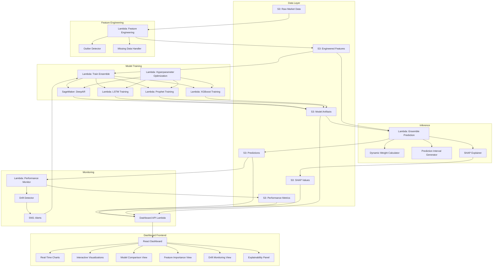

# Design Document: Model Optimization

## Overview

Este documento descreve o design técnico para otimização do sistema de forecasting de ações da B3. O sistema atual utiliza DeepAR com MAPE de 10.5% e cobertura de 94.1%. A solução proposta implementa um ensemble de modelos (DeepAR, LSTM, Prophet, XGBoost) com feature engineering avançado, otimização bayesiana de hiperparâmetros, e monitoramento contínuo de performance e drift.

### Objetivos

- Reduzir MAPE de 10.5% para abaixo de 7%
- Manter cobertura acima de 90%
- Implementar pipeline automatizado de retreinamento
- Detectar e alertar sobre model drift
- Fornecer explicabilidade das previsões

### Tecnologias

**Backend & ML:**
- **AWS SageMaker**: Treinamento de modelos DeepAR e LSTM
- **AWS Lambda**: Orquestração de pipelines e inferência
- **AWS S3**: Armazenamento de dados, features e modelos
- **AWS SNS**: Alertas de drift e degradação
- **Python 3.9+**: Linguagem principal
- **PyTorch**: Framework para LSTM customizado
- **Prophet**: Modelo de séries temporais do Facebook
- **XGBoost**: Gradient boosting
- **Optuna**: Otimização bayesiana de hiperparâmetros
- **SHAP**: Explicabilidade de modelos

**Frontend & Visualization:**
- **React 18**: Framework UI com hooks e context API
- **Recharts 2.12**: Biblioteca de gráficos interativos
- **D3.js**: Visualizações customizadas avançadas
- **Plotly.js**: Gráficos 3D e interativos
- **React Query**: Cache e sincronização de dados
- **Zustand**: State management leve e performático
- **Framer Motion**: Animações fluidas
- **TailwindCSS**: Styling responsivo e moderno

## Architecture

### System Architecture



### Component Interaction Flow

1. **Feature Engineering Pipeline**:
   - Lambda lê dados brutos do S3
   - Outlier Detector identifica anomalias usando Isolation Forest
   - Missing Data Handler aplica interpolação
   - Feature Engine calcula 50+ features (indicadores técnicos, lags, rolling stats)
   - Features normalizadas são salvas no S3

2. **Training Pipeline**:
   - Lambda orquestra treinamento de 4 modelos em paralelo
   - Hyperparameter Optimizer executa otimização bayesiana com Optuna
   - Cada modelo é treinado com walk-forward validation
   - Artefatos de modelos são salvos no S3 com versionamento

3. **Inference Pipeline**:
   - Lambda carrega modelos do S3
   - Cada modelo gera previsões independentes
   - Weight Calculator ajusta pesos baseado em performance histórica
   - Ensemble combina previsões usando weighted average
   - Interval Generator cria intervalos de confiança usando quantile regression
   - SHAP Explainer calcula feature importance para cada previsão

4. **Monitoring Pipeline**:
   - Lambda calcula métricas diárias (MAPE, coverage, interval width)
   - Drift Detector executa KS test em features
   - Métricas são salvas no S3 para histórico
   - Alertas SNS são enviados quando thresholds são excedidos

5. **Dashboard Pipeline**:
   - Dashboard API Lambda agrega dados de múltiplas fontes S3
   - React App consome API via fetch com cache (React Query)
   - Visualizações interativas atualizam em tempo real (polling 30s)
   - Usuário pode filtrar por ação, período, modelo
   - Drill-down em métricas específicas e explicabilidade

## Components and Interfaces

### 1. Feature Engineering Component

**Responsabilidade**: Calcular features avançadas de mercado e preparar dados para treinamento.

**Módulos**:

#### 1.1 Technical Indicators Calculator
```python
class TechnicalIndicatorsCalculator:
    def calculate_rsi(self, prices: pd.Series, period: int = 14) -> pd.Series
    def calculate_macd(self, prices: pd.Series) -> Tuple[pd.Series, pd.Series, pd.Series]
    def calculate_bollinger_bands(self, prices: pd.Series, period: int = 20) -> Tuple[pd.Series, pd.Series, pd.Series]
    def calculate_stochastic(self, high: pd.Series, low: pd.Series, close: pd.Series) -> pd.Series
    def calculate_atr(self, high: pd.Series, low: pd.Series, close: pd.Series) -> pd.Series
```

#### 1.2 Rolling Statistics Calculator
```python
class RollingStatsCalculator:
    def calculate_rolling_mean(self, series: pd.Series, windows: List[int]) -> pd.DataFrame
    def calculate_rolling_std(self, series: pd.Series, windows: List[int]) -> pd.DataFrame
    def calculate_rolling_min_max(self, series: pd.Series, windows: List[int]) -> pd.DataFrame
    def calculate_ewm_volatility(self, returns: pd.Series, span: int = 20) -> pd.Series
```

#### 1.3 Lag Features Calculator
```python
class LagFeaturesCalculator:
    def create_lags(self, series: pd.Series, lags: List[int]) -> pd.DataFrame
    def create_diff_features(self, series: pd.Series, periods: List[int]) -> pd.DataFrame
```

#### 1.4 Volume Features Calculator
```python
class VolumeFeaturesCalculator:
    def calculate_volume_ratio(self, volume: pd.Series, window: int = 20) -> pd.Series
    def calculate_obv(self, close: pd.Series, volume: pd.Series) -> pd.Series
    def calculate_vwap(self, high: pd.Series, low: pd.Series, close: pd.Series, volume: pd.Series) -> pd.Series
```

#### 1.5 Feature Normalizer
```python
class FeatureNormalizer:
    def fit(self, features: pd.DataFrame) -> None
    def transform(self, features: pd.DataFrame) -> pd.DataFrame
    def inverse_transform(self, features: pd.DataFrame) -> pd.DataFrame
    def save_scaler(self, path: str) -> None
    def load_scaler(self, path: str) -> None
```

**Interface Lambda**:
```python
def lambda_handler(event, context):
    """
    Event: {
        "stock_symbols": ["PETR4", "VALE3", ...],
        "start_date": "2023-01-01",
        "end_date": "2024-01-01"
    }
    
    Returns: {
        "status": "success",
        "features_s3_path": "s3://bucket/features/2024-01-01/",
        "num_stocks": 100,
        "num_features": 52
    }
    """
```

### 2. Outlier Detection Component

**Responsabilidade**: Identificar e tratar anomalias nos dados.

**Módulos**:

#### 2.1 Isolation Forest Detector
```python
class IsolationForestDetector:
    def __init__(self, contamination: float = 0.01)
    def fit(self, data: pd.DataFrame) -> None
    def detect(self, data: pd.DataFrame) -> np.ndarray  # Boolean mask
    def get_anomaly_scores(self, data: pd.DataFrame) -> np.ndarray
```

#### 2.2 Statistical Outlier Detector
```python
class StatisticalOutlierDetector:
    def detect_zscore(self, series: pd.Series, threshold: float = 3.5) -> np.ndarray
    def detect_iqr(self, series: pd.Series, multiplier: float = 1.5) -> np.ndarray
```

#### 2.3 Outlier Treatment
```python
class OutlierTreatment:
    def winsorize(self, series: pd.Series, lower_percentile: float = 0.01, upper_percentile: float = 0.99) -> pd.Series
    def interpolate(self, series: pd.Series, method: str = 'linear') -> pd.Series
    def log_outliers(self, outliers: pd.DataFrame, log_path: str) -> None
```

**Interface Lambda**:
```python
def lambda_handler(event, context):
    """
    Event: {
        "data_s3_path": "s3://bucket/raw/2024-01-01/",
        "detection_method": "isolation_forest",
        "treatment_method": "winsorize"
    }
    
    Returns: {
        "status": "success",
        "outliers_detected": 45,
        "outliers_treated": 45,
        "audit_log_path": "s3://bucket/logs/outliers/2024-01-01.json"
    }
    """
```

### 3. Model Ensemble Component

**Responsabilidade**: Treinar e gerenciar ensemble de modelos.

**Módulos**:

#### 3.1 DeepAR Model Wrapper
```python
class DeepARModel:
    def __init__(self, sagemaker_client)
    def train(self, train_data: pd.DataFrame, hyperparameters: Dict) -> str  # Returns job name
    def predict(self, input_data: pd.DataFrame, model_endpoint: str) -> np.ndarray
    def get_prediction_intervals(self, input_data: pd.DataFrame, quantiles: List[float]) -> pd.DataFrame
```

#### 3.2 LSTM Model
```python
class LSTMModel(nn.Module):
    def __init__(self, input_size: int, hidden_size: int, num_layers: int, dropout: float)
    def forward(self, x: torch.Tensor) -> torch.Tensor
    def train_model(self, train_loader: DataLoader, val_loader: DataLoader, epochs: int) -> Dict
    def predict(self, input_data: np.ndarray) -> np.ndarray
    def save_model(self, path: str) -> None
    def load_model(self, path: str) -> None
```

#### 3.3 Prophet Model Wrapper
```python
class ProphetModel:
    def __init__(self)
    def train(self, train_data: pd.DataFrame, hyperparameters: Dict) -> None
    def predict(self, periods: int) -> pd.DataFrame
    def get_prediction_intervals(self, periods: int, interval_width: float = 0.95) -> pd.DataFrame
```

#### 3.4 XGBoost Model Wrapper
```python
class XGBoostModel:
    def __init__(self)
    def train(self, X_train: pd.DataFrame, y_train: pd.Series, hyperparameters: Dict) -> None
    def predict(self, X_test: pd.DataFrame) -> np.ndarray
    def get_feature_importance(self) -> pd.DataFrame
    def save_model(self, path: str) -> None
    def load_model(self, path: str) -> None
```

#### 3.5 Ensemble Manager
```python
class EnsembleManager:
    def __init__(self, models: List[BaseModel])
    def train_all(self, train_data: pd.DataFrame) -> Dict[str, Any]
    def predict_all(self, input_data: pd.DataFrame) -> Dict[str, np.ndarray]
    def calculate_weights(self, validation_results: Dict[str, float]) -> Dict[str, float]
    def weighted_average(self, predictions: Dict[str, np.ndarray], weights: Dict[str, float]) -> np.ndarray
    def generate_ensemble_intervals(self, predictions: Dict[str, np.ndarray], quantiles: List[float]) -> pd.DataFrame
```

**Interface Lambda (Training)**:
```python
def lambda_handler(event, context):
    """
    Event: {
        "features_s3_path": "s3://bucket/features/2024-01-01/",
        "models_to_train": ["deepar", "lstm", "prophet", "xgboost"],
        "hyperparameters": {...}
    }
    
    Returns: {
        "status": "success",
        "models_trained": 4,
        "model_artifacts": {
            "deepar": "s3://bucket/models/deepar/v1.0/",
            "lstm": "s3://bucket/models/lstm/v1.0/",
            "prophet": "s3://bucket/models/prophet/v1.0/",
            "xgboost": "s3://bucket/models/xgboost/v1.0/"
        },
        "validation_metrics": {
            "deepar": {"mape": 8.2, "coverage": 91.5},
            "lstm": {"mape": 7.8, "coverage": 92.1},
            "prophet": {"mape": 9.1, "coverage": 90.3},
            "xgboost": {"mape": 7.5, "coverage": 89.8}
        }
    }
    """
```

**Interface Lambda (Prediction)**:
```python
def lambda_handler(event, context):
    """
    Event: {
        "stock_symbols": ["PETR4", "VALE3"],
        "prediction_horizon": 5,
        "model_versions": {
            "deepar": "v1.0",
            "lstm": "v1.0",
            "prophet": "v1.0",
            "xgboost": "v1.0"
        }
    }
    
    Returns: {
        "status": "success",
        "predictions": {
            "PETR4": {
                "point_forecast": [30.5, 30.8, 31.1, 31.3, 31.5],
                "lower_bound": [29.2, 29.4, 29.7, 29.9, 30.1],
                "upper_bound": [31.8, 32.2, 32.5, 32.7, 32.9],
                "ensemble_weights": {"deepar": 0.25, "lstm": 0.30, "prophet": 0.20, "xgboost": 0.25}
            }
        }
    }
    """
```

### 4. Hyperparameter Optimization Component

**Responsabilidade**: Otimizar hiperparâmetros usando otimização bayesiana.

**Módulos**:

#### 4.1 Optuna Optimizer
```python
class OptunaOptimizer:
    def __init__(self, model_type: str, n_trials: int = 50)
    def objective(self, trial: optuna.Trial) -> float
    def optimize(self, train_data: pd.DataFrame, val_data: pd.DataFrame) -> Dict[str, Any]
    def get_best_params(self) -> Dict[str, Any]
    def save_study(self, path: str) -> None
    def load_study(self, path: str) -> None
```

#### 4.2 Walk-Forward Validator
```python
class WalkForwardValidator:
    def __init__(self, train_window_months: int = 12, test_window_months: int = 1, step_months: int = 1)
    def split_data(self, data: pd.DataFrame) -> List[Tuple[pd.DataFrame, pd.DataFrame]]
    def validate(self, model: BaseModel, data: pd.DataFrame) -> Dict[str, List[float]]
    def aggregate_metrics(self, fold_metrics: Dict[str, List[float]]) -> Dict[str, float]
```

**Interface Lambda**:
```python
def lambda_handler(event, context):
    """
    Event: {
        "model_type": "lstm",
        "features_s3_path": "s3://bucket/features/2024-01-01/",
        "n_trials": 50,
        "timeout_hours": 24
    }
    
    Returns: {
        "status": "success",
        "best_params": {
            "hidden_size": 128,
            "num_layers": 3,
            "dropout": 0.2,
            "learning_rate": 0.001
        },
        "best_mape": 7.5,
        "n_trials_completed": 50,
        "optimization_time_hours": 18.5
    }
    """
```

### 5. Performance Monitoring Component

**Responsabilidade**: Monitorar métricas e detectar drift.

**Módulos**:

#### 5.1 Metrics Calculator
```python
class MetricsCalculator:
    def calculate_mape(self, y_true: np.ndarray, y_pred: np.ndarray) -> float
    def calculate_coverage(self, y_true: np.ndarray, lower: np.ndarray, upper: np.ndarray) -> float
    def calculate_interval_width(self, lower: np.ndarray, upper: np.ndarray, y_pred: np.ndarray) -> float
    def calculate_per_stock_metrics(self, predictions: pd.DataFrame, actuals: pd.DataFrame) -> pd.DataFrame
```

#### 5.2 Drift Detector
```python
class DriftDetector:
    def detect_performance_drift(self, current_mape: float, baseline_mape: float, threshold: float = 0.20) -> bool
    def detect_feature_drift(self, reference_data: pd.DataFrame, current_data: pd.DataFrame, alpha: float = 0.05) -> Dict[str, bool]
    def ks_test(self, reference: np.ndarray, current: np.ndarray) -> Tuple[float, float]
```

#### 5.3 Alert Manager
```python
class AlertManager:
    def __init__(self, sns_client, topic_arn: str)
    def send_drift_alert(self, drift_type: str, details: Dict) -> None
    def send_performance_alert(self, metric: str, current_value: float, threshold: float) -> None
```

#### 5.4 Stock Ranker
```python
class StockRanker:
    def rank_by_mape(self, stock_metrics: pd.DataFrame) -> pd.DataFrame
    def get_top_n(self, ranked_stocks: pd.DataFrame, n: int = 10) -> pd.DataFrame
    def calculate_ranking_stability(self, current_ranking: pd.DataFrame, previous_ranking: pd.DataFrame) -> float
```

**Interface Lambda**:
```python
def lambda_handler(event, context):
    """
    Event: {
        "predictions_s3_path": "s3://bucket/predictions/2024-01-01/",
        "actuals_s3_path": "s3://bucket/actuals/2024-01-01/",
        "baseline_metrics_s3_path": "s3://bucket/baseline/metrics.json"
    }
    
    Returns: {
        "status": "success",
        "metrics": {
            "overall_mape": 6.8,
            "overall_coverage": 91.2,
            "avg_interval_width": 12.5
        },
        "drift_detected": {
            "performance_drift": false,
            "feature_drift": true,
            "drifted_features": ["volume", "rsi"]
        },
        "alerts_sent": 1,
        "top_10_stocks": ["PETR4", "VALE3", ...]
    }
    """
```

### 6. Missing Data Handler Component

**Responsabilidade**: Tratar dados faltantes de forma robusta.

**Módulos**:

#### 6.1 Missing Data Analyzer
```python
class MissingDataAnalyzer:
    def calculate_missing_percentage(self, data: pd.DataFrame) -> pd.Series
    def identify_missing_patterns(self, data: pd.DataFrame) -> Dict[str, str]
```

#### 6.2 Interpolation Handler
```python
class InterpolationHandler:
    def forward_fill(self, series: pd.Series) -> pd.Series
    def linear_interpolate(self, series: pd.Series) -> pd.Series
    def spline_interpolate(self, series: pd.Series, order: int = 3) -> pd.Series
```

#### 6.3 Data Validator
```python
class DataValidator:
    def validate_completeness(self, data: pd.DataFrame, threshold: float = 0.20) -> Tuple[bool, List[str]]
    def validate_schema(self, data: pd.DataFrame, expected_columns: List[str]) -> bool
    def log_validation_results(self, results: Dict, log_path: str) -> None
```

### 7. Dashboard Component

**Responsabilidade**: Fornecer interface interativa para visualização de métricas, comparação de modelos, e monitoramento de drift.

**Arquitetura Frontend**:

```
dashboard/
├── src/
│   ├── components/
│   │   ├── charts/
│   │   │   ├── MAPETimeSeriesChart.jsx
│   │   │   ├── ModelComparisonChart.jsx
│   │   │   ├── FeatureImportanceChart.jsx
│   │   │   ├── DriftDetectionChart.jsx
│   │   │   ├── PredictionIntervalChart.jsx
│   │   │   ├── EnsembleWeightsChart.jsx
│   │   │   └── StockRankingChart.jsx
│   │   ├── panels/
│   │   │   ├── ModelPerformancePanel.jsx
│   │   │   ├── EnsembleInsightsPanel.jsx
│   │   │   ├── FeatureAnalysisPanel.jsx
│   │   │   ├── DriftMonitoringPanel.jsx
│   │   │   ├── ExplainabilityPanel.jsx
│   │   │   └── HyperparameterPanel.jsx
│   │   ├── filters/
│   │   │   ├── StockSelector.jsx
│   │   │   ├── DateRangePicker.jsx
│   │   │   ├── ModelSelector.jsx
│   │   │   └── MetricSelector.jsx
│   │   └── shared/
│   │       ├── LoadingSpinner.jsx
│   │       ├── ErrorBoundary.jsx
│   │       ├── Tooltip.jsx
│   │       └── Card.jsx
│   ├── hooks/
│   │   ├── useMetrics.js
│   │   ├── usePredictions.js
│   │   ├── useModels.js
│   │   ├── useDrift.js
│   │   └── useExplainability.js
│   ├── store/
│   │   ├── dashboardStore.js
│   │   └── filterStore.js
│   ├── services/
│   │   ├── api.js
│   │   └── s3Client.js
│   └── utils/
│       ├── formatters.js
│       ├── calculations.js
│       └── colors.js
```

**Módulos**:

#### 7.1 Dashboard API Lambda
```python
class DashboardAPI:
    def get_performance_metrics(self, stock_symbol: Optional[str], start_date: str, end_date: str) -> Dict
    def get_model_comparison(self, stock_symbol: str, date: str) -> Dict
    def get_feature_importance(self, stock_symbol: str, top_n: int = 20) -> Dict
    def get_drift_status(self, lookback_days: int = 30) -> Dict
    def get_ensemble_weights(self, stock_symbol: Optional[str]) -> Dict
    def get_prediction_details(self, stock_symbol: str, date: str) -> Dict
    def get_hyperparameter_history(self, model_type: str) -> Dict
```

#### 7.2 React Components - Charts

**MAPE Time Series Chart**:
```jsx
const MAPETimeSeriesChart = ({ data, selectedModels, showConfidenceBands }) => {
  // Interactive line chart showing MAPE evolution over time
  // Features:
  // - Multi-line comparison (ensemble vs individual models)
  // - Confidence bands (95% CI)
  // - Zoom and pan
  // - Hover tooltips with detailed metrics
  // - Threshold line at 7% target
  // - Annotations for retraining events
  
  return (
    <ResponsiveContainer width="100%" height={400}>
      <LineChart data={data}>
        <CartesianGrid strokeDasharray="3 3" />
        <XAxis dataKey="date" />
        <YAxis label={{ value: 'MAPE (%)', angle: -90 }} />
        <Tooltip content={<CustomTooltip />} />
        <Legend />
        <ReferenceLine y={7} stroke="red" strokeDasharray="3 3" label="Target" />
        {selectedModels.map(model => (
          <Line 
            key={model}
            type="monotone" 
            dataKey={model} 
            stroke={getModelColor(model)}
            strokeWidth={2}
            dot={{ r: 3 }}
            activeDot={{ r: 6 }}
          />
        ))}
        {showConfidenceBands && (
          <Area 
            type="monotone" 
            dataKey="upper" 
            stroke="none" 
            fill="#8884d8" 
            fillOpacity={0.2} 
          />
        )}
      </LineChart>
    </ResponsiveContainer>
  );
};
```

**Model Comparison Chart**:
```jsx
const ModelComparisonChart = ({ data, metric }) => {
  // Radar chart comparing 4 models across multiple metrics
  // Metrics: MAPE, Coverage, Interval Width, Training Time, Inference Speed
  // Interactive: Click model to highlight, hover for details
  
  return (
    <ResponsiveContainer width="100%" height={400}>
      <RadarChart data={data}>
        <PolarGrid />
        <PolarAngleAxis dataKey="metric" />
        <PolarRadiusAxis angle={90} domain={[0, 100]} />
        <Radar name="DeepAR" dataKey="deepar" stroke="#8884d8" fill="#8884d8" fillOpacity={0.6} />
        <Radar name="LSTM" dataKey="lstm" stroke="#82ca9d" fill="#82ca9d" fillOpacity={0.6} />
        <Radar name="Prophet" dataKey="prophet" stroke="#ffc658" fill="#ffc658" fillOpacity={0.6} />
        <Radar name="XGBoost" dataKey="xgboost" stroke="#ff7c7c" fill="#ff7c7c" fillOpacity={0.6} />
        <Legend />
        <Tooltip />
      </RadarChart>
    </ResponsiveContainer>
  );
};
```

**Feature Importance Chart**:
```jsx
const FeatureImportanceChart = ({ shapValues, topN = 20 }) => {
  // Horizontal bar chart showing SHAP feature importance
  // Interactive: Click bar to see feature distribution
  // Color-coded by feature category (technical, volume, lag, etc)
  
  return (
    <ResponsiveContainer width="100%" height={600}>
      <BarChart data={shapValues.slice(0, topN)} layout="vertical">
        <CartesianGrid strokeDasharray="3 3" />
        <XAxis type="number" label={{ value: 'SHAP Value', position: 'bottom' }} />
        <YAxis type="category" dataKey="feature" width={150} />
        <Tooltip content={<FeatureTooltip />} />
        <Bar dataKey="importance" fill="#8884d8">
          {shapValues.slice(0, topN).map((entry, index) => (
            <Cell key={`cell-${index}`} fill={getFeatureCategoryColor(entry.category)} />
          ))}
        </Bar>
      </BarChart>
    </ResponsiveContainer>
  );
};
```

**Drift Detection Chart**:
```jsx
const DriftDetectionChart = ({ driftData, threshold = 0.05 }) => {
  // Heatmap showing KS test p-values for all features over time
  // Red = drift detected (p < 0.05), Green = no drift
  // Interactive: Click cell to see feature distribution comparison
  
  return (
    <div className="drift-heatmap">
      <ResponsiveContainer width="100%" height={400}>
        <ScatterChart>
          <CartesianGrid />
          <XAxis dataKey="date" name="Date" />
          <YAxis dataKey="feature" name="Feature" type="category" />
          <ZAxis dataKey="pValue" range={[50, 400]} />
          <Tooltip cursor={{ strokeDasharray: '3 3' }} content={<DriftTooltip />} />
          <Scatter data={driftData} fill="#8884d8">
            {driftData.map((entry, index) => (
              <Cell 
                key={`cell-${index}`} 
                fill={entry.pValue < threshold ? '#ff4444' : '#44ff44'} 
              />
            ))}
          </Scatter>
        </ScatterChart>
      </ResponsiveContainer>
    </div>
  );
};
```

**Prediction Interval Chart**:
```jsx
const PredictionIntervalChart = ({ predictions, actuals }) => {
  // Fan chart showing prediction intervals with actual values
  // Shows 50%, 80%, 95% confidence intervals
  // Interactive: Hover to see exact values and coverage
  
  return (
    <ResponsiveContainer width="100%" height={400}>
      <ComposedChart data={predictions}>
        <CartesianGrid strokeDasharray="3 3" />
        <XAxis dataKey="date" />
        <YAxis label={{ value: 'Price (R$)', angle: -90 }} />
        <Tooltip />
        <Legend />
        
        {/* 95% interval */}
        <Area 
          type="monotone" 
          dataKey="upper_95" 
          stroke="none" 
          fill="#8884d8" 
          fillOpacity={0.1} 
        />
        <Area 
          type="monotone" 
          dataKey="lower_95" 
          stroke="none" 
          fill="#8884d8" 
          fillOpacity={0.1} 
        />
        
        {/* 80% interval */}
        <Area 
          type="monotone" 
          dataKey="upper_80" 
          stroke="none" 
          fill="#8884d8" 
          fillOpacity={0.2} 
        />
        <Area 
          type="monotone" 
          dataKey="lower_80" 
          stroke="none" 
          fill="#8884d8" 
          fillOpacity={0.2} 
        />
        
        {/* Point forecast */}
        <Line 
          type="monotone" 
          dataKey="forecast" 
          stroke="#8884d8" 
          strokeWidth={2} 
          dot={false} 
        />
        
        {/* Actual values */}
        <Line 
          type="monotone" 
          dataKey="actual" 
          stroke="#ff7c7c" 
          strokeWidth={2} 
          dot={{ r: 4 }} 
        />
      </ComposedChart>
    </ResponsiveContainer>
  );
};
```

**Ensemble Weights Chart**:
```jsx
const EnsembleWeightsChart = ({ weights, historical = false }) => {
  // Stacked area chart showing ensemble weight evolution
  // Shows how weights change over time based on performance
  // Interactive: Click to see weight calculation details
  
  return (
    <ResponsiveContainer width="100%" height={300}>
      <AreaChart data={weights}>
        <CartesianGrid strokeDasharray="3 3" />
        <XAxis dataKey="date" />
        <YAxis label={{ value: 'Weight', angle: -90 }} />
        <Tooltip />
        <Legend />
        <Area type="monotone" dataKey="deepar" stackId="1" stroke="#8884d8" fill="#8884d8" />
        <Area type="monotone" dataKey="lstm" stackId="1" stroke="#82ca9d" fill="#82ca9d" />
        <Area type="monotone" dataKey="prophet" stackId="1" stroke="#ffc658" fill="#ffc658" />
        <Area type="monotone" dataKey="xgboost" stackId="1" stroke="#ff7c7c" fill="#ff7c7c" />
      </AreaChart>
    </ResponsiveContainer>
  );
};
```

**Stock Ranking Chart**:
```jsx
const StockRankingChart = ({ rankings, showTrend = true }) => {
  // Bump chart showing stock ranking changes over time
  // Top 20 stocks by MAPE
  // Interactive: Click stock to see detailed metrics
  
  return (
    <ResponsiveContainer width="100%" height={500}>
      <LineChart data={rankings}>
        <CartesianGrid strokeDasharray="3 3" />
        <XAxis dataKey="date" />
        <YAxis 
          reversed 
          domain={[1, 20]} 
          label={{ value: 'Rank', angle: -90 }} 
        />
        <Tooltip content={<RankingTooltip />} />
        <Legend />
        {rankings[0]?.stocks.map((stock, idx) => (
          <Line 
            key={stock}
            type="monotone" 
            dataKey={stock} 
            stroke={getStockColor(idx)}
            strokeWidth={2}
            dot={{ r: 3 }}
          />
        ))}
      </LineChart>
    </ResponsiveContainer>
  );
};
```

#### 7.3 React Components - Panels

**Model Performance Panel**:
```jsx
const ModelPerformancePanel = () => {
  const { data, loading, error } = useMetrics();
  const [selectedStock, setSelectedStock] = useState(null);
  const [dateRange, setDateRange] = useState({ start: '2024-01-01', end: '2024-12-31' });
  
  return (
    <Card title="Model Performance" icon={<Activity />}>
      <div className="filters">
        <StockSelector value={selectedStock} onChange={setSelectedStock} />
        <DateRangePicker value={dateRange} onChange={setDateRange} />
      </div>
      
      <div className="metrics-grid">
        <MetricCard 
          title="Ensemble MAPE" 
          value={data?.ensemble_mape} 
          target={7.0}
          format="percentage"
          trend={data?.mape_trend}
        />
        <MetricCard 
          title="Coverage" 
          value={data?.coverage} 
          target={90.0}
          format="percentage"
          trend={data?.coverage_trend}
        />
        <MetricCard 
          title="Avg Interval Width" 
          value={data?.interval_width} 
          target={15.0}
          format="percentage"
          trend={data?.interval_trend}
        />
        <MetricCard 
          title="Top Performers" 
          value={data?.top_performers_count} 
          target={30}
          format="count"
          suffix="stocks"
        />
      </div>
      
      <MAPETimeSeriesChart 
        data={data?.mape_history} 
        selectedModels={['ensemble', 'deepar', 'lstm', 'prophet', 'xgboost']}
        showConfidenceBands={true}
      />
      
      <ModelComparisonChart 
        data={data?.model_comparison} 
        metric="mape"
      />
    </Card>
  );
};
```

**Ensemble Insights Panel**:
```jsx
const EnsembleInsightsPanel = () => {
  const { data } = useModels();
  const [selectedStock, setSelectedStock] = useState('PETR4');
  
  return (
    <Card title="Ensemble Insights" icon={<TrendingUp />}>
      <StockSelector value={selectedStock} onChange={setSelectedStock} />
      
      <div className="insights-grid">
        <div className="weight-section">
          <h4>Current Weights</h4>
          <EnsembleWeightsChart weights={data?.current_weights} />
        </div>
        
        <div className="contribution-section">
          <h4>Model Contributions</h4>
          <PieChart width={300} height={300}>
            <Pie 
              data={data?.contributions} 
              dataKey="value" 
              nameKey="model"
              cx="50%" 
              cy="50%" 
              outerRadius={100}
              label
            >
              {data?.contributions.map((entry, index) => (
                <Cell key={`cell-${index}`} fill={getModelColor(entry.model)} />
              ))}
            </Pie>
            <Tooltip />
          </PieChart>
        </div>
        
        <div className="prediction-section">
          <h4>Prediction Breakdown</h4>
          <table className="prediction-table">
            <thead>
              <tr>
                <th>Model</th>
                <th>Prediction</th>
                <th>Weight</th>
                <th>Contribution</th>
              </tr>
            </thead>
            <tbody>
              {data?.prediction_breakdown.map(row => (
                <tr key={row.model}>
                  <td>{row.model}</td>
                  <td>R$ {row.prediction.toFixed(2)}</td>
                  <td>{(row.weight * 100).toFixed(1)}%</td>
                  <td>R$ {row.contribution.toFixed(2)}</td>
                </tr>
              ))}
            </tbody>
          </table>
        </div>
      </div>
    </Card>
  );
};
```

**Feature Analysis Panel**:
```jsx
const FeatureAnalysisPanel = () => {
  const { data } = useExplainability();
  const [selectedStock, setSelectedStock] = useState('PETR4');
  const [selectedDate, setSelectedDate] = useState(new Date());
  
  return (
    <Card title="Feature Analysis" icon={<BarChart3 />}>
      <div className="filters">
        <StockSelector value={selectedStock} onChange={setSelectedStock} />
        <DatePicker value={selectedDate} onChange={setSelectedDate} />
      </div>
      
      <Tabs>
        <TabPanel label="Feature Importance">
          <FeatureImportanceChart 
            shapValues={data?.shap_values} 
            topN={20}
          />
        </TabPanel>
        
        <TabPanel label="Feature Distributions">
          <div className="distribution-grid">
            {data?.top_features.map(feature => (
              <div key={feature.name} className="distribution-card">
                <h5>{feature.name}</h5>
                <ResponsiveContainer width="100%" height={150}>
                  <AreaChart data={feature.distribution}>
                    <Area type="monotone" dataKey="value" fill="#8884d8" />
                    <XAxis dataKey="date" />
                    <YAxis />
                    <Tooltip />
                  </AreaChart>
                </ResponsiveContainer>
              </div>
            ))}
          </div>
        </TabPanel>
        
        <TabPanel label="Feature Correlations">
          <HeatmapChart 
            data={data?.correlation_matrix}
            xAxis="feature1"
            yAxis="feature2"
            value="correlation"
          />
        </TabPanel>
      </Tabs>
    </Card>
  );
};
```

**Drift Monitoring Panel**:
```jsx
const DriftMonitoringPanel = () => {
  const { data, refresh } = useDrift();
  const [alertsOnly, setAlertsOnly] = useState(false);
  
  return (
    <Card title="Drift Monitoring" icon={<AlertTriangle />}>
      <div className="drift-header">
        <div className="drift-summary">
          <StatusBadge 
            status={data?.performance_drift ? 'critical' : 'good'}
            label="Performance Drift"
          />
          <StatusBadge 
            status={data?.feature_drift_count > 0 ? 'warning' : 'good'}
            label={`${data?.feature_drift_count} Features Drifting`}
          />
        </div>
        
        <div className="drift-controls">
          <Toggle 
            label="Show Alerts Only" 
            checked={alertsOnly} 
            onChange={setAlertsOnly}
          />
          <Button onClick={refresh} icon={<RefreshCw />}>
            Refresh
          </Button>
        </div>
      </div>
      
      <div className="drift-charts">
        <div className="performance-drift-section">
          <h4>Performance Drift</h4>
          <LineChart width={600} height={300} data={data?.mape_history}>
            <CartesianGrid strokeDasharray="3 3" />
            <XAxis dataKey="date" />
            <YAxis />
            <Tooltip />
            <Legend />
            <Line type="monotone" dataKey="current" stroke="#8884d8" name="Current MAPE" />
            <Line type="monotone" dataKey="baseline" stroke="#82ca9d" name="Baseline MAPE" />
            <ReferenceLine 
              y={data?.baseline_mape * 1.2} 
              stroke="red" 
              strokeDasharray="3 3"
              label="Drift Threshold (+20%)"
            />
          </LineChart>
        </div>
        
        <div className="feature-drift-section">
          <h4>Feature Drift Detection</h4>
          <DriftDetectionChart 
            driftData={alertsOnly ? data?.drifted_features : data?.all_features}
            threshold={0.05}
          />
        </div>
        
        <div className="drift-timeline">
          <h4>Drift Events Timeline</h4>
          <Timeline events={data?.drift_events} />
        </div>
      </div>
    </Card>
  );
};
```

**Explainability Panel**:
```jsx
const ExplainabilityPanel = () => {
  const { data } = useExplainability();
  const [selectedStock, setSelectedStock] = useState('PETR4');
  const [selectedPrediction, setSelectedPrediction] = useState(null);
  
  return (
    <Card title="Prediction Explainability" icon={<Info />}>
      <StockSelector value={selectedStock} onChange={setSelectedStock} />
      
      <div className="prediction-selector">
        <h4>Recent Predictions</h4>
        <div className="prediction-list">
          {data?.recent_predictions.map(pred => (
            <PredictionCard 
              key={pred.id}
              prediction={pred}
              selected={selectedPrediction?.id === pred.id}
              onClick={() => setSelectedPrediction(pred)}
            />
          ))}
        </div>
      </div>
      
      {selectedPrediction && (
        <div className="explanation-details">
          <div className="prediction-summary">
            <h4>Prediction: R$ {selectedPrediction.value.toFixed(2)}</h4>
            <p>Confidence: {(selectedPrediction.confidence * 100).toFixed(1)}%</p>
            <p>Dominant Model: {selectedPrediction.dominant_model}</p>
          </div>
          
          <div className="shap-waterfall">
            <h4>Feature Contributions (SHAP)</h4>
            <WaterfallChart 
              data={selectedPrediction.shap_waterfall}
              baseValue={selectedPrediction.base_value}
              finalValue={selectedPrediction.value}
            />
          </div>
          
          <div className="feature-values">
            <h4>Feature Values</h4>
            <table className="feature-table">
              <thead>
                <tr>
                  <th>Feature</th>
                  <th>Value</th>
                  <th>SHAP Impact</th>
                  <th>Direction</th>
                </tr>
              </thead>
              <tbody>
                {selectedPrediction.top_features.map(feat => (
                  <tr key={feat.name}>
                    <td>{feat.name}</td>
                    <td>{feat.value.toFixed(4)}</td>
                    <td>{feat.shap_value.toFixed(4)}</td>
                    <td>
                      <Arrow direction={feat.shap_value > 0 ? 'up' : 'down'} />
                    </td>
                  </tr>
                ))}
              </tbody>
            </table>
          </div>
        </div>
      )}
    </Card>
  );
};
```

#### 7.4 Custom Hooks

**useMetrics Hook**:
```javascript
const useMetrics = (stockSymbol = null, dateRange = null) => {
  return useQuery({
    queryKey: ['metrics', stockSymbol, dateRange],
    queryFn: async () => {
      const response = await fetch(`/api/metrics?stock=${stockSymbol}&start=${dateRange.start}&end=${dateRange.end}`);
      return response.json();
    },
    refetchInterval: 30000, // Refresh every 30 seconds
    staleTime: 20000,
  });
};
```

**useDrift Hook**:
```javascript
const useDrift = (lookbackDays = 30) => {
  const queryClient = useQueryClient();
  
  const query = useQuery({
    queryKey: ['drift', lookbackDays],
    queryFn: async () => {
      const response = await fetch(`/api/drift?lookback=${lookbackDays}`);
      return response.json();
    },
    refetchInterval: 60000, // Refresh every minute
  });
  
  const refresh = () => {
    queryClient.invalidateQueries(['drift']);
  };
  
  return { ...query, refresh };
};
```

#### 7.5 State Management (Zustand)

```javascript
const useDashboardStore = create((set) => ({
  selectedStock: null,
  dateRange: { start: '2024-01-01', end: '2024-12-31' },
  selectedModels: ['ensemble', 'deepar', 'lstm', 'prophet', 'xgboost'],
  theme: 'light',
  
  setSelectedStock: (stock) => set({ selectedStock: stock }),
  setDateRange: (range) => set({ dateRange: range }),
  toggleModel: (model) => set((state) => ({
    selectedModels: state.selectedModels.includes(model)
      ? state.selectedModels.filter(m => m !== model)
      : [...state.selectedModels, model]
  })),
  setTheme: (theme) => set({ theme }),
}));
```

**Interface Lambda (Dashboard API)**:
```python
def lambda_handler(event, context):
    """
    Event: {
        "endpoint": "performance_metrics",
        "params": {
            "stock_symbol": "PETR4",
            "start_date": "2024-01-01",
            "end_date": "2024-12-31"
        }
    }
    
    Returns: {
        "status": "success",
        "data": {
            "ensemble_mape": 6.5,
            "coverage": 91.2,
            "interval_width": 12.3,
            "top_performers_count": 35,
            "mape_history": [...],
            "model_comparison": {...},
            "mape_trend": "improving"
        }
    }
    """
```

### 8. Model Explainability Component

**Responsabilidade**: Fornecer explicabilidade das previsões.

**Módulos**:

#### 7.1 SHAP Explainer
```python
class SHAPExplainer:
    def __init__(self, model: BaseModel, background_data: pd.DataFrame)
    def calculate_shap_values(self, input_data: pd.DataFrame) -> np.ndarray
    def get_top_features(self, shap_values: np.ndarray, feature_names: List[str], n: int = 10) -> pd.DataFrame
    def aggregate_feature_importance(self, shap_values: np.ndarray) -> pd.DataFrame
```

#### 7.2 Ensemble Contribution Analyzer
```python
class EnsembleContributionAnalyzer:
    def identify_dominant_model(self, predictions: Dict[str, np.ndarray], weights: Dict[str, float], final_prediction: np.ndarray) -> str
    def calculate_model_contributions(self, predictions: Dict[str, np.ndarray], weights: Dict[str, float]) -> Dict[str, float]
```

## Data Models

### Dashboard API Response Schemas

```python
@dataclass
class DashboardMetricsResponse:
    ensemble_mape: float
    coverage: float
    interval_width: float
    top_performers_count: int
    mape_trend: str  # "improving", "stable", "degrading"
    coverage_trend: str
    interval_trend: str
    
    # Time series data
    mape_history: List[Dict[str, Any]]  # [{date, ensemble, deepar, lstm, prophet, xgboost}]
    coverage_history: List[Dict[str, Any]]
    
    # Model comparison
    model_comparison: Dict[str, Dict[str, float]]  # {model: {mape, coverage, interval_width, ...}}
    
    # Per-stock breakdown (if stock_symbol provided)
    stock_metrics: Optional[Dict[str, Any]]

@dataclass
class DriftStatusResponse:
    performance_drift: bool
    feature_drift_count: int
    baseline_mape: float
    current_mape: float
    mape_change_percentage: float
    
    # Drift history
    mape_history: List[Dict[str, Any]]  # [{date, current, baseline}]
    
    # Feature drift details
    all_features: List[Dict[str, Any]]  # [{feature, date, pValue, driftDetected}]
    drifted_features: List[Dict[str, Any]]
    
    # Timeline
    drift_events: List[Dict[str, Any]]  # [{date, type, description, severity}]

@dataclass
class ExplainabilityResponse:
    stock_symbol: str
    prediction_date: datetime
    prediction_value: float
    confidence: float
    dominant_model: str
    base_value: float
    
    # SHAP values
    shap_waterfall: List[Dict[str, Any]]  # [{feature, value, shap_value}]
    top_features: List[Dict[str, Any]]  # [{name, value, shap_value, category}]
    
    # Feature distributions
    feature_distributions: Dict[str, List[Dict[str, Any]]]
    
    # Model contributions
    model_contributions: Dict[str, float]  # {model: contribution}

@dataclass
class EnsembleInsightsResponse:
    stock_symbol: str
    current_weights: Dict[str, float]  # {model: weight}
    weight_history: List[Dict[str, Any]]  # [{date, deepar, lstm, prophet, xgboost}]
    
    # Prediction breakdown
    prediction_breakdown: List[Dict[str, Any]]  # [{model, prediction, weight, contribution}]
    
    # Model contributions (pie chart data)
    contributions: List[Dict[str, Any]]  # [{model, value}]
```

### Feature Data Schema

```python
@dataclass
class FeatureData:
    stock_symbol: str
    date: datetime
    
    # Price features
    close: float
    open: float
    high: float
    low: float
    volume: float
    
    # Technical indicators
    rsi_14: float
    macd: float
    macd_signal: float
    macd_hist: float
    bb_upper: float
    bb_middle: float
    bb_lower: float
    stochastic: float
    atr: float
    
    # Rolling statistics (5, 10, 20, 60 days)
    rolling_mean_5: float
    rolling_mean_10: float
    rolling_mean_20: float
    rolling_mean_60: float
    rolling_std_5: float
    rolling_std_10: float
    rolling_std_20: float
    rolling_std_60: float
    rolling_min_20: float
    rolling_max_20: float
    
    # Lag features
    lag_1: float
    lag_2: float
    lag_3: float
    lag_5: float
    lag_10: float
    
    # Volatility
    ewm_volatility: float
    
    # Volume features
    volume_ratio: float
    obv: float
    vwap: float
    
    # Normalized versions
    close_normalized: float
    volume_normalized: float
```

### Prediction Data Schema

```python
@dataclass
class PredictionData:
    stock_symbol: str
    prediction_date: datetime
    forecast_horizon: int  # Days ahead
    
    # Ensemble predictions
    point_forecast: float
    lower_bound_95: float
    upper_bound_95: float
    
    # Individual model predictions
    deepar_prediction: float
    lstm_prediction: float
    prophet_prediction: float
    xgboost_prediction: float
    
    # Ensemble weights
    deepar_weight: float
    lstm_weight: float
    prophet_weight: float
    xgboost_weight: float
    
    # Metadata
    model_version: str
    prediction_timestamp: datetime
```

### Model Metadata Schema

```python
@dataclass
class ModelMetadata:
    model_id: str
    model_type: str  # "deepar", "lstm", "prophet", "xgboost"
    version: str
    
    # Training info
    training_date: datetime
    training_data_start: datetime
    training_data_end: datetime
    num_training_samples: int
    
    # Hyperparameters
    hyperparameters: Dict[str, Any]
    
    # Performance metrics
    validation_mape: float
    validation_coverage: float
    validation_interval_width: float
    
    # Artifacts
    model_s3_path: str
    scaler_s3_path: str
    
    # Status
    status: str  # "active", "deprecated", "testing"
    deployed_date: Optional[datetime]
```

### Performance Metrics Schema

```python
@dataclass
class PerformanceMetrics:
    metric_date: datetime
    stock_symbol: Optional[str]  # None for overall metrics
    
    # Accuracy metrics
    mape: float
    mae: float
    rmse: float
    
    # Interval metrics
    coverage: float
    avg_interval_width: float
    interval_width_percentage: float
    
    # Per-model metrics
    model_metrics: Dict[str, Dict[str, float]]
    
    # Ranking
    rank: Optional[int]
    rank_change: Optional[int]
```

### Drift Detection Schema

```python
@dataclass
class DriftDetectionResult:
    detection_date: datetime
    
    # Performance drift
    current_mape: float
    baseline_mape: float
    mape_change_percentage: float
    performance_drift_detected: bool
    
    # Feature drift
    feature_drift_results: Dict[str, Dict[str, Any]]  # {feature_name: {ks_statistic, p_value, drift_detected}}
    num_drifted_features: int
    
    # Actions taken
    alert_sent: bool
    retraining_triggered: bool
```

### Outlier Detection Schema

```python
@dataclass
class OutlierDetectionResult:
    detection_date: datetime
    stock_symbol: str
    
    # Outliers detected
    outlier_indices: List[int]
    outlier_dates: List[datetime]
    outlier_values: List[float]
    outlier_scores: List[float]
    
    # Treatment applied
    treatment_method: str  # "winsorize", "interpolate", "exclude"
    treated_values: List[float]
    
    # Audit
    detection_method: str  # "isolation_forest", "zscore", "iqr"
    logged: bool
```


## Correctness Properties

*A property is a characteristic or behavior that should hold true across all valid executions of a system-essentially, a formal statement about what the system should do. Properties serve as the bridge between human-readable specifications and machine-verifiable correctness guarantees.*

### Property Reflection

Após análise dos critérios de aceitação, identifiquei as seguintes redundâncias e oportunidades de consolidação:

- **Propriedades 3.1-3.5**: Podem ser consolidadas em uma única propriedade que verifica a presença de todas as features obrigatórias
- **Propriedades 4.2 e 4.5**: Ambas tratam de métodos de combinação de previsões, podem ser consolidadas
- **Propriedades 10.1 e 10.5**: Ambas tratam de métodos de geração de intervalos, podem ser consolidadas
- **Propriedades 11.1-11.3**: Podem ser consolidadas em uma única propriedade que testa a estratégia de tratamento baseada em percentual de dados faltantes
- **Propriedades 14.2 e 14.3**: Podem ser consolidadas em uma única propriedade sobre métodos de augmentation

### Property 1: Ensemble MAPE Target Achievement

*For any* validation dataset with at least 12 months of historical data, when the Model_Ensemble generates predictions using walk-forward validation, the overall MAPE SHALL be below 7%.

**Validates: Requirements 1.1, 1.3**

### Property 2: Top Performer Distribution

*For any* set of stocks in the validation dataset, at least 30% of stocks SHALL achieve MAPE below 5%.

**Validates: Requirements 1.2**

### Property 3: Automatic Retraining Trigger

*For any* MAPE measurement that exceeds 7%, the Performance_Monitor SHALL trigger model retraining.

**Validates: Requirements 1.4**

### Property 4: Coverage Maintenance

*For any* set of prediction intervals generated by the Model_Ensemble, the coverage (percentage of actual values within 95% confidence intervals) SHALL be above 90%.

**Validates: Requirements 2.1, 2.2**

### Property 5: Coverage Alert Trigger

*For any* coverage measurement below 90%, the Performance_Monitor SHALL send an alert and trigger interval recalibration.

**Validates: Requirements 2.3**

### Property 6: Complete Feature Set Generation

*For any* input market data, the Feature_Engine SHALL calculate all required features including: (1) technical indicators (RSI, MACD, Bollinger Bands, Stochastic, ATR), (2) rolling statistics with windows [5, 10, 20, 60], (3) lagged features [1, 2, 3, 5, 10], (4) EWMA volatility, and (5) volume features (volume ratio, OBV).

**Validates: Requirements 3.1, 3.2, 3.3, 3.4, 3.5**

### Property 7: Robust Feature Normalization

*For any* set of calculated features, the Feature_Engine SHALL normalize all features using robust scaling (median and IQR) to handle outliers.

**Validates: Requirements 3.7**

### Property 8: Weighted Ensemble Combination

*For any* set of individual model predictions, the Model_Ensemble SHALL combine them using weighted average based on historical performance, and SHALL generate prediction intervals using quantile regression.

**Validates: Requirements 4.2, 4.5, 10.1**

### Property 9: Dynamic Weight Adjustment

*For any* set of individual model MAPEs where the difference between best and worst exceeds 20%, the Model_Ensemble SHALL adjust weights dynamically.

**Validates: Requirements 4.3**

### Property 10: Bayesian Optimization Minimum Trials

*For any* hyperparameter optimization run, the Hyperparameter_Optimizer SHALL execute at least 50 trials using Bayesian optimization with walk-forward validation as the objective function.

**Validates: Requirements 5.1, 5.3**

### Property 11: Independent Model Optimization

*For any* two different model types being optimized, optimizing one model SHALL NOT affect the hyperparameters or optimization process of the other model.

**Validates: Requirements 5.2**

### Property 12: Hyperparameter Persistence

*For any* completed optimization run, the Hyperparameter_Optimizer SHALL save the best parameters to the configuration store.

**Validates: Requirements 5.4**

### Property 13: Z-Score Outlier Flagging

*For any* data point with z-score above 3.5 or below -3.5, the Outlier_Detector SHALL flag it as an outlier.

**Validates: Requirements 6.2**

### Property 14: Training Data Outlier Treatment

*For any* outliers detected in training data, the Outlier_Detector SHALL apply winsorization at 1st and 99th percentiles.

**Validates: Requirements 6.3**

### Property 15: Prediction Input Outlier Handling

*For any* outliers detected in prediction input data, the Outlier_Detector SHALL log a warning and use interpolated values.

**Validates: Requirements 6.4**

### Property 16: Outlier Audit Trail

*For any* outlier detection and treatment, the Outlier_Detector SHALL create an audit log entry with timestamp, stock symbol, and treatment method.

**Validates: Requirements 6.5**

### Property 17: Rolling Window MAPE Comparison

*For any* current MAPE measurement, the Performance_Monitor SHALL compare it against baseline using a 30-day rolling window.

**Validates: Requirements 7.2**

### Property 18: Performance Drift Alert

*For any* MAPE increase of more than 20% relative to baseline, the Performance_Monitor SHALL trigger a drift alert.

**Validates: Requirements 7.3**

### Property 19: Feature Distribution Drift Detection

*For any* feature, the Performance_Monitor SHALL monitor distribution drift using Kolmogorov-Smirnov test, and SHALL trigger a data drift alert when p-value is below 0.05.

**Validates: Requirements 7.4, 7.5**

### Property 20: Walk-Forward Validation Configuration

*For any* walk-forward validation execution, the Forecasting_System SHALL use 1-month step size, minimum 12 months training window, and 1 month test window.

**Validates: Requirements 8.1, 8.2**

### Property 21: Validation Fold Retraining

*For any* validation fold in walk-forward validation, the Forecasting_System SHALL retrain models before evaluating on that fold.

**Validates: Requirements 8.3**

### Property 22: Validation Metrics Aggregation

*For any* walk-forward validation execution, the Forecasting_System SHALL aggregate metrics across all folds AND report per-fold metrics.

**Validates: Requirements 8.4, 8.5**

### Property 23: Stock Ranking by MAPE

*For any* set of stocks with performance metrics, the Performance_Monitor SHALL rank them by MAPE in ascending order and identify the top 10 stocks with lowest MAPE.

**Validates: Requirements 9.1, 9.2**

### Property 24: Ranking Stability Measurement

*For any* two consecutive monthly rankings, the Performance_Monitor SHALL calculate ranking stability using Spearman correlation.

**Validates: Requirements 9.3**

### Property 25: Ranking Instability Investigation Trigger

*For any* Spearman correlation below 0.7 between consecutive rankings, the Performance_Monitor SHALL trigger an investigation alert.

**Validates: Requirements 9.4**

### Property 26: Interval Width Optimization

*For any* set of prediction intervals, the Model_Ensemble SHALL maintain coverage above 90% while minimizing interval width.

**Validates: Requirements 10.2**

### Property 27: Interval Width Measurement

*For any* prediction interval, the Performance_Monitor SHALL measure interval width as percentage of predicted value.

**Validates: Requirements 10.3**

### Property 28: Interval Tightening Trigger

*For any* prediction interval where width exceeds 15% of predicted value, the Model_Ensemble SHALL apply interval tightening techniques using conformal prediction methods.

**Validates: Requirements 10.4, 10.5**

### Property 29: Missing Data Treatment Strategy

*For any* input data: (1) if missing values < 5%, apply forward fill; (2) if 5% ≤ missing values ≤ 20%, apply linear interpolation; (3) if missing values > 20%, exclude stock from training.

**Validates: Requirements 11.1, 11.2, 11.3**

### Property 30: Missing Data Logging

*For any* missing data occurrence, the Feature_Engine SHALL create a log entry with timestamp and affected stock symbols.

**Validates: Requirements 11.4**

### Property 31: Data Completeness Validation Order

*For any* feature calculation request, the Feature_Engine SHALL validate data completeness before calculating features.

**Validates: Requirements 11.5**

### Property 32: Retrained Model Validation

*For any* retrained model, the Forecasting_System SHALL validate it using walk-forward validation before deployment.

**Validates: Requirements 12.3**

### Property 33: Model Rollback on Degradation

*For any* retrained model with MAPE worse than the current deployed model, the Forecasting_System SHALL rollback to the previous version.

**Validates: Requirements 12.4**

### Property 34: Model Version History

*For any* deployed model, the Forecasting_System SHALL maintain version history including performance metrics.

**Validates: Requirements 12.5**

### Property 35: Multi-Level Metrics Aggregation

*For any* set of predictions, the Performance_Monitor SHALL aggregate metrics at three levels: individual stock, sector, and overall portfolio.

**Validates: Requirements 13.2**

### Property 36: Time Series Metrics Reporting

*For any* metrics calculation, the Performance_Monitor SHALL include time series data for trend analysis.

**Validates: Requirements 13.3**

### Property 37: Data Augmentation Trigger

*For any* training dataset with fewer than 500 observations, the Feature_Engine SHALL apply time series augmentation.

**Validates: Requirements 14.1**

### Property 38: Augmentation Methods

*For any* data augmentation, the Feature_Engine SHALL generate synthetic samples using both jittering (5% noise) and window slicing (80% overlap).

**Validates: Requirements 14.2, 14.3**

### Property 39: Augmentation Size Limit

*For any* augmented dataset, the total size SHALL NOT exceed 2x the original dataset size.

**Validates: Requirements 14.4**

### Property 40: Augmentation Statistical Preservation

*For any* augmented dataset, the statistical properties (mean, standard deviation) SHALL be preserved within 5% of the original data.

**Validates: Requirements 14.5**

### Property 41: SHAP Feature Importance

*For any* prediction, the Model_Ensemble SHALL calculate SHAP values for the top 10 most important features.

**Validates: Requirements 15.1**

### Property 42: Dominant Model Identification

*For any* ensemble prediction, the Model_Ensemble SHALL identify which ensemble member contributed most to the final prediction.

**Validates: Requirements 15.2**

### Property 43: Top Features Reporting

*For any* stock, the Performance_Monitor SHALL report the top 5 most influential features.

**Validates: Requirements 15.4**

### Property 44: High Uncertainty Explanation

*For any* prediction with uncertainty above the 90th percentile, the Model_Ensemble SHALL provide a feature contribution breakdown.

**Validates: Requirements 15.5**

## Error Handling

### Data Quality Errors

**Missing Data Errors**:
- **Error**: Input data contains > 20% missing values
- **Handling**: Exclude stock from training, log warning with stock symbol and missing percentage
- **Recovery**: Continue processing remaining stocks

**Outlier Detection Errors**:
- **Error**: Isolation Forest fails to fit (e.g., insufficient data)
- **Handling**: Fall back to z-score method, log fallback event
- **Recovery**: Continue with alternative detection method

**Schema Validation Errors**:
- **Error**: Input data missing required columns
- **Handling**: Raise ValidationError with list of missing columns, halt processing
- **Recovery**: User must provide complete data

### Model Training Errors

**Insufficient Training Data**:
- **Error**: Training window < 12 months
- **Handling**: Log error, skip training for affected stock
- **Recovery**: Wait for more historical data to accumulate

**Model Convergence Failure**:
- **Error**: Model fails to converge within max iterations
- **Handling**: Log convergence failure, use previous model version
- **Recovery**: Trigger hyperparameter optimization

**SageMaker Training Job Failure**:
- **Error**: SageMaker training job fails or times out
- **Handling**: Retry up to 3 times with exponential backoff
- **Recovery**: If all retries fail, send SNS alert and use previous model version

### Prediction Errors

**Model Loading Failure**:
- **Error**: Cannot load model artifacts from S3
- **Handling**: Retry with exponential backoff (3 attempts)
- **Recovery**: If all retries fail, use fallback model or raise critical alert

**Prediction Out of Bounds**:
- **Error**: Predicted value is negative or exceeds 10x historical max
- **Handling**: Log warning, clip prediction to reasonable bounds
- **Recovery**: Flag prediction as low confidence

**Ensemble Weight Calculation Failure**:
- **Error**: Cannot calculate weights (e.g., all models have infinite MAPE)
- **Handling**: Use equal weights (0.25 each), log fallback event
- **Recovery**: Continue with equal weighting

### Monitoring Errors

**Drift Detection Failure**:
- **Error**: KS test fails due to insufficient data
- **Handling**: Skip drift detection for affected feature, log warning
- **Recovery**: Continue monitoring other features

**Metrics Calculation Error**:
- **Error**: Cannot calculate MAPE (e.g., actual values are zero)
- **Handling**: Use alternative metric (MAE), log metric substitution
- **Recovery**: Continue with alternative metric

**Alert Delivery Failure**:
- **Error**: SNS publish fails
- **Handling**: Retry up to 3 times, log to CloudWatch as backup
- **Recovery**: Ensure alerts are visible in CloudWatch logs

### Hyperparameter Optimization Errors

**Optimization Timeout**:
- **Error**: Optimization exceeds 24-hour limit
- **Handling**: Use best parameters found so far, log early termination
- **Recovery**: Continue with best available parameters

**Trial Evaluation Failure**:
- **Error**: Individual trial fails during evaluation
- **Handling**: Mark trial as failed, continue with remaining trials
- **Recovery**: Ensure minimum 50 successful trials

## Testing Strategy

### Unit Testing

**Objetivo**: Verificar comportamento de componentes individuais com exemplos específicos e casos extremos.

**Ferramentas**:
- pytest para framework de testes
- pytest-mock para mocking de dependências AWS
- pytest-cov para cobertura de código

**Escopo**:

1. **Feature Engineering Tests**:
   - Teste específico: RSI calculation com série de preços conhecida
   - Edge case: Cálculo de features com dados insuficientes (< window size)
   - Edge case: Normalização com valores constantes (std = 0)
   - Exemplo: Bollinger Bands com série de preços sintética

2. **Outlier Detection Tests**:
   - Teste específico: Z-score detection com outliers conhecidos
   - Edge case: Detecção com dataset muito pequeno (< 10 pontos)
   - Exemplo: Winsorization com distribuição conhecida

3. **Model Ensemble Tests**:
   - Teste específico: Weighted average com pesos e previsões conhecidos
   - Edge case: Ensemble com um modelo faltando
   - Exemplo: Weight adjustment quando MAPE difere > 20%

4. **Missing Data Handler Tests**:
   - Teste específico: Forward fill com gaps conhecidos
   - Edge case: 100% missing data
   - Exemplo: Linear interpolation com série sintética

5. **Metrics Calculator Tests**:
   - Teste específico: MAPE calculation com valores conhecidos
   - Edge case: MAPE com valores reais = 0
   - Exemplo: Coverage calculation com intervalos conhecidos

**Cobertura Mínima**: 85% de cobertura de código

### Property-Based Testing

**Objetivo**: Verificar propriedades universais através de geração automática de inputs aleatórios.

**Ferramentas**:
- Hypothesis para property-based testing em Python
- Configuração: 100 iterações mínimas por teste

**Estratégia de Geração**:

1. **Market Data Generators**:
```python
@st.composite
def market_data_strategy(draw):
    n_days = draw(st.integers(min_value=500, max_value=2000))
    base_price = draw(st.floats(min_value=1.0, max_value=1000.0))
    returns = draw(st.lists(
        st.floats(min_value=-0.1, max_value=0.1),
        min_size=n_days,
        max_size=n_days
    ))
    # Generate price series from returns
    prices = generate_price_series(base_price, returns)
    volume = draw(st.lists(
        st.integers(min_value=1000, max_value=10000000),
        min_size=n_days,
        max_size=n_days
    ))
    return pd.DataFrame({'close': prices, 'volume': volume})
```

2. **Prediction Generators**:
```python
@st.composite
def predictions_strategy(draw):
    n_predictions = draw(st.integers(min_value=10, max_value=100))
    predictions = draw(st.lists(
        st.floats(min_value=0.1, max_value=1000.0),
        min_size=n_predictions,
        max_size=n_predictions
    ))
    return np.array(predictions)
```

**Property Tests**:

1. **Property 1: Ensemble MAPE Target Achievement**
```python
@given(market_data=market_data_strategy())
@settings(max_examples=100)
def test_ensemble_mape_below_7_percent(market_data):
    """
    Feature: model-optimization, Property 1: For any validation dataset with at least 
    12 months of historical data, when the Model_Ensemble generates predictions using 
    walk-forward validation, the overall MAPE SHALL be below 7%.
    """
    # Test implementation
```

2. **Property 6: Complete Feature Set Generation**
```python
@given(market_data=market_data_strategy())
@settings(max_examples=100)
def test_complete_feature_set(market_data):
    """
    Feature: model-optimization, Property 6: For any input market data, the Feature_Engine 
    SHALL calculate all required features including technical indicators, rolling statistics, 
    lagged features, EWMA volatility, and volume features.
    """
    # Test implementation
```

3. **Property 13: Z-Score Outlier Flagging**
```python
@given(data=st.lists(st.floats(min_value=-1000, max_value=1000), min_size=100))
@settings(max_examples=100)
def test_zscore_outlier_flagging(data):
    """
    Feature: model-optimization, Property 13: For any data point with z-score above 3.5 
    or below -3.5, the Outlier_Detector SHALL flag it as an outlier.
    """
    # Test implementation
```

4. **Property 29: Missing Data Treatment Strategy**
```python
@given(
    data=market_data_strategy(),
    missing_pct=st.floats(min_value=0.0, max_value=0.3)
)
@settings(max_examples=100)
def test_missing_data_treatment(data, missing_pct):
    """
    Feature: model-optimization, Property 29: For any input data with varying missing 
    percentages, the correct treatment strategy SHALL be applied.
    """
    # Test implementation
```

**Todas as 44 propriedades** definidas na seção Correctness Properties devem ter testes property-based correspondentes seguindo este padrão.

### Integration Testing

**Objetivo**: Verificar interação entre componentes e fluxos end-to-end.

**Escopo**:

1. **Feature Engineering Pipeline Integration**:
   - Teste: Raw data → Feature calculation → Normalization → S3 storage
   - Validação: Features salvas no S3 podem ser carregadas e usadas para treinamento

2. **Training Pipeline Integration**:
   - Teste: Features → Train 4 models → Save artifacts → Load for prediction
   - Validação: Todos os 4 modelos são treinados e podem gerar previsões

3. **Prediction Pipeline Integration**:
   - Teste: Load models → Generate predictions → Combine ensemble → Save results
   - Validação: Previsões ensemble são geradas e salvas corretamente

4. **Monitoring Pipeline Integration**:
   - Teste: Load predictions → Calculate metrics → Detect drift → Send alerts
   - Validação: Métricas são calculadas e alertas são enviados quando necessário

5. **Retraining Pipeline Integration**:
   - Teste: Drift detected → Trigger retraining → Validate → Deploy/Rollback
   - Validação: Pipeline completo de retreinamento funciona end-to-end

**Ambiente**: Usar LocalStack para simular serviços AWS (S3, SNS, SageMaker)

### Performance Testing

**Objetivo**: Validar que o sistema atende requisitos de performance.

**Testes**:

1. **Feature Calculation Performance**:
   - Métrica: Tempo para calcular features de 100 ações
   - Target: < 5 minutos
   - Ferramenta: pytest-benchmark

2. **Prediction Latency**:
   - Métrica: Tempo para gerar previsão ensemble de 1 ação
   - Target: < 2 segundos
   - Ferramenta: pytest-benchmark

3. **Hyperparameter Optimization Duration**:
   - Métrica: Tempo para completar 50 trials
   - Target: < 24 horas por modelo
   - Ferramenta: Monitoramento manual com CloudWatch

### Acceptance Testing

**Objetivo**: Validar que o sistema atende todos os requisitos de negócio.

**Critérios**:

1. **MAPE Target**: Sistema atinge MAPE < 7% em dataset de validação real
2. **Coverage Target**: Sistema mantém coverage > 90% em dataset de validação real
3. **Top Performers**: Pelo menos 30% das ações têm MAPE < 5%
4. **Drift Detection**: Sistema detecta drift quando MAPE aumenta > 20%
5. **Retraining**: Sistema retreina automaticamente quando drift é detectado

**Dataset**: Usar dados históricos reais da B3 (últimos 24 meses)

### Test Data Management

**Synthetic Data**:
- Usar Hypothesis para gerar dados sintéticos em property tests
- Garantir que dados sintéticos cobrem edge cases (valores extremos, missing data, outliers)

**Real Data**:
- Manter dataset de validação fixo com dados históricos da B3
- Atualizar dataset trimestralmente para incluir novos padrões de mercado
- Versionar datasets para reprodutibilidade

**Mock Data**:
- Criar fixtures pytest para dados de teste comuns
- Usar pytest-mock para simular chamadas AWS
- Manter mocks sincronizados com APIs reais

